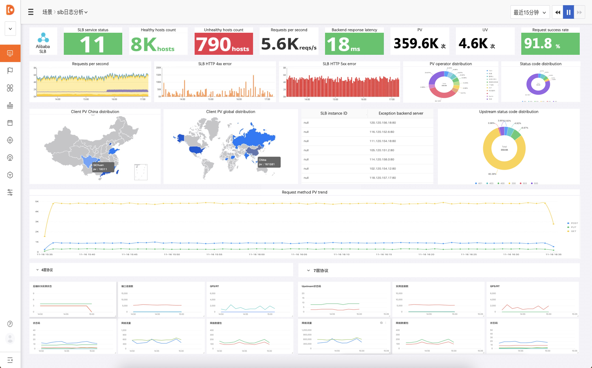

# SLB 监控场景

### 简介
展示 阿里云SLB 的后端ECS状态，端口，状态码，网络流量,slb的状态信息,PV和UV分布等情况

### 前置条件
* 已安装 DataKit（DataKit 安装文档）
* 需要有阿里云权限 AliyunLogFullAccess 的 Access Key ID 和 Access Key Secret（为了保证你的数据安全，建议使用子用户授权，请不要使用超过只读权限的 Access Key ID 和 Access Key Secret)
* 阿里云账号开通了日志服务，以及创建了相应的LogProject和LogStore

### 配置
进入 DataKit 安装目录下的 conf.d/aliyun 目录，复制 aliyunlog.conf.sample 并命名为 aliyunlog.conf。示例如下：

	[[inputs.aliyunlog]]
	# ##(required)
	endpoint = ''
	access_key_id = ''
	access_key_secret = ''
	
	[[inputs.aliyunlog.projects]]
	# ##(required) 日志服务项目名称 
	name = ''
	
	[[inputs.aliyunlog.projects.stores]]
	# ##(required) 日志库名称
	name = ''
	
	# ##(optional) 指标集名称, 默认使用 'aliyunlog_{store-name}' 
	#metric_name = ''
	
	# ##(optional) 指定当前日志库的消费组名称以及消费数据客户端名称.
	# ## consumer_group_name 默认使用 'datakit'
	# ## consumer_name 默认使用 'datakit_{datakit-uuid}'
	# ## 关于消费组的更多概念: https://help.aliyun.com/document_detail/28998.html
	consumer_group_name = ''
	consumer_name = ''
	
	# ##(optional) 日志内容是一系列键值对,默认都作为field. 通过 tags 指定哪些作为tag, 格式: key[:[*][:{alias}]]
	# ##指定 status_code 和 protocol 作为tag: tags = ["status_code","protocol"]
	# ##status_code同时作为tag和field: tags = ["status_code:*", "protocol"]
	# ##status_code同时为tag和field, 作为tag时设置别名为status: tags = ["status_code:*:status"]
	#tags = []
	
	# # ##(optional) 设置field的类型, 支持float和int.
	# # ##eg., fields = ["int:status,request_length", "float:cpuUsage"]
	#fields = []
	
并配置 aliyuncms 采集源。

	[[cms]]
	  # ## Aliyun Credentials (required)
	  access_key_id = 'ak'
	  access_key_secret = 'aks'
	  region_id = 'region'
	  [[cms.project]]
	        name='acs_slb_dashboard'
	        [cms.project.metrics]
	        names = ['ActiveConnection','DropConnection','DropPacketRX','DropPacketTX','DropTrafficRX','DropTrafficTX','GroupTrafficRX','GroupTrafficTX','HeathyServerCount','InactiveConnection','InstanceActiveConnection','InstanceDropConnection','InstanceDropPacketRX','InstanceDropPacketTX','InstanceDropTrafficRX','InstanceDropTrafficTX','InstanceInactiveConnection','InstanceMaxConnection','InstanceMaxConnectionUtilization','InstanceNewConnection','InstanceNewConnectionUtilization','InstancePacketRX','InstancePacketTX','InstanceQps','InstanceQpsUtilization','InstanceRt','InstanceStatusCode2xx','InstanceStatusCode3xx','InstanceStatusCode4xx','InstanceStatusCode5xx','InstanceStatusCodeOther','InstanceTrafficRX','InstanceTrafficTX','InstanceUpstreamCode4xx','InstanceUpstreamCode5xx','InstanceUpstreamRt','MaxConnection','NewConnection','PacketRX','PacketTX','Qps','Rt','StatusCode2xx','StatusCode3xx','StatusCode4xx','StatusCode5xx','StatusCodeOther','TrafficRXNew','TrafficTXNew','UnhealthyServerCount','UpstreamCode4xx','UpstreamCode5xx','UpstreamRt']

重新启动datakit

`systemctl restart datakit`	        

### 采集指标
参考： [阿里云文档](https://help.aliyun.com/document_detail/183239.html?spm=a2c4g.11186623.6.1149.2761a5f5AIZjAE)

|	字段	|	说明	|
|	:----	|	:----	|
|	__topic__	|	日志主题，固定为slb_layer7_access_log。|
|	body_bytes_sent		|	发送给客户端的http body字节数。|
|	client_ip		|	请求客户端IP地址。|
|	host	|	优先从请求参数中获取host，如果获取不到则从host header取值，如果还是获取不到则以处理请求的后端服务器IP地址作为host。|
|	http_host	|	请求报文host header的内容。|
|	http_referer		|	Proxy收到的请求报文中http的referer header的内容。|
|	http_user_agent		|	Proxy收到的请求报文中http的user-agent header的内容。|
|	http_x_forwarded_for		|	Proxy收到的请求报文中x-forwarded-for header的内容。|
|	http_x_real_ip	|	真实的客户端IP地址。|
|	read_request_time	|	Proxy读取请求的时间，单位：毫秒。|
|	request_length		|	请求报文的长度，包括startline、http头报文和http body。|
|	request_method		|	请求报文的方法。|
|	request_time	|	Proxy收到第一个请求报文的时间到proxy返回应答之间的间隔时间，单位：秒。|
|	request_uri		|	Proxy收到的请求报文的URI。|
|	scheme		|	请求的schema，包括http、https。|
|	server_protocol		|	Proxy收到的http协议的版本，例如HTTP/1.0或HTTP/1.1。|
|	slb_vport	|	负载均衡的监听端口。|
|	slbid	|	负载均衡实例ID。|
|	ssl_cipher	|	建立SSL连接使用的密码，例如ECDHE-RSA-AES128-GCM-SHA256等。|
|	ssl_protocol		|	建立SSL连接使用的协议，例如TLSv1.2。|
|	status	|	Proxy应答报文的状态。|
|	tcpinfo_rtt		|	客户端TCP连接时间，单位：微秒。|
|	time	|	日志记录时间。|
|	upstream_addr	|	后端服务器的IP地址和端口。|
|	upstream_response_time		|	从负载均衡向后端建立连接开始到接受完数据然后关闭连接为止的时间，单位：秒。|
|	upstream_status		|	Proxy收到的后端服务器的响应状态码。|
|	vip_addr		|	虚拟IP地址。|
|write_response_time		|	Proxy写的响应时间，单位：毫秒。|

### 概览
