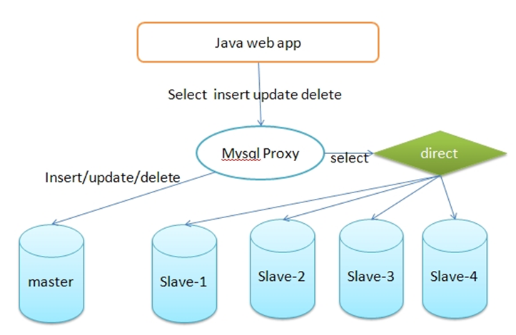
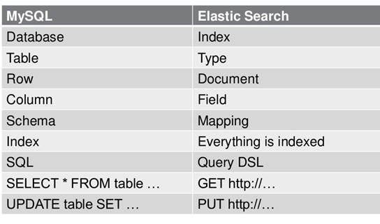

# Elasticsearch组件

## 简介

ElasticSearch是一个基于Lucene的搜索服务器。它提供了一个分布式多用户能力的全文搜索引擎，基于RESTful web接口操作ES，也可以利用Java API。Elasticsearch是用Java开发的，并作为Apache许可条款下的开放源码发布，是当前流行的企业级搜索引擎。设计用于云计算中，能够达到实时搜索，稳定，可靠，快速，安装使用方便。

我们建立一个网站或应用程序，并要添加搜索功能，但是想要完成搜索工作的创建是非常困难的。我们希望搜索解决方案要运行速度快，我们希望能有一个零配置和一个完全免费的搜索模式，我们希望能够简单地使用JSON通过HTTP来索引数据，我们希望我们的搜索服务器始终可用，我们希望能够从一台开始并扩展到数百台，我们要实时搜索，我们要简单的多租户，我们希望建立一个云的解决方案。因此我们利用Elasticsearch来解决所有这些问题及可能出现的更多其它问题。

## ES的产生

### 大规模数据如何检索？
如：当系统数据量上了10亿、100亿条的时候，我们在做系统架构的时候通常会从以下角度去考虑问题：

1. 用什么数据库 ；(mysql、sybase、oracle、mongodb、hbase)
2. 如何解决单点故障；(lvs、F5、A10、Zookeep、MQ)
3. 如何保证数据安全性；(热备、冷备、异地多活)
4. 如何解决检索难题；(数据库代理中间件：mysql-proxy、Cobar、MaxScale)
5. 如何解决统计分析问题；(离线、近实时)

### 传统数据库的应对解决方案

对于关系型数据，我们通常采用以下或类似架构去解决查询瓶颈和写入瓶颈：

1. 通过主从备份解决数据安全性问题；
2. 通过数据库代理中间件心跳监测，解决单点故障问题；
3. 通过代理中间件将查询语句分发到各个slave节点进行查询，并汇总结果

### 非关系型数据库的解决方案
对于Nosql数据库，以mongodb为例，其它原理类似：

1.  通过副本备份保证数据安全性；
2.  通过节点竞选机制解决单点问题；
3.  先从配置库检索分片信息，然后将请求分发到各个节点，最后由路由节点合并汇总结果

## ES解决方案
为解决以上问题，从源头着手分析，通常会从以下方式来寻找方法：

1. 存储数据时按有序存储；
2. 将数据和索引分离；
3. 压缩数据；

这就引出了Elasticsearch。

### ES定义

ES=elaticsearch简写， Elasticsearch是一个开源的高扩展的分布式全文检索引擎，它可以近乎实时的存储、检索数据；本身扩展性很好，可以扩展到上百台服务器，处理PB级别的数据。
Elasticsearch也使用Java开发并使用Lucene作为其核心来实现所有索引和搜索的功能，但是它的目的是通过简单的RESTful API来隐藏Lucene的复杂性，从而让全文搜索变得简单。

### Lucene与ES关系

1. Lucene只是一个库。想要使用它，你必须使用Java来作为开发语言并将其直接集成到你的应用中，更糟糕的是，Lucene非常复杂，你需要深入了解检索的相关知识来理解它是如何工作的。
2. Elasticsearch也使用Java开发并使用Lucene作为其核心来实现所有索引和搜索的功能，但是它的目的是通过简单的RESTful API来隐藏Lucene的复杂性，从而让全文搜索变得简单。

### ES主要解决问题

1. 检索相关数据；
2. 返回统计结果；
3. 速度要快

### ES数据架构的主要概念

1.  关系型数据库中的数据库（DataBase），等价于ES中的索引（Index）
2. 一个数据库下面有N张表（Table），等价于1个索引Index下面有N多类型（Type），
3. 一个数据库表（Table）下的数据由多行（ROW）多列（column，属性）组成，等价于1个Type由多个文档（Document）和多Field组成。
4. 在一个关系型数据库里面，schema定义了表、每个表的字段，还有表和字段之间的关系。 与之对应的，在ES中：Mapping定义索引下的Type的字段处理规则，即索引如何建立、索引类型、是否保存原始索引JSON文档、是否压缩原始JSON文档、是否需要分词处理、如何进行分词处理等。
5. 在数据库中的增insert、删delete、改update、查search操作等价于ES中的增PUT/POST、删Delete、改_update、查GET.

### ES特点和优势

1. 分布式实时文件存储，可将每一个字段存入索引，使其可以被检索到。
2. 实时分析的分布式搜索引擎。
分布式：索引分拆成多个分片，每个分片可有零个或多个副本。集群中的每个数据节点都可承载一个或多个分片，并且协调和处理各种操作；
负载再平衡和路由在大多数情况下自动完成。
3. 可以扩展到上百台服务器，处理PB级别的结构化或非结构化数据。也可以运行在单台PC上
4. 支持插件机制，分词插件、同步插件、Hadoop插件、可视化插件等。

### 对比MYSQL

1. 如果业务数据为结构化数据，同时不需要特别关注排名和智能分词模糊匹配查询等特性，则建议采用关系型数据库如MySQL来作为数据存储介质并使用配套搜索引擎
2. 如果业务数据为非结构化数据，同时更关注排名和需要智能分词模糊匹配的特性，则建议采用非关系型数据库如ES作为数据存储介质并使用配套搜索引擎。
3. MYSQL支持事务和访问权限控制，ES不支持事务和访问权限控制
4. ES在全文搜索、分词、常规搜索、聚合统计方面性能高，ES团队不建议完全采用ES作为数据库，而是作为一个分布式搜索服务

## ES的原理和应用
### 索引结构
下图是ElasticSearch的索引结构，下边黑色部分是物理结构，上边橙色部分是逻辑结构，逻辑结构也是为了更好的去描述ElasticSearch的工作原理及去使用物理结构中的索引文件

逻辑结构部分是一个倒排索引表：

1. 将要搜索的文档内容分词，所有不重复的词组成分词列表。
2. 将搜索的文档最终以Document方式存储起来。
3. 每个词和docment都有关联。

如下：

现在，如果想搜索 quick brown ，我们只需要查找包含每个词条的文档：

两个文档都匹配，但是第一个文档比第二个匹配度更高。如果我们使用仅计算匹配词条数量的简单 相似性算法 ，那么，我们可以说，对于我们查询的相关性来讲，第一个文档比第二个文档更佳。

## ES安装相关文件位置及配置

* /opt/Elasticsearch/bin/: 脚本目录，包括：启动、停止等可执行脚本
* /opt/Elasticsearch/config/ : 配置文件目录
* /opt/Elasticsearch/data/ : 索引目录，存放索引文件
* /opt/Elasticsearch/logs/ : 日志目录
* /opt/Elasticsearch/modules/ : 模块目录，包括了es的功能模块
* /opt/Elasticsearch/plugins/ : 插件目录，es支持插件机制

## ES数据架构的主要概念
	node01:	192.168.1.89  
	node02:	192.168.1.98 
	node03:	192.168.115
	

## ES 相关配置  

#### elasticsearch.yml
	cluster.name: xuecheng   #配置elasticsearch的集群名称，默认是elasticsearch。建议修改成一个有意义的名称。
	node.name: node_02  #节点名，通常一台物理服务器就是一个节点，es会默认随机指定一个名字，建议指定一个有意义的名称，方便管理
	network.host: 0.0.0.0  #绑定ip地址
	http.port: 9200  #暴露的http端口
	transport.tcp.port: 9300  #内部端口
	node.master: true  #主节点
	node.data: true  #数据节点
	discovery.zen.ping.unicast.hosts: ["0.0.0.0:9300", "0.0.0.0:9301", "0.0.0.0:9302"]  #设置集群中master节点的初始列表
	discovery.zen.minimum_master_nodes: 1  #主结点数量的最少值 ,此值的公式为：(master_eligible_nodes / 2) + 1 ，比如：有3个符合要求的主结点，那么这里要设置为2。
	bootstrap.memory_lock: false  #内存的锁定只给es用
	node.max_local_storage_nodes: 1 #单机允许的最大存储结点数，通常单机启动一个结点建议设置为1，开发环境如果单机启动多个节点可设置大于1
	path.data: /opt/Elasticsearch/data/ 
	path.logs: /opt/Elasticsearch/logs/    #日志
	http.cors.enabled: true #  跨域设置
	http.cors.allow‐origin: /.*/  

####  jvm.options
	设置最小及最大的JVM堆内存大小：
	在jvm.options中设置 -Xms和-Xmx：
	1） 两个值设置为相等
	2） 将 Xmx 设置为不超过物理内存的一半
	
	
