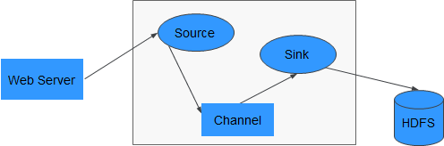
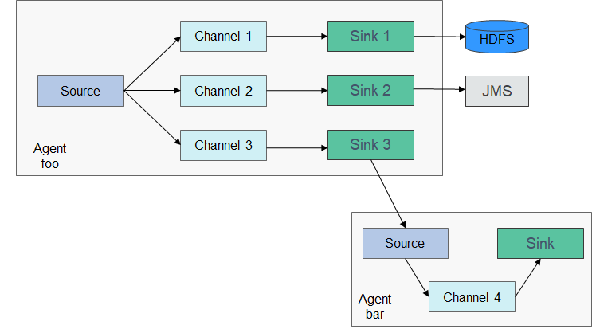
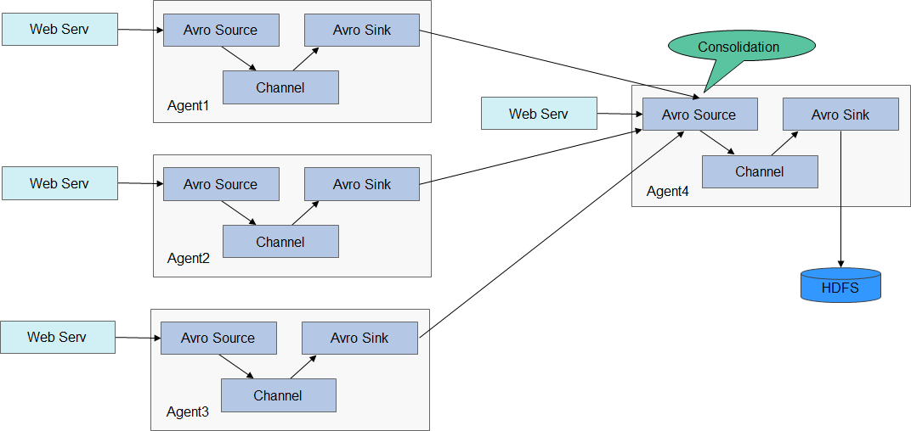
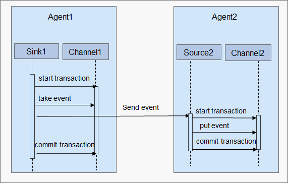

# Flume组件

## Flume 基本架构
Flume是一个高可用、高可靠，分布式的海量日志采集、聚合和传输的系统。Flume支持在日志系统中定制各类数据发送方，用于收集数据；同时，Flume提供对数据进行简单处理，并写到各种数据接受方（可定制）的能力。其中Flume-NG是Flume 的一个分支，其目的是要明显简单，体积更小，更容易部署，其最基本的架构如下图所示

Flume-NG由一个个Agent来组成，而每个Agent由Source、Channel、Sink三个模块组成，其中Source负责接收数据，Channel负责数据的传输，Sink则负责数据向下一端的发送。

### Source

Source负责接收数据或通过特殊机制产生数据，并将数据批量放到一个或多个Channel。Source的类型有数据驱动和轮询两种。

典型的Source类型如下：

* 和系统集成的Sources：Syslog、Netcat。
* 自动生成事件的Sources：Exec、SEQ。
* 用于Agent和Agent之间通信的IPC Sources：Avro。
Source必须至少和一个Channel关联。

### Channel

Channel位于Source和Sink之间，用于缓存来自Source的数据，当Sink成功将数据发送到下一跳的Channel或最终目的地时，数据从Channel移除。

Channel提供的持久化水平与Channel的类型相关，有以下三类：

* Memory Channel：非持久化。
* File Channel：基于WAL（预写式日志Write-Ahead Logging）的持久化实现。
* JDBC Channel：基于嵌入Database的持久化实现。
Channel支持事务，可提供较弱的顺序保证，可以和任何数量的Source和Sink工作。	

### Sink

Sink负责将数据传输到下一跳或最终目的，成功完成后将数据从Channel移除。

典型的Sink类型如下：

* 存储数据到最终目的终端Sink，比如：HDFS、HBase。
* 自动消耗的Sink，比如：Null Sink。
* 用于Agent间通信的IPC sink：Avro。
Sink必须作用于一个确切的Channel。

## 配置多Source、Channel、Sink的Flume

Flume的可靠性基于Agent间事务的交换，下一个Agent down掉，Channel可以持久化数据， Agent恢复后再传输。Flume的可用性则基于内建的Load Balancing和Failover机制。Channel及Agent都可以配多个实体，实体之间可以使用负载分担等策略。每个Agent为一个JVM进程，同一台服务器可以有多个Agent。收集节点（Agent1，2，3）负责处理日志，汇聚节点（Agent4）负责写入HDFS，每个收集节点的Agent可以选择多个汇聚节点，这样可以实现负载均衡。

## Agent之间的可靠性
Agent之间数据交换流程如图所示。

1.  Flume采用基于Transactions的方式保证数据传输的可靠性，当数据从一个Agent流向另外一个Agent时，两个Transactions已经开始生效。发送Agent的Sink首先从Channel取出一条消息，并且将该消息发送给另外一个Agent。如果接受消息的Agent成功地接受并处理消息，那么发送Agent将会提交Transactions，标识一次数据传输成功可靠地完成。

2.  当接收Agent接受到发送Agent发送的消息时，开始一个新的Transactions，当该数据被成功处理（写入Channel中），那么接收Agent提交该Transactions，并向发送Agent发送成功响应。

3.  如果在某次提交（commit）之前，数据传输出现了失败，将会再次开始上一次Transactions，并将上次发送失败的数据重新传输。因为commit操作已经将Transactions写入了磁盘，那么在进程故障退出并恢复业务之后，仍然可以继续上次的Transactions。

## Flume 架构
	node01:	192.168.1.89  
	node02:	192.168.1.98 
	node03:	192.168.115
	
	Hue Server : node01
	Load Balancer : node01

## Flume 相关配置  

#### 配置flume-env.sh
	
	export JAVA_HOME=/usr/java/jdk1.8.0_261-amd64
	export HADOOP_HOME=/opt/cloudera/parcels/CDH/lib/hadoop
 

