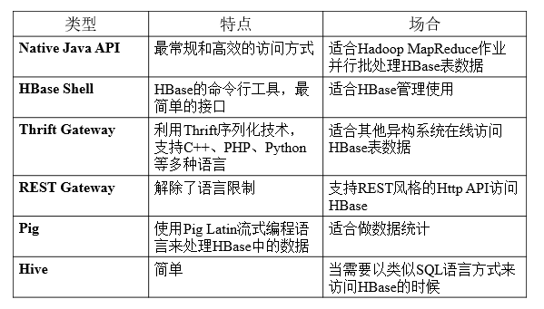
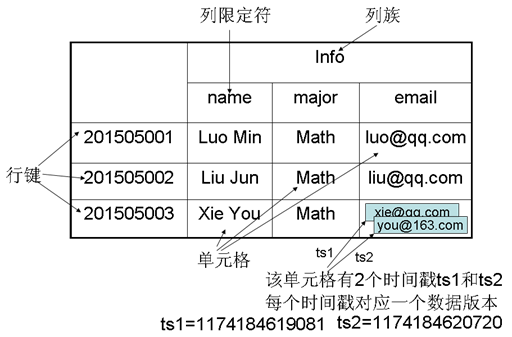
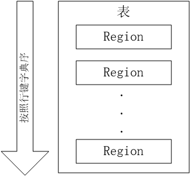
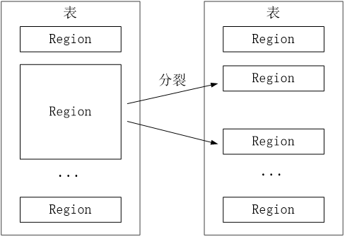
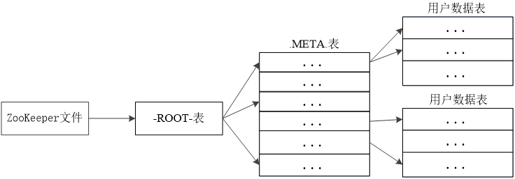
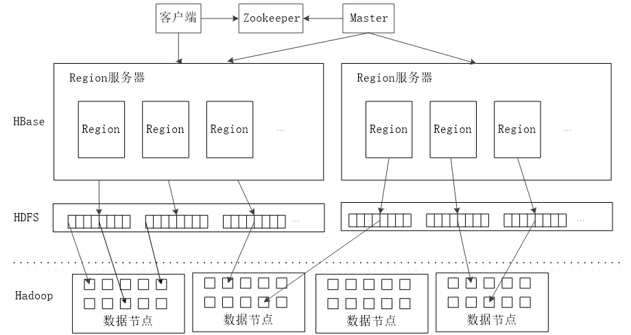
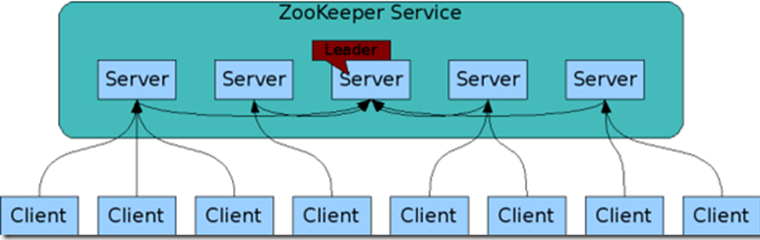
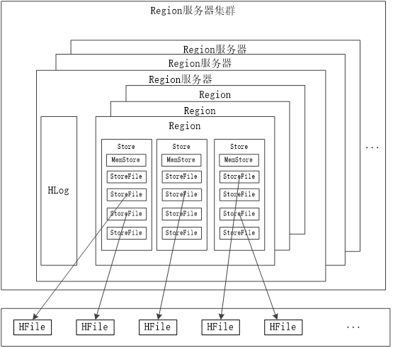

# HBASE组件

## Hbase起源

HBase是一个开源的非关系型分布式数据库，它参考了谷歌的BigTable建模，实现的编程语言为Java。它是Apache软件基金会的Hadoop项目的一部分，运行于HDFS文件系统之上，为 Hadoop 提供类似于BigTable 规模的服务。因此，它可以容错地存储海量稀疏的数据。

HBase是一个高可靠、高性能、面向列、可伸缩的分布式数据库，是谷歌BigTable的开源实现，主要用来存储非结构化和半结构化的松散数据。HBase的目标是处理非常庞大的表，可以通过水平扩展的方式，利用廉价计算机集群处理由超过10亿行数据和数百万列元素组成的数据表。

### 关系数据库已经流行很多年，并且Hadoop已经有了HDFS和MapReduce，为什么需要HBase?

* Hadoop可以很好地解决大规模数据的离线批量处理问题，但是，受限于HadoopMapReduce编程框架的高延迟数据处理机制，使得Hadoop无法满足大规模数据实时处理应用的需求。
* HDFS面向批量访问模式，不是随机访问模式。
* 传统的通用关系型数据库无法应对在数据规模剧增时导致的系统扩展性和性能问题（分库分表也不能很好解决）。
* 传统关系数据库在数据结构变化时一般需要停机维护；空列浪费存储空间。

###HBase与传统的关系数据库的区别主要体现在以下几个方面：
1. 数据类型：关系数据库采用关系模型，具有丰富的数据类型和存储方式，HBase则采用了更加简单的数据模型，它把数据存储为未经解释的字符串。
2. 数据操作：关系数据库中包含了丰富的操作，其中会涉及复杂的多表连接。HBase操作则不存在复杂的表与表之间的关系，只有简单的插入、查询、删除、清空等，因为HBase在设计上就避免了复杂的表和表之间的关系。
3. 存储模式：关系数据库是基于行模式存储的。HBase是基于列存储的，每个列族都由几个文件保存，不同列族的文件是分离的。
4. 数据索引：关系数据库通常可以针对不同列构建复杂的多个索引，以提高数据访问性能。HBase只有一个索引——行键，通过巧妙的设计，HBase中的所有访问方法，或者通过行键访问，或者通过行键扫描，从而使得整个系统不会慢下来。
5. 数据维护：在关系数据库中，更新操作会用最新的当前值去替换记录中原来的旧值，旧值被覆盖后就不会存在。而在HBase中执行更新操作时，并不会删除数据旧的版本，而是生成一个新的版本，旧有的版本仍然保留。
6. 可伸缩性：关系数据库很难实现横向扩展，纵向扩展的空间也比较有限。相反，HBase和BigTable这些分布式数据库就是为了实现灵活的水平扩展而开发的，能够轻易地通过在集群中增加或者减少硬件数量来实现性能的伸缩。

## Hbase访问接口

## Hbase数据模型

Hbase是一个稀疏、多维度、排序的映射表，这张表的索引是行键、列族、列限定符和时间戳。

* 每个值是一个未经解释的字符串，没有数据类型。用户在表中存储数据，每一行都有一个可排序的行键和任意多的列。
* 表在水平方向由一个或多个列族组成，一个列族中可以包含任意多个列，同一个列族里面的数据存储在一起。
* 列族支持动态扩展，可以很轻松地添加一个列族或列，无需预先定义列的数量以及类型，所有列均以字符串形式存储，用户需要自行进行数据类型转换。
* HBase中执行更新操作时，并不会删除数据旧的版本，而是生成一个新的版本，旧的版本仍然保留（这是和HDFS只允许追加不允许修改的特性相关的）

下面对上图的一个具体解释：

表：HBase采用表来组织数据，表由行和列组成，列划分为若干列族。

行：每个HBase表都由若干行组成，每个行由行键（row key）来标识。

列族：一个HBase表被分组成许多“列族”（Column Family）的集合，它是基本的访问控制单元。

列限定符：列族里的数据通过限定符（或列）来定位。

单元格：在HBase表中，通过行、列族和列限定符确定一个“单元格”（cell），单元格中存储的数据没有数据类型，总被视为字节数组byte[]

时间戳：每个单元格都保存着同一份数据的多个版本，这些版本采用时间戳进行索引。

## Hbase的实现原理

### HBase的实现包括三个主要的功能组件：

1. 库函数：链接到每个客户端
2. 一个Master主服务器
3. 许多个Region服务器

主服务器Master负责管理和维护Hbase表的分区信息，维护Region服务器列表，分配Region，负载均衡。

Region服务器负责存储和维护分配给自己的Region，处理来自客户端的读写请求。

客户端并不是直接从Master主服务器上读取数据，而是在获得Region的存储位置信息后，直接从Region服务器上读取数据。

客户端并不依赖Master，而是通过Zookeeper来Region位置信息，大多数客户端甚至从来不和Master通信，这种设计方式使得Master负载很小。

### 表和Region

一个HBase表被划分成多个Region。

开始只有一个Region，后台不断分裂。Region拆分操作非常快，接近瞬间，因为拆分之后Region读取的仍然是原存储文件，直到“合并”过程把存储文件异步地写到独立的文件之后，才会读取新文件。

### Region的定位

元数据表，又名.META.表，存储了Region和Region服务器的映射关系。当HBase表很大时， .META.表也会被分裂成多个Region

根数据表，又名-ROOT-表，记录所有元数据的具体位置，-ROOT-表只有唯一一个Region，名字是在程序中被写死的。Zookeeper文件记录了-ROOT-表的位置

Hbase的三层结构图如下：

客户端访问数据时的“三级寻址”：

* 为了加速寻址，客户端会缓存位置信息，同时，需要解决缓存失效问题。
* 寻址过程客户端只需要询问Zookeeper服务器，不需要连接Master服务器。

## Hbase系统架构

### 客户端

客户端包含访问Hbase的接口，同时在缓存中维护着已经访问过的Region位置信息，用来加快后续数据访问过程。

### Zookeeper服务器

Zookeeper可以帮助选举出一个Master作为集群的总管，并保证在任何时刻总有唯一一个Master在运行，这就避免了Master的“单点失效”的问题。

### Master服务器

主服务器Master主要负责表和Region的管理工作：

* 管理用户对表的增加、删除、修改、查询等操作
* 实现不同Region服务器之间的负载均衡
* 在Region分裂或合并后，负责重新调整Region的分布
* 对发生故障失效的Region服务器上Region进行迁移

### Region服务器

Region服务器是Hbase中最核心的模块，负责维护分配给自己的Region，并响应用户的读写请求。

#### Region服务器工作原理

Region服务器向HDFS文件系统中读写数据过程：

1、 用户读写数据过程 

* 用户写入数据时，被分配到相应Region服务器去执行
* 用户数据首先被写入到MEMStore和Hlog中
* 只有当操作写入Hlog之后，commit()调用才会将其返回给客户端
* 当用户读取数据时，Region服务器首先访问MEMStore缓存，如果找不到，再去磁盘上面的StoreFile中寻找

2、 缓存的刷新 

* 系统会周期性地把MemStore缓存里的内容刷写到磁盘的StoreFile文件中，清空缓存，并在Hlog里面写入一个标记
* 每次刷写都生成一个新的StoreFile文件，因此，每个Store包含多个StoreFile文件
* 每个Region服务器都有一个自己的HLog 文件，每次启动都检查该文件，确认最近一次执行缓存刷新操作之后是否发生新的写入操作；如果发现更新，则先写入MemStore，再刷写到StoreFile，最后删除旧的Hlog文件，开始为用户提供服务。

3、 StoreFile的合并 

* 每次刷写都生成一个新的StoreFile，数量太多，影响查找速度、
* 调用Store.compact()把多个合并成一个
* 合并操作比较耗费资源，只有数量达到一个阈值才启动合并

## 在Hbase之上构建SQL引擎

NoSQL区别于关系型数据库的一点就是NoSQL不使用SQL作为查询语言，至于为何在NoSQL数据存储HBase上提供SQL接口，有如下原因：

1. 易使用。使用诸如SQL这样易于理解的语言，使人们能够更加轻松地使用Hasee。
2. 减少编码。使用诸如SQL这样更高层次的语言来编写，减少了编写的代码量。

解决方案：Hive整合HBase

Hive与HBase的整合功能从Hive0.6.0版本已经开始出现，利用两者对外的API接口互相通信，通信主要依靠hive_hbase-handler.jar工具包(HiveStorage Handlers)。由于HBase有一次比较大的版本变动，所以并不是每个版本的Hive都能和现有的HBase版本进行整合，所以在使用过程中特别注意的就是两者版本的一致性。

## 构建Hbase二级索引

HBase只有一个针对行键的索引，访问Hbase表中的行，只有三种方式：

* 通过单个行键访问
* 通过一个行键的区间来访问
* 全表扫描

使用其他产品为Hbase行键提供索引功能：

* Hindex二级索引
* Hbase+Redis
* Hbase+solr

## HBASE安装相关文件位置及配置

* /usr/bin/  : 所有HBASE相关命令的软链，它们会再软链到/etc/alternatives中去
* /var/lib/ : HBASE服务相关数据目录
* /var/log/   : HBASE相关服务运行日志目录
* /opt/cloudera/parcels/CDH/jars   : HBASE所有相关服务的安装文件，包含jar包，配置文件以及执行命令等。
* /tmp  :所有HBASE相关服务不同角色的OOM堆栈转存目录。以及所有角色启动的pid文件

## HBASE架构
	node01:	192.168.1.89  
	node02:	192.168.1.98 
	node03:	192.168.115
	
	Master ： node01
	HBase REST Server : node02
	HBase Thrift Server : node02
	RegionServer : node01-node03

## HBASE相关配置  

#### hadoop-metrics2-hbase.properties
	
		# Licensed to the Apache Software Foundation (ASF) under one
	# or more contributor license agreements.  See the NOTICE file
	# distributed with this work for additional information
	# regarding copyright ownership.  The ASF licenses this file
	# to you under the Apache License, Version 2.0 (the
	# "License"); you may not use this file except in compliance
	# with the License.  You may obtain a copy of the License at
	#
	#     http://www.apache.org/licenses/LICENSE-2.0
	#
	# Unless required by applicable law or agreed to in writing, software
	# distributed under the License is distributed on an "AS IS" BASIS,
	# WITHOUT WARRANTIES OR CONDITIONS OF ANY KIND, either express or implied.
	# See the License for the specific language governing permissions and
	# limitations under the License.
	
	# syntax: [prefix].[source|sink].[instance].[options]
	# See javadoc of package-info.java for org.apache.hadoop.metrics2 for details
	
	*.sink.file*.class=org.apache.hadoop.metrics2.sink.FileSink
	# default sampling period
	*.period=10
	
	# Below are some examples of sinks that could be used
	# to monitor different hbase daemons.
	
	# hbase.sink.file-all.class=org.apache.hadoop.metrics2.sink.FileSink
	# hbase.sink.file-all.filename=all.metrics
	
	# hbase.sink.file0.class=org.apache.hadoop.metrics2.sink.FileSink
	# hbase.sink.file0.context=hmaster
	# hbase.sink.file0.filename=master.metrics
	
	# hbase.sink.file1.class=org.apache.hadoop.metrics2.sink.FileSink
	# hbase.sink.file1.context=thrift-one
	# hbase.sink.file1.filename=thrift-one.metrics
	
	# hbase.sink.file2.class=org.apache.hadoop.metrics2.sink.FileSink
	# hbase.sink.file2.context=thrift-two
	# hbase.sink.file2.filename=thrift-one.metrics
	
	# hbase.sink.file3.class=org.apache.hadoop.metrics2.sink.FileSink
	# hbase.sink.file3.context=rest
	# hbase.sink.file3.filename=rest.metrics

	
 

#### hbase-env.cmd

		@rem/**
	@rem * Licensed to the Apache Software Foundation (ASF) under one
	@rem * or more contributor license agreements.  See the NOTICE file
	@rem * distributed with this work for additional information
	@rem * regarding copyright ownership.  The ASF licenses this file
	@rem * to you under the Apache License, Version 2.0 (the
	@rem * "License"); you may not use this file except in compliance
	@rem * with the License.  You may obtain a copy of the License at
	@rem *
	@rem *     http://www.apache.org/licenses/LICENSE-2.0
	@rem *
	@rem * Unless required by applicable law or agreed to in writing, software
	@rem * distributed under the License is distributed on an "AS IS" BASIS,
	@rem * WITHOUT WARRANTIES OR CONDITIONS OF ANY KIND, either express or implied.
	@rem * See the License for the specific language governing permissions and
	@rem * limitations under the License.
	@rem */
	
	@rem Set environment variables here.
	
	@rem The java implementation to use.  Java 1.7+ required.
	@rem set JAVA_HOME=c:\apps\java
	
	@rem Extra Java CLASSPATH elements.  Optional.
	@rem set HBASE_CLASSPATH=
	
	@rem The maximum amount of heap to use. Default is left to JVM default.
	@rem set HBASE_HEAPSIZE=1000
	
	@rem Uncomment below if you intend to use off heap cache. For example, to allocate 8G of 
	@rem offheap, set the value to "8G".
	@rem set HBASE_OFFHEAPSIZE=1000
	
	@rem For example, to allocate 8G of offheap, to 8G:
	@rem etHBASE_OFFHEAPSIZE=8G
	
	@rem Extra Java runtime options.
	@rem Below are what we set by default.  May only work with SUN JVM.
	@rem For more on why as well as other possible settings,
	@rem see http://wiki.apache.org/hadoop/PerformanceTuning
	@rem JDK6 on Windows has a known bug for IPv6, use preferIPv4Stack unless JDK7.
	@rem @rem See TestIPv6NIOServerSocketChannel.
	set HBASE_OPTS="-XX:+UseConcMarkSweepGC" "-Djava.net.preferIPv4Stack=true"
	
	@rem Configure PermSize. Only needed in JDK7. You can safely remove it for JDK8+
	set HBASE_MASTER_OPTS=%HBASE_MASTER_OPTS% "-XX:PermSize=128m" "-XX:MaxPermSize=128m"
	set HBASE_REGIONSERVER_OPTS=%HBASE_REGIONSERVER_OPTS% "-XX:PermSize=128m" "-XX:MaxPermSize=128m"
	
	@rem Uncomment below to enable java garbage collection logging for the server-side processes
	@rem this enables basic gc logging for the server processes to the .out file
	@rem set SERVER_GC_OPTS="-verbose:gc" "-XX:+PrintGCDetails" "-XX:+PrintGCDateStamps" %HBASE_GC_OPTS%
	
	@rem this enables gc logging using automatic GC log rolling. Only applies to jdk 1.6.0_34+ and 1.7.0_2+. Either use this set of options or the one above
	@rem set SERVER_GC_OPTS="-verbose:gc" "-XX:+PrintGCDetails" "-XX:+PrintGCDateStamps" "-XX:+UseGCLogFileRotation" "-XX:NumberOfGCLogFiles=1" "-XX:GCLogFileSize=512M" %HBASE_GC_OPTS%
	
	@rem Uncomment below to enable java garbage collection logging for the client processes in the .out file.
	@rem set CLIENT_GC_OPTS="-verbose:gc" "-XX:+PrintGCDetails" "-XX:+PrintGCDateStamps" %HBASE_GC_OPTS%
	
	@rem Uncomment below (along with above GC logging) to put GC information in its own logfile (will set HBASE_GC_OPTS)
	@rem set HBASE_USE_GC_LOGFILE=true
	
	@rem Uncomment and adjust to enable JMX exporting
	@rem See jmxremote.password and jmxremote.access in $JRE_HOME/lib/management to configure remote password access.
	@rem More details at: http://java.sun.com/javase/6/docs/technotes/guides/management/agent.html
	@rem
	@rem set HBASE_JMX_BASE="-Dcom.sun.management.jmxremote.ssl=false" "-Dcom.sun.management.jmxremote.authenticate=false"
	@rem set HBASE_MASTER_OPTS=%HBASE_JMX_BASE% "-Dcom.sun.management.jmxremote.port=10101"
	@rem set HBASE_REGIONSERVER_OPTS=%HBASE_JMX_BASE% "-Dcom.sun.management.jmxremote.port=10102"
	@rem set HBASE_THRIFT_OPTS=%HBASE_JMX_BASE% "-Dcom.sun.management.jmxremote.port=10103"
	@rem set HBASE_ZOOKEEPER_OPTS=%HBASE_JMX_BASE% -Dcom.sun.management.jmxremote.port=10104"
	
	@rem File naming hosts on which HRegionServers will run.  $HBASE_HOME/conf/regionservers by default.
	@rem set HBASE_REGIONSERVERS=%HBASE_HOME%\conf\regionservers
	
	@rem Where log files are stored.  $HBASE_HOME/logs by default.
	@rem set HBASE_LOG_DIR=%HBASE_HOME%\logs
	
	@rem A string representing this instance of hbase. $USER by default.
	@rem set HBASE_IDENT_STRING=%USERNAME%
	
	@rem Seconds to sleep between slave commands.  Unset by default.  This
	@rem can be useful in large clusters, where, e.g., slave rsyncs can
	@rem otherwise arrive faster than the master can service them.
	@rem set HBASE_SLAVE_SLEEP=0.1
	
	@rem Tell HBase whether it should manage it's own instance of Zookeeper or not.
	@rem set HBASE_MANAGES_ZK=true

 

#### hbase-env.sh

	#
	#/**
	# * Licensed to the Apache Software Foundation (ASF) under one
	# * or more contributor license agreements.  See the NOTICE file
	# * distributed with this work for additional information
	# * regarding copyright ownership.  The ASF licenses this file
	# * to you under the Apache License, Version 2.0 (the
	# * "License"); you may not use this file except in compliance
	# * with the License.  You may obtain a copy of the License at
	# *
	# *     http://www.apache.org/licenses/LICENSE-2.0
	# *
	# * Unless required by applicable law or agreed to in writing, software
	# * distributed under the License is distributed on an "AS IS" BASIS,
	# * WITHOUT WARRANTIES OR CONDITIONS OF ANY KIND, either express or implied.
	# * See the License for the specific language governing permissions and
	# * limitations under the License.
	# */
	
	# Set environment variables here.
	
	# This script sets variables multiple times over the course of starting an hbase process,
	# so try to keep things idempotent unless you want to take an even deeper look
	# into the startup scripts (bin/hbase, etc.)
	
	# The java implementation to use.  Java 1.7+ required.
	# export JAVA_HOME=/usr/java/jdk1.6.0/
	
	# Extra Java CLASSPATH elements.  Optional.
	# export HBASE_CLASSPATH=
	
	# The maximum amount of heap to use. Default is left to JVM default.
	# export HBASE_HEAPSIZE=1G
	
	# Uncomment below if you intend to use off heap cache. For example, to allocate 8G of 
	# offheap, set the value to "8G".
	# export HBASE_OFFHEAPSIZE=1G
	
	# Extra Java runtime options.
	# Below are what we set by default.  May only work with SUN JVM.
	# For more on why as well as other possible settings,
	# see http://wiki.apache.org/hadoop/PerformanceTuning
	export HBASE_OPTS="-XX:+UseConcMarkSweepGC"
	
	# Configure PermSize. Only needed in JDK7. You can safely remove it for JDK8+
	export HBASE_MASTER_OPTS="$HBASE_MASTER_OPTS -XX:PermSize=128m -XX:MaxPermSize=128m"
	export HBASE_REGIONSERVER_OPTS="$HBASE_REGIONSERVER_OPTS -XX:PermSize=128m -XX:MaxPermSize=128m"
	
	# Uncomment one of the below three options to enable java garbage collection logging for the server-side processes.
	
	# This enables basic gc logging to the .out file.
	# export SERVER_GC_OPTS="-verbose:gc -XX:+PrintGCDetails -XX:+PrintGCDateStamps"
	
	# This enables basic gc logging to its own file.
	# If FILE-PATH is not replaced, the log file(.gc) would still be generated in the HBASE_LOG_DIR .
	# export SERVER_GC_OPTS="-verbose:gc -XX:+PrintGCDetails -XX:+PrintGCDateStamps -Xloggc:<FILE-PATH>"
	
	# This enables basic GC logging to its own file with automatic log rolling. Only applies to jdk 1.6.0_34+ and 1.7.0_2+.
	# If FILE-PATH is not replaced, the log file(.gc) would still be generated in the HBASE_LOG_DIR .
	# export SERVER_GC_OPTS="-verbose:gc -XX:+PrintGCDetails -XX:+PrintGCDateStamps -Xloggc:<FILE-PATH> -XX:+UseGCLogFileRotation -XX:NumberOfGCLogFiles=1 -XX:GCLogFileSize=512M"
	
	# Uncomment one of the below three options to enable java garbage collection logging for the client processes.
	
	# This enables basic gc logging to the .out file.
	# export CLIENT_GC_OPTS="-verbose:gc -XX:+PrintGCDetails -XX:+PrintGCDateStamps"
	
	# This enables basic gc logging to its own file.
	# If FILE-PATH is not replaced, the log file(.gc) would still be generated in the HBASE_LOG_DIR .
	# export CLIENT_GC_OPTS="-verbose:gc -XX:+PrintGCDetails -XX:+PrintGCDateStamps -Xloggc:<FILE-PATH>"
	
	# This enables basic GC logging to its own file with automatic log rolling. Only applies to jdk 1.6.0_34+ and 1.7.0_2+.
	# If FILE-PATH is not replaced, the log file(.gc) would still be generated in the HBASE_LOG_DIR .
	# export CLIENT_GC_OPTS="-verbose:gc -XX:+PrintGCDetails -XX:+PrintGCDateStamps -Xloggc:<FILE-PATH> -XX:+UseGCLogFileRotation -XX:NumberOfGCLogFiles=1 -XX:GCLogFileSize=512M"
	
	# See the package documentation for org.apache.hadoop.hbase.io.hfile for other configurations
	# needed setting up off-heap block caching. 
	
	# Uncomment and adjust to enable JMX exporting
	# See jmxremote.password and jmxremote.access in $JRE_HOME/lib/management to configure remote password access.
	# More details at: http://java.sun.com/javase/6/docs/technotes/guides/management/agent.html
	# NOTE: HBase provides an alternative JMX implementation to fix the random ports issue, please see JMX
	# section in HBase Reference Guide for instructions.
	
	# export HBASE_JMX_BASE="-Dcom.sun.management.jmxremote.ssl=false -Dcom.sun.management.jmxremote.authenticate=false"
	# export HBASE_MASTER_OPTS="$HBASE_MASTER_OPTS $HBASE_JMX_BASE -Dcom.sun.management.jmxremote.port=10101"
	# export HBASE_REGIONSERVER_OPTS="$HBASE_REGIONSERVER_OPTS $HBASE_JMX_BASE -Dcom.sun.management.jmxremote.port=10102"
	# export HBASE_THRIFT_OPTS="$HBASE_THRIFT_OPTS $HBASE_JMX_BASE -Dcom.sun.management.jmxremote.port=10103"
	# export HBASE_ZOOKEEPER_OPTS="$HBASE_ZOOKEEPER_OPTS $HBASE_JMX_BASE -Dcom.sun.management.jmxremote.port=10104"
	# export HBASE_REST_OPTS="$HBASE_REST_OPTS $HBASE_JMX_BASE -Dcom.sun.management.jmxremote.port=10105"
	
	# File naming hosts on which HRegionServers will run.  $HBASE_HOME/conf/regionservers by default.
	# export HBASE_REGIONSERVERS=${HBASE_HOME}/conf/regionservers
	
	# Uncomment and adjust to keep all the Region Server pages mapped to be memory resident
	#HBASE_REGIONSERVER_MLOCK=true
	#HBASE_REGIONSERVER_UID="hbase"
	
	# File naming hosts on which backup HMaster will run.  $HBASE_HOME/conf/backup-masters by default.
	# export HBASE_BACKUP_MASTERS=${HBASE_HOME}/conf/backup-masters
	
	# Extra ssh options.  Empty by default.
	# export HBASE_SSH_OPTS="-o ConnectTimeout=1 -o SendEnv=HBASE_CONF_DIR"
	
	# Where log files are stored.  $HBASE_HOME/logs by default.
	# export HBASE_LOG_DIR=${HBASE_HOME}/logs
	
	# Enable remote JDWP debugging of major HBase processes. Meant for Core Developers 
	# export HBASE_MASTER_OPTS="$HBASE_MASTER_OPTS -Xdebug -Xrunjdwp:transport=dt_socket,server=y,suspend=n,address=8070"
	# export HBASE_REGIONSERVER_OPTS="$HBASE_REGIONSERVER_OPTS -Xdebug -Xrunjdwp:transport=dt_socket,server=y,suspend=n,address=8071"
	# export HBASE_THRIFT_OPTS="$HBASE_THRIFT_OPTS -Xdebug -Xrunjdwp:transport=dt_socket,server=y,suspend=n,address=8072"
	# export HBASE_ZOOKEEPER_OPTS="$HBASE_ZOOKEEPER_OPTS -Xdebug -Xrunjdwp:transport=dt_socket,server=y,suspend=n,address=8073"
	
	# A string representing this instance of hbase. $USER by default.
	# export HBASE_IDENT_STRING=$USER
	
	# The scheduling priority for daemon processes.  See 'man nice'.
	# export HBASE_NICENESS=10
	
	# The directory where pid files are stored. /tmp by default.
	# export HBASE_PID_DIR=/var/hadoop/pids
	
	# Seconds to sleep between slave commands.  Unset by default.  This
	# can be useful in large clusters, where, e.g., slave rsyncs can
	# otherwise arrive faster than the master can service them.
	# export HBASE_SLAVE_SLEEP=0.1
	
	# Tell HBase whether it should manage it's own instance of Zookeeper or not.
	# export HBASE_MANAGES_ZK=true
	
	# The default log rolling policy is RFA, where the log file is rolled as per the size defined for the 
	# RFA appender. Please refer to the log4j.properties file to see more details on this appender.
	# In case one needs to do log rolling on a date change, one should set the environment property
	# HBASE_ROOT_LOGGER to "<DESIRED_LOG LEVEL>,DRFA".
	# For example:
	# HBASE_ROOT_LOGGER=INFO,DRFA
	# The reason for changing default to RFA is to avoid the boundary case of filling out disk space as 
	# DRFA doesn't put any cap on the log size. Please refer to HBase-5655 for more context.

 

#### hbase-policy.xml

	<?xml version="1.0"?>
	<?xml-stylesheet type="text/xsl" href="configuration.xsl"?>
	<!--
	/**
	 * Licensed to the Apache Software Foundation (ASF) under one
	 * or more contributor license agreements.  See the NOTICE file
	 * distributed with this work for additional information
	 * regarding copyright ownership.  The ASF licenses this file
	 * to you under the Apache License, Version 2.0 (the
	 * "License"); you may not use this file except in compliance
	 * with the License.  You may obtain a copy of the License at
	 *
	 *     http://www.apache.org/licenses/LICENSE-2.0
	 *
	 * Unless required by applicable law or agreed to in writing, software
	 * distributed under the License is distributed on an "AS IS" BASIS,
	 * WITHOUT WARRANTIES OR CONDITIONS OF ANY KIND, either express or implied.
	 * See the License for the specific language governing permissions and
	 * limitations under the License.
	 */
	-->
	
	<configuration>
	  <property>
	    <name>security.client.protocol.acl</name>
	    <value>*</value>
	    <description>ACL for ClientProtocol and AdminProtocol implementations (ie. 
	    clients talking to HRegionServers)
	    The ACL is a comma-separated list of user and group names. The user and 
	    group list is separated by a blank. For e.g. "alice,bob users,wheel". 
	    A special value of "*" means all users are allowed.</description>
	  </property>
	
	  <property>
	    <name>security.admin.protocol.acl</name>
	    <value>*</value>
	    <description>ACL for HMasterInterface protocol implementation (ie. 
	    clients talking to HMaster for admin operations).
	    The ACL is a comma-separated list of user and group names. The user and 
	    group list is separated by a blank. For e.g. "alice,bob users,wheel". 
	    A special value of "*" means all users are allowed.</description>
	  </property>
	
	  <property>
	    <name>security.masterregion.protocol.acl</name>
	    <value>*</value>
	    <description>ACL for HMasterRegionInterface protocol implementations
	    (for HRegionServers communicating with HMaster)
	    The ACL is a comma-separated list of user and group names. The user and 
	    group list is separated by a blank. For e.g. "alice,bob users,wheel". 
	    A special value of "*" means all users are allowed.</description>
	  </property>
	</configuration>

 
