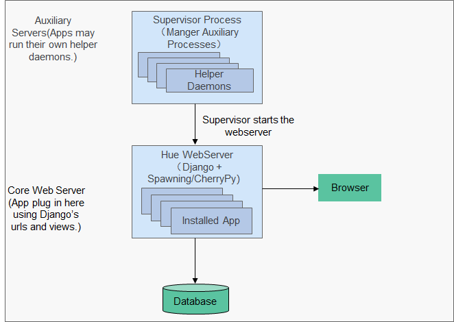

# HUE组件

Hue是一组WEB应用，用于和MRS大数据组件进行交互，能够帮助用户浏览HDFS，进行Hive查询，启动MapReduce任务等，它承载了与所有MRS大数据组件交互的应用。

## Hue的文件浏览器和查询编辑器的功能

* 文件浏览器能够允许用户直接通过界面浏览以及操作HDFS的不同目录；
* 查询编辑器能够编写简单的SQL，查询存储在Hadoop之上的数据。例如HDFS，HBase，Hive。 用户可以方便地创建、管理、执行SQL，并且能够以Excel的形式下载执行的结果。

## Hue的界面操作

* HDFS：
	* 查看、创建、管理、重命名、移动、删除文件/目录；
	* 上传下载文件；
	* 搜索文件、目录、文件所有人、所属用户组；修改文件以及目录的属主和权限；
	* 手动配置HDFS目录存储策略，配置动态存储策略等操作。
* Hive：
	* 编辑、执行HQL，SQL模板保存，模板复制，模板编辑。SQL解释，查询，历史记录；
	* 数据库展示，数据表展示；
	* 支持多种Hadoop存储；
	* 通过metastore对数据库及表和视图进行增删改查等操作。
* Impala：
	* 编辑、执行HQL，SQL模板保存、模板复制、模板编辑，SQL解释、查询、历史记录；
	* 数据库展示，数据表展示；
	* 支持多种Hadoop存储；
	* 通过metastore对数据库及表和视图进行增删改查等操作。
* MapReduce：查看集群中正在执行和已经完成的MR任务，包括它们的状态、起始结束时间、运行日志等。
* ZooKeeper：提供了ZooKeeper浏览器功能，使用户可以通过界面图形化的方式查看ZooKeeper。

## Hue结构

Hue是建立在Django Python（开放源代码的Web应用框架）的Web框架上的Web应用程序，采用了MTV（模型M-模板T-视图V）的软件设计模式。

Hue由“Supervisor Process”和“WebServer”构成，“Supervisor Process”是Hue的核心进程，负责应用进程管理。“Supervisor Process”和“WebServer”通过“THRIFT/REST”接口与WebServer上的应用进行交互，如图所示。

## HUE 架构
	node01:	192.168.1.89  
	node02:	192.168.1.98 
	node03:	192.168.115
	
	Hue Server : node01
	Load Balancer : node01

## HUE 相关配置  

#### 更改Hadoop配置 hdfs-site.xml
	
		主要是为了能以web方式访问HDFS文件。需要在hdfs-site.xml中修改如下配置
	　　　　<property>
	　　　　　　<name>dfs.webhdfs.enabled</name>
	　　　　　　<value>true</value>
	　　　　</property>
	　　以及在core-site.xml中修改如下配置
	　　　　<property>
	　　　　　　<name>hadoop.proxyuser.hue.hosts</name>
	　　　　　　<value>*</value>
	　　　　</property>
	　　　　<property>
	　　　　　　<name>hadoop.proxyuser.hue.groups</name>
	　　　　　　<value>*</value>
	　　　　</property>
	
	
	　　以及在httpfs-site.xml中修改如下配置
	　　　　<property>
	　　　　　　<name>httpfs.proxyuser.hue.hosts</name>
	　　　　　　<value>*</value>
	　　　　</property>
	　　　　<property>
	　　　　　　<name>httpfs.proxyuser.hue.groups</name>
	　　　　　　<value>*</value>
	　　　　</property>
	　　修改完后，重启HDFS服务。
	
 

#### 更改oozie配置 oozie-site.xml

		Hue使用登录账户向Oozie提交MapReduce作业，因此需要配置Oozie将Hue的登录账户作为proxyuser。
	
	　　在oozie-site.xml中增加以下配置并重启Oozie：
	　　　　<property>
	　　　　　　<name>oozie.service.ProxyUserService.proxyuser.hue.hosts</name>
	　　　　　　<value>*</value>
	　　　　</property>
	　　　　<property>
	　　　　　　<name>oozie.service.ProxyUserService.proxyuser.hue.groups</name>
	　　　　　　<value>*</value>
	　　　　</property>
	
	　　另外hue.ini中的主要配置有：
	　　　　[oozie]
	　　　　#存储样本数据的本地路径
	　　　　local_data_dir=/xxx
	　　　　#存储采样数据的本地路径
	　　　　sample_data_dir=/xxx
	　　　　#存储oozie工作流的HDFS路径
	　　　　remote_data_dir=/xxx
	　　　　#一次调用中最大返回的oozie工作流数量
	　　　　oozie_jobs_count=50

 

#### 更改hive 配置 hue.ini

		Hue可以作为执行Hive SQL的一种工具。为此必须保证一些HDFS目录对Hue登录用户有权限，如/user/hive/warehouse下的相应目录有写入（建表）权限，以及/tmp目录是777权限。如果不是要先做相应修改。
	
	　　hue.ini中的主要配置有：
	　　[beeswax]
	　　#HiveServer2的服务器地址，如果使用了HAProxy配置了多个HiveServer2的地址，这里应填写HAProxy的地址
	　　hive_server_host=xxx
	　　# HiveServer2的端口，如果使用了HAProxy配置了多个HiveServer2的地址，这里应填写HAProxy的JDBC服务的端口（上一讲讲了，对于JDBC连接均衡算法应配为balance source，这对Impala还是Hive是完全一样的）
	　　hive_server_port=xxx
	　　#指向hive-site.xml文件的路径
	　　hive_conf_dir=/xxx/xxx
　　
　　 

#### 更改imapla配置

		Impala一般也会用HAProxy做代理，配置项也不多，主要有。
	　　[impala]
	　　#连接的impalad的服务器地址，如果使用了HAProxy配置了多个impalad，这里应填写HAProxy的地址
	　　server_host=xxx
	　　#连接的impalad的端口，如果使用了HAProxy配置了多个impalad，这里应填写HAProxy的JDBC服务的端口
	　　server_port=xxx
	　　
 

#### 更改YARN配置 

	Hue可使用菜单上的Job Browser浏览Yarn上的作业并进行Kill操作，相关配置在hue.ini中的[hadoop] - [[yarn_clusters]]下，其中[[[default]]]中可配置resourcemanager_host，resourcemanager_port，resourcemanager_api_url等，如果RM做了HA，可以和[[[default]]]平级再写一个[[[ha]]]段，里面的可配置项完全一致，值填写为另一个RM的地址和端口。
	
 

