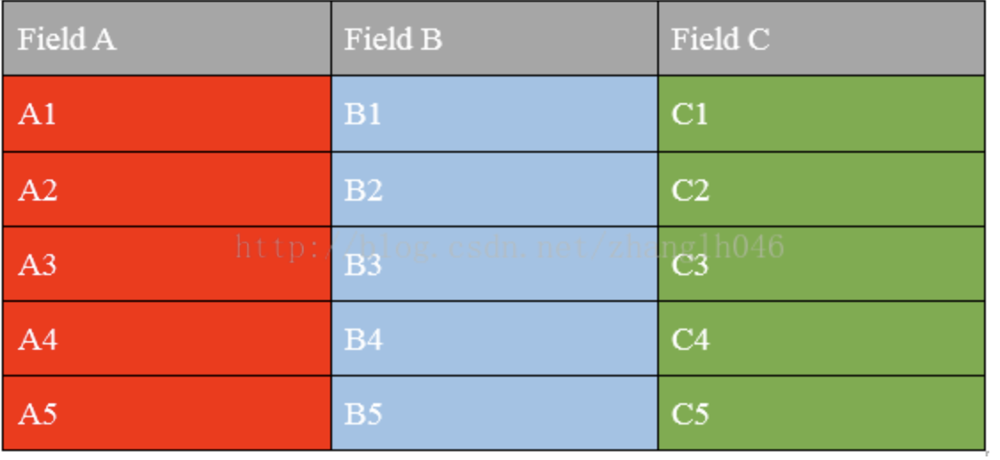

# Hive组件

## Hive简介

Facebook为了解决海量日志数据的分析而开发了Hive，后来开源给了Apache软件基金会。

> 官网定义：

> The Apache Hive ™ data warehouse software facilitates reading, writing, and managing large datasets residing in distributed storage using SQL.

Hive是一种用类SQL语句来协助读写、管理那些存储在分布式存储系统上大数据集的数据仓库软件。

### Hive的几个特点

* Hive最大的特点是通过类SQL来分析大数据，而避免了写MapReduce程序来分析数据，这样使得分析数据更容易。

* 数据是存储在HDFS上的，Hive本身并不提供数据的存储功能

* Hive是将数据映射成数据库和一张张的表，库和表的元数据信息一般存在关系型数据库上（比如MySQL）。

* 数据存储方面：它能够存储很大的数据集，并且对数据完整性、格式要求并不严格。

* 数据处理方面：因为Hive语句最终会生成MapReduce任务去计算，所以不适用于实时计算的场景，它适用于离线分析。

## Hive架构

### Hive的底层存储

Hive的数据是存储在HDFS上的。Hive中的库和表可以看作是对HDFS上数据做的一个映射。所以Hive必须是运行在一个Hadoop集群上的。

### Hive语句的执行过程

Hive中的执行器，是将最终要执行的MapReduce程序放到YARN上以一系列Job的方式去执行。

### Hive的元数据存储

Hive的元数据是一般是存储在MySQL这种关系型数据库上的，Hive和MySQL之间通过MetaStore服务交互。

## Hive重要概念

### 外部表和内部表

#### 内部表（managed table）

* 默认创建的是内部表（managed table），存储位置在`hive.metastore.warehouse.dir`设置，默认位置是`/user/hive/warehouse。`
* 导入数据的时候是将文件剪切（移动）到指定位置，即原有路径下文件不再存在
* 删除表的时候，数据和元数据都将被删除
* 默认创建的就是内部表`create table xxx (xx xxx)`

#### 外部表（external table）

* 外部表文件可以在外部系统上，只要有访问权限就可以
* 外部表导入文件时不移动文件，仅仅是添加一个metadata
* 删除外部表时原数据不会被删除
* 分辨外部表内部表可以使用`DESCRIBE FORMATTED table_name`命令查看
* 创建外部表命令添加一个external即可，即`create external table xxx `(xxx)
* 外部表指向的数据发生变化的时候会自动更新，不用特殊处理

### 分区表和桶表
#### 分区（partioned）

*  有些时候数据是有组织的，比方按日期/类型等分类，而查询数据的时候也经常只关心部分数据，比方说我只想查2017年8月8号，此时可以创建分区，查询具体某一天的数据时，不需要扫描全部目录，所以会明显优化性能
*  一个Hive表在HDFS上是有一个对应的目录来存储数据，普通表的数据直接存储在这个目录下，而分区表数据存储时，是再划分子目录来存储的
*  使用`partioned by (xxx)`来创建表的分区

#### 分桶（clustered）

*  分桶是相对分区进行更细粒度的划分。分桶将整个数据内容安装某列属性值得hash值进行区分，按照取模结果对数据分桶。如取模结果相同的数据记录存放到一个文件。
*  桶表也是一种用于优化查询而设计的表类型。创建通表时，指定桶的个数、分桶的依据字段，hive就可以自动将数据分桶存储。查询时只需要遍历一个桶里的数据，或者遍历部分桶，这样就提高了查询效率。

## Hive文件格式

hive文件存储格式包括以下几类：

* TEXTFILE
* SEQUENCEFILE
* RCFILE
* ORCFILE(0.11以后出现)

其中TEXTFILE为默认格式，建表时不指定默认为这个格式，导入数据时会直接把数据文件拷贝到hdfs上不进行处理；SEQUENCEFILE，RCFILE，ORCFILE格式的表不能直接从本地文件导入数据，数据要先导入到textfile格式的表中， 然后再从表中用insert导入SequenceFile,RCFile,ORCFile表中。

## 列式存储和行式存储

首先我们看一下一张表的存储格式

行式存储

列式存储

### 列式存储和行式存储的比较
#### 行式存储
优点：

* 相关的数据是保存在一起，比较符合面向对象的思维，因为一行数据就是一条记录
* 这种存储格式比较方便进行INSERT/UPDATE操作

缺点：

* 如果查询只涉及某几个列，它会把整行数据都读取出来，不能跳过不必要的列读取。当然数据比较少，一般没啥问题，如果数据量比较大就比较影响性能
* 由于每一行中，列的数据类型不一致，导致不容易获得一个极高的压缩比，也就是空间利用率不高
* 不是所有的列都适合作为索引

#### 列式存储

优点：

* 查询时，只有涉及到的列才会被查询，不会把所有列都查询出来，即可以跳过不必要的列查询
* 高效的压缩率，不仅节省储存空间也节省计算内存和CPU
* 任何列都可以作为索引

缺点：

* INSERT/UPDATE很麻烦或者不方便
* 不适合扫描小量的数据

## Hive安装相关文件位置及配置

* /usr/bin/  : 所有Hive相关命令的软链，它们会再软链到/etc/alternatives中去
* /var/lib/ : Hive服务相关数据目录
* /var/log/   :Hive相关服务运行日志目录
* /opt/cloudera/parcels/CDH/jars   : Hive所有相关服务的安装文件，包含jar包，配置文件以及执行命令等。
* /tmp  :所有Hive相关服务不同角色的OOM堆栈转存目录。以及所有角色启动的pid文件

## Hive架构
	node01:	192.168.1.89  
	node02:	192.168.1.98 
	node03:	192.168.115
	
	Gateway ： node01-node03
	Hive Metastore Server: node01
	WebHCat Server : node02
	HiveServer2 : node01
	
## Hive相关配置  

#### hdfs-site.xml
	
	<?xml version="1.0" encoding="UTF-8"?>
	
	<!--Autogenerated by Cloudera Manager-->
	<configuration>
	  <property>
	    <name>dfs.namenode.name.dir</name>
	    <value>file:///dfs/nn</value>
	  </property>
	  <property>
	    <name>dfs.namenode.servicerpc-address</name>
	    <value>node01:8022</value>
	  </property>
	  <property>
	    <name>dfs.https.address</name>
	    <value>node01:50470</value>
	  </property>
	  <property>
	    <name>dfs.https.port</name>
	    <value>50470</value>
	  </property>
	  <property>
	    <name>dfs.namenode.http-address</name>
	    <value>node01:50070</value>
	  </property>
	  <property>
	    <name>dfs.replication</name>
	    <value>3</value>
	  </property>
	  <property>
	    <name>dfs.blocksize</name>
	    <value>134217728</value>
	  </property>
	  <property>
	    <name>dfs.client.use.datanode.hostname</name>
	    <value>false</value>
	  </property>
	  <property>
	    <name>fs.permissions.umask-mode</name>
	    <value>022</value>
	  </property>
	  <property>
	    <name>dfs.namenode.acls.enabled</name>
	    <value>false</value>
	  </property>
	  <property>
	    <name>dfs.client.use.legacy.blockreader</name>
	    <value>false</value>
	  </property>
	  <property>
	    <name>dfs.client.read.shortcircuit</name>
	    <value>false</value>
	  </property>
	  <property>
	    <name>dfs.domain.socket.path</name>
	    <value>/var/run/hdfs-sockets/dn</value>
	  </property>
	  <property>
	    <name>dfs.client.read.shortcircuit.skip.checksum</name>
	    <value>false</value>
	  </property>
	  <property>
	    <name>dfs.client.domain.socket.data.traffic</name>
	    <value>false</value>
	  </property>
	  <property>
	    <name>dfs.datanode.hdfs-blocks-metadata.enabled</name>
	    <value>true</value>
	  </property>
	</configuration>
	
 

#### core-site.xml

	<?xml version="1.0" encoding="UTF-8"?>
	
	<!--Autogenerated by Cloudera Manager-->
	<configuration>
	  <property>
	    <name>fs.defaultFS</name>
	    <value>hdfs://node01:8020</value>
	  </property>
	  <property>
	    <name>fs.trash.interval</name>
	    <value>1</value>
	  </property>
	  <property>
	    <name>io.compression.codecs</name>
	    <value>org.apache.hadoop.io.compress.DefaultCodec,org.apache.hadoop.io.compress.GzipCodec,org.apache.hadoop.io.compress.BZip2Codec,org.apache.hadoop.io.compress.DeflateCodec,org.apache.hadoop.io.compress.SnappyCodec,org.apache.hadoop.io.compress.Lz4Codec</value>
	  </property>
	  <property>
	    <name>hadoop.security.authentication</name>
	    <value>simple</value>
	  </property>
	  <property>
	    <name>hadoop.security.authorization</name>
	    <value>false</value>
	  </property>
	  <property>
	    <name>hadoop.rpc.protection</name>
	    <value>authentication</value>
	  </property>
	  <property>
	    <name>hadoop.security.auth_to_local</name>
	    <value>DEFAULT</value>
	  </property>
	  <property>
	    <name>hadoop.proxyuser.oozie.hosts</name>
	    <value>*</value>
	  </property>
	  <property>
	    <name>hadoop.proxyuser.oozie.groups</name>
	    <value>*</value>
	  </property>
	  <property>
	    <name>hadoop.proxyuser.mapred.hosts</name>
	    <value>*</value>
	  </property>
	  <property>
	    <name>hadoop.proxyuser.mapred.groups</name>
	    <value>*</value>
	  </property>
	  <property>
	    <name>hadoop.proxyuser.flume.hosts</name>
	    <value>*</value>
	  </property>
	  <property>
	    <name>hadoop.proxyuser.flume.groups</name>
	    <value>*</value>
	  </property>
	  <property>
	    <name>hadoop.proxyuser.HTTP.hosts</name>
	    <value>*</value>
	  </property>
	  <property>
	    <name>hadoop.proxyuser.HTTP.groups</name>
	    <value>*</value>
	  </property>
	  <property>
	    <name>hadoop.proxyuser.hive.hosts</name>
	    <value>*</value>
	  </property>
	  <property>
	    <name>hadoop.proxyuser.hive.groups</name>
	    <value>*</value>
	  </property>
	  <property>
	    <name>hadoop.proxyuser.hue.hosts</name>
	    <value>*</value>
	  </property>
	  <property>
	    <name>hadoop.proxyuser.hue.groups</name>
	    <value>*</value>
	  </property>
	  <property>
	    <name>hadoop.proxyuser.httpfs.hosts</name>
	    <value>*</value>
	  </property>
	  <property>
	    <name>hadoop.proxyuser.httpfs.groups</name>
	    <value>*</value>
	  </property>
	  <property>
	    <name>hadoop.proxyuser.hdfs.groups</name>
	    <value>*</value>
	  </property>
	  <property>
	    <name>hadoop.proxyuser.hdfs.hosts</name>
	    <value>*</value>
	  </property>
	  <property>
	    <name>hadoop.proxyuser.yarn.hosts</name>
	    <value>*</value>
	  </property>
	  <property>
	    <name>hadoop.proxyuser.yarn.groups</name>
	    <value>*</value>
	  </property>
	  <property>
	    <name>hadoop.security.group.mapping</name>
	    <value>org.apache.hadoop.security.ShellBasedUnixGroupsMapping</value>
	  </property>
	  <property>
	    <name>hadoop.security.instrumentation.requires.admin</name>
	    <value>false</value>
	  </property>
	  <property>
	    <name>net.topology.script.file.name</name>
	    <value>/etc/hadoop/conf.cloudera.yarn/topology.py</value>
	  </property>
	  <property>
	    <name>io.file.buffer.size</name>
	    <value>65536</value>
	  </property>
	  <property>
	    <name>hadoop.ssl.enabled</name>
	    <value>false</value>
	  </property>
	  <property>
	    <name>hadoop.ssl.require.client.cert</name>
	    <value>false</value>
	    <final>true</final>
	  </property>
	  <property>
	    <name>hadoop.ssl.keystores.factory.class</name>
	    <value>org.apache.hadoop.security.ssl.FileBasedKeyStoresFactory</value>
	    <final>true</final>
	  </property>
	  <property>
	    <name>hadoop.ssl.server.conf</name>
	    <value>ssl-server.xml</value>
	    <final>true</final>
	  </property>
	  <property>
	    <name>hadoop.ssl.client.conf</name>
	    <value>ssl-client.xml</value>
	    <final>true</final>
	  </property>
	</configuration>

 

#### hive-env.sh

	# HIVE_AUX_JARS_PATH={{HIVE_AUX_JARS_PATH}}
	# JAVA_LIBRARY_PATH={{JAVA_LIBRARY_PATH}}
	export HADOOP_CONF_DIR="${HADOOP_CONF_DIR:-"$( cd "$( dirname "${BASH_SOURCE[0]}" )" && pwd )"}"
	HBASE_HIVE_DEFAULT_JAR=$(find /usr/lib/hive/lib -name hive-hbase-handler-*.jar 2> /dev/null | tail -n 1),$(sed "s: :,:g" <<< $(find /usr/lib/hbase -regextype posix-egrep -regex "/usr/lib/hbase/(hbase|hbase-client|hbase-server|hbase-protocol|hbase-common|hbase-hadoop-compat|hbase-hadoop2-compat|(lib/htrace-core.*)).jar" 2> /dev/null))
	HIVE_AUX_JARS_PATH=$([[ -n $HIVE_AUX_JARS_PATH ]] && echo $HIVE_AUX_JARS_PATH,)$( ([[ ! '/opt/cloudera/parcels/CDH-5.12.1-1.cdh5.12.1.p0.3/lib/hive/lib/hive-hbase-handler-1.1.0-cdh5.12.1.jar,/opt/cloudera/parcels/CDH-5.12.1-1.cdh5.12.1.p0.3/lib/hbase/hbase-client.jar,/opt/cloudera/parcels/CDH-5.12.1-1.cdh5.12.1.p0.3/lib/hbase/hbase-common.jar,/opt/cloudera/parcels/CDH-5.12.1-1.cdh5.12.1.p0.3/lib/hbase/hbase-hadoop-compat.jar,/opt/cloudera/parcels/CDH-5.12.1-1.cdh5.12.1.p0.3/lib/hbase/hbase-hadoop2-compat.jar,/opt/cloudera/parcels/CDH-5.12.1-1.cdh5.12.1.p0.3/lib/hbase/hbase-protocol.jar,/opt/cloudera/parcels/CDH-5.12.1-1.cdh5.12.1.p0.3/lib/hbase/hbase-server.jar,/opt/cloudera/parcels/CDH-5.12.1-1.cdh5.12.1.p0.3/lib/hbase/lib/htrace-core-3.2.0-incubating.jar,/opt/cloudera/parcels/CDH-5.12.1-1.cdh5.12.1.p0.3/lib/hbase/lib/htrace-core.jar,/opt/cloudera/parcels/CDH-5.12.1-1.cdh5.12.1.p0.3/lib/hbase/lib/htrace-core4-4.0.1-incubating.jar' =~ HIVE_HBASE_JAR ]] &&  echo /opt/cloudera/parcels/CDH-5.12.1-1.cdh5.12.1.p0.3/lib/hive/lib/hive-hbase-handler-1.1.0-cdh5.12.1.jar,/opt/cloudera/parcels/CDH-5.12.1-1.cdh5.12.1.p0.3/lib/hbase/hbase-client.jar,/opt/cloudera/parcels/CDH-5.12.1-1.cdh5.12.1.p0.3/lib/hbase/hbase-common.jar,/opt/cloudera/parcels/CDH-5.12.1-1.cdh5.12.1.p0.3/lib/hbase/hbase-hadoop-compat.jar,/opt/cloudera/parcels/CDH-5.12.1-1.cdh5.12.1.p0.3/lib/hbase/hbase-hadoop2-compat.jar,/opt/cloudera/parcels/CDH-5.12.1-1.cdh5.12.1.p0.3/lib/hbase/hbase-protocol.jar,/opt/cloudera/parcels/CDH-5.12.1-1.cdh5.12.1.p0.3/lib/hbase/hbase-server.jar,/opt/cloudera/parcels/CDH-5.12.1-1.cdh5.12.1.p0.3/lib/hbase/lib/htrace-core-3.2.0-incubating.jar,/opt/cloudera/parcels/CDH-5.12.1-1.cdh5.12.1.p0.3/lib/hbase/lib/htrace-core.jar,/opt/cloudera/parcels/CDH-5.12.1-1.cdh5.12.1.p0.3/lib/hbase/lib/htrace-core4-4.0.1-incubating.jar) || echo ${HBASE_HIVE_DEFAULT_JAR:-}),$(find /usr/share/java/mysql-connector-java.jar 2> /dev/null),$(find /usr/share/cmf/lib/postgresql-*jdbc*.jar 2> /dev/null | tail -n 1),$(find /usr/share/java/oracle-connector-java.jar 2> /dev/null)
	export HIVE_AUX_JARS_PATH=$(echo $HIVE_AUX_JARS_PATH | sed 's/,,*/,/g' | sed 's/^,//' | sed 's/,$//')
	export HADOOP_CLIENT_OPTS="-Xmx2147483648 -XX:MaxPermSize=512M -Djava.net.preferIPv4Stack=true $HADOOP_CLIENT_OPTS"

 

#### hive-site.xml

	<?xml version="1.0" encoding="UTF-8"?>
	
	<!--Autogenerated by Cloudera Manager-->
	<configuration>
	  <property>
	    <name>hive.metastore.uris</name>
	    <value>thrift://node01:9083</value>
	  </property>
	  <property>
	    <name>hive.metastore.client.socket.timeout</name>
	    <value>300</value>
	  </property>
	  <property>
	    <name>hive.metastore.warehouse.dir</name>
	    <value>/user/hive/warehouse</value>
	  </property>
	  <property>
	    <name>hive.warehouse.subdir.inherit.perms</name>
	    <value>true</value>
	  </property>
	  <property>
	    <name>hive.auto.convert.join</name>
	    <value>true</value>
	  </property>
	  <property>
	    <name>hive.auto.convert.join.noconditionaltask.size</name>
	    <value>20971520</value>
	  </property>
	  <property>
	    <name>hive.optimize.bucketmapjoin.sortedmerge</name>
	    <value>false</value>
	  </property>
	  <property>
	    <name>hive.smbjoin.cache.rows</name>
	    <value>10000</value>
	  </property>
	  <property>
	    <name>hive.server2.logging.operation.enabled</name>
	    <value>true</value>
	  </property>
	  <property>
	    <name>hive.server2.logging.operation.log.location</name>
	    <value>/var/log/hive/operation_logs</value>
	  </property>
	  <property>
	    <name>mapred.reduce.tasks</name>
	    <value>-1</value>
	  </property>
	  <property>
	    <name>hive.exec.reducers.bytes.per.reducer</name>
	    <value>67108864</value>
	  </property>
	  <property>
	    <name>hive.exec.copyfile.maxsize</name>
	    <value>33554432</value>
	  </property>
	  <property>
	    <name>hive.exec.reducers.max</name>
	    <value>1099</value>
	  </property>
	  <property>
	    <name>hive.vectorized.groupby.checkinterval</name>
	    <value>4096</value>
	  </property>
	  <property>
	    <name>hive.vectorized.groupby.flush.percent</name>
	    <value>0.1</value>
	  </property>
	  <property>
	    <name>hive.compute.query.using.stats</name>
	    <value>false</value>
	  </property>
	  <property>
	    <name>hive.vectorized.execution.enabled</name>
	    <value>true</value>
	  </property>
	  <property>
	    <name>hive.vectorized.execution.reduce.enabled</name>
	    <value>false</value>
	  </property>
	  <property>
	    <name>hive.merge.mapfiles</name>
	    <value>true</value>
	  </property>
	  <property>
	    <name>hive.merge.mapredfiles</name>
	    <value>false</value>
	  </property>
	  <property>
	    <name>hive.cbo.enable</name>
	    <value>false</value>
	  </property>
	  <property>
	    <name>hive.fetch.task.conversion</name>
	    <value>minimal</value>
	  </property>
	  <property>
	    <name>hive.fetch.task.conversion.threshold</name>
	    <value>268435456</value>
	  </property>
	  <property>
	    <name>hive.limit.pushdown.memory.usage</name>
	    <value>0.1</value>
	  </property>
	  <property>
	    <name>hive.merge.sparkfiles</name>
	    <value>true</value>
	  </property>
	  <property>
	    <name>hive.merge.smallfiles.avgsize</name>
	    <value>16777216</value>
	  </property>
	  <property>
	    <name>hive.merge.size.per.task</name>
	    <value>268435456</value>
	  </property>
	  <property>
	    <name>hive.optimize.reducededuplication</name>
	    <value>true</value>
	  </property>
	  <property>
	    <name>hive.optimize.reducededuplication.min.reducer</name>
	    <value>4</value>
	  </property>
	  <property>
	    <name>hive.map.aggr</name>
	    <value>true</value>
	  </property>
	  <property>
	    <name>hive.map.aggr.hash.percentmemory</name>
	    <value>0.5</value>
	  </property>
	  <property>
	    <name>hive.optimize.sort.dynamic.partition</name>
	    <value>false</value>
	  </property>
	  <property>
	    <name>hive.execution.engine</name>
	    <value>mr</value>
	  </property>
	  <property>
	    <name>spark.executor.memory</name>
	    <value>228170137</value>
	  </property>
	  <property>
	    <name>spark.driver.memory</name>
	    <value>966367641</value>
	  </property>
	  <property>
	    <name>spark.executor.cores</name>
	    <value>4</value>
	  </property>
	  <property>
	    <name>spark.yarn.driver.memoryOverhead</name>
	    <value>102</value>
	  </property>
	  <property>
	    <name>spark.yarn.executor.memoryOverhead</name>
	    <value>38</value>
	  </property>
	  <property>
	    <name>spark.dynamicAllocation.enabled</name>
	    <value>true</value>
	  </property>
	  <property>
	    <name>spark.dynamicAllocation.initialExecutors</name>
	    <value>1</value>
	  </property>
	  <property>
	    <name>spark.dynamicAllocation.minExecutors</name>
	    <value>1</value>
	  </property>
	  <property>
	    <name>spark.dynamicAllocation.maxExecutors</name>
	    <value>2147483647</value>
	  </property>
	  <property>
	    <name>hive.metastore.execute.setugi</name>
	    <value>true</value>
	  </property>
	  <property>
	    <name>hive.support.concurrency</name>
	    <value>true</value>
	  </property>
	  <property>
	    <name>hive.zookeeper.quorum</name>
	    <value>node02,node03,node01</value>
	  </property>
	  <property>
	    <name>hive.zookeeper.client.port</name>
	    <value>2181</value>
	  </property>
	  <property>
	    <name>hive.zookeeper.namespace</name>
	    <value>hive_zookeeper_namespace_hive</value>
	  </property>
	  <property>
	    <name>hive.cluster.delegation.token.store.class</name>
	    <value>org.apache.hadoop.hive.thrift.MemoryTokenStore</value>
	  </property>
	  <property>
	    <name>hive.server2.enable.doAs</name>
	    <value>true</value>
	  </property>
	  <property>
	    <name>hive.server2.use.SSL</name>
	    <value>false</value>
	  </property>
	  <property>
	    <name>spark.shuffle.service.enabled</name>
	    <value>true</value>
	  </property>
	</configuration>

 

#### mapred-site.xml

	<?xml version="1.0" encoding="UTF-8"?>
	
	<!--Autogenerated by Cloudera Manager-->
	<configuration>
	  <property>
	    <name>mapreduce.job.split.metainfo.maxsize</name>
	    <value>10000000</value>
	  </property>
	  <property>
	    <name>mapreduce.job.counters.max</name>
	    <value>120</value>
	  </property>
	  <property>
	    <name>mapreduce.job.counters.groups.max</name>
	    <value>50</value>
	  </property>
	  <property>
	    <name>mapreduce.output.fileoutputformat.compress</name>
	    <value>false</value>
	  </property>
	  <property>
	    <name>mapreduce.output.fileoutputformat.compress.type</name>
	    <value>BLOCK</value>
	  </property>
	  <property>
	    <name>mapreduce.output.fileoutputformat.compress.codec</name>
	    <value>org.apache.hadoop.io.compress.DefaultCodec</value>
	  </property>
	  <property>
	    <name>mapreduce.map.output.compress.codec</name>
	    <value>org.apache.hadoop.io.compress.SnappyCodec</value>
	  </property>
	  <property>
	    <name>mapreduce.map.output.compress</name>
	    <value>true</value>
	  </property>
	  <property>
	    <name>zlib.compress.level</name>
	    <value>DEFAULT_COMPRESSION</value>
	  </property>
	  <property>
	    <name>mapreduce.task.io.sort.factor</name>
	    <value>64</value>
	  </property>
	  <property>
	    <name>mapreduce.map.sort.spill.percent</name>
	    <value>0.8</value>
	  </property>
	  <property>
	    <name>mapreduce.reduce.shuffle.parallelcopies</name>
	    <value>10</value>
	  </property>
	  <property>
	    <name>mapreduce.task.timeout</name>
	    <value>600000</value>
	  </property>
	  <property>
	    <name>mapreduce.client.submit.file.replication</name>
	    <value>3</value>
	  </property>
	  <property>
	    <name>mapreduce.job.reduces</name>
	    <value>24</value>
	  </property>
	  <property>
	    <name>mapreduce.task.io.sort.mb</name>
	    <value>256</value>
	  </property>
	  <property>
	    <name>mapreduce.map.speculative</name>
	    <value>false</value>
	  </property>
	  <property>
	    <name>mapreduce.reduce.speculative</name>
	    <value>false</value>
	  </property>
	  <property>
	    <name>mapreduce.job.reduce.slowstart.completedmaps</name>
	    <value>0.8</value>
	  </property>
	  <property>
	    <name>mapreduce.jobhistory.address</name>
	    <value>node01:10020</value>
	  </property>
	  <property>
	    <name>mapreduce.jobhistory.webapp.address</name>
	    <value>node01:19888</value>
	  </property>
	  <property>
	    <name>mapreduce.jobhistory.webapp.https.address</name>
	    <value>node01:19890</value>
	  </property>
	  <property>
	    <name>mapreduce.jobhistory.admin.address</name>
	    <value>node01:10033</value>
	  </property>
	  <property>
	    <name>mapreduce.framework.name</name>
	    <value>yarn</value>
	  </property>
	  <property>
	    <name>yarn.app.mapreduce.am.staging-dir</name>
	    <value>/user</value>
	  </property>
	  <property>
	    <name>mapreduce.am.max-attempts</name>
	    <value>2</value>
	  </property>
	  <property>
	    <name>yarn.app.mapreduce.am.resource.mb</name>
	    <value>1024</value>
	  </property>
	  <property>
	    <name>yarn.app.mapreduce.am.resource.cpu-vcores</name>
	    <value>1</value>
	  </property>
	  <property>
	    <name>mapreduce.job.ubertask.enable</name>
	    <value>false</value>
	  </property>
	  <property>
	    <name>yarn.app.mapreduce.am.command-opts</name>
	    <value>-Djava.net.preferIPv4Stack=true -Xmx825955249</value>
	  </property>
	  <property>
	    <name>mapreduce.map.java.opts</name>
	    <value>-Djava.net.preferIPv4Stack=true</value>
	  </property>
	  <property>
	    <name>mapreduce.reduce.java.opts</name>
	    <value>-Djava.net.preferIPv4Stack=true</value>
	  </property>
	  <property>
	    <name>yarn.app.mapreduce.am.admin.user.env</name>
	    <value>LD_LIBRARY_PATH=$HADOOP_COMMON_HOME/lib/native:$JAVA_LIBRARY_PATH</value>
	  </property>
	  <property>
	    <name>mapreduce.map.memory.mb</name>
	    <value>0</value>
	  </property>
	  <property>
	    <name>mapreduce.map.cpu.vcores</name>
	    <value>1</value>
	  </property>
	  <property>
	    <name>mapreduce.reduce.memory.mb</name>
	    <value>0</value>
	  </property>
	  <property>
	    <name>mapreduce.reduce.cpu.vcores</name>
	    <value>1</value>
	  </property>
	  <property>
	    <name>mapreduce.job.heap.memory-mb.ratio</name>
	    <value>0.8</value>
	  </property>
	  <property>
	    <name>mapreduce.application.classpath</name>
	    <value>$HADOOP_MAPRED_HOME/*,$HADOOP_MAPRED_HOME/lib/*,$MR2_CLASSPATH</value>
	  </property>
	  <property>
	    <name>mapreduce.jobhistory.jhist.format</name>
	    <value>binary</value>
	  </property>
	  <property>
	    <name>mapreduce.admin.user.env</name>
	    <value>LD_LIBRARY_PATH=$HADOOP_COMMON_HOME/lib/native:$JAVA_LIBRARY_PATH</value>
	  </property>
	  <property>
	    <name>mapreduce.job.redacted-properties</name>
	    <value>fs.s3a.access.key,fs.s3a.secret.key</value>
	  </property>
	  <property>
	    <name>mapreduce.job.acl-view-job</name>
	    <value> </value>
	  </property>
	  <property>
	    <name>mapreduce.job.acl-modify-job</name>
	    <value> </value>
	  </property>
	  <property>
	    <name>mapreduce.cluster.acls.enabled</name>
	    <value>false</value>
	  </property>
	</configuration>

 

#### ssl-client.xml

	<?xml version="1.0" encoding="UTF-8"?>

	<!--Autogenerated by Cloudera Manager-->
	<configuration>
	  <property>
	    <name>ssl.client.truststore.type</name>
	    <value>jks</value>
	  </property>
	  <property>
	    <name>ssl.client.truststore.reload.interval</name>
	    <value>10000</value>
	  </property>
	</configuration>	
	
 

#### yarn-site.xml

	<?xml version="1.0" encoding="UTF-8"?>
	
	<!--Autogenerated by Cloudera Manager-->
	<configuration>
	  <property>
	    <name>yarn.acl.enable</name>
	    <value>true</value>
	  </property>
	  <property>
	    <name>yarn.admin.acl</name>
	    <value>*</value>
	  </property>
	  <property>
	    <name>yarn.resourcemanager.address</name>
	    <value>node01:8032</value>
	  </property>
	  <property>
	    <name>yarn.resourcemanager.admin.address</name>
	    <value>node01:8033</value>
	  </property>
	  <property>
	    <name>yarn.resourcemanager.scheduler.address</name>
	    <value>node01:8030</value>
	  </property>
	  <property>
	    <name>yarn.resourcemanager.resource-tracker.address</name>
	    <value>node01:8031</value>
	  </property>
	  <property>
	    <name>yarn.resourcemanager.webapp.address</name>
	    <value>node01:8088</value>
	  </property>
	  <property>
	    <name>yarn.resourcemanager.webapp.https.address</name>
	    <value>node01:8090</value>
	  </property>
	  <property>
	    <name>yarn.resourcemanager.client.thread-count</name>
	    <value>50</value>
	  </property>
	  <property>
	    <name>yarn.resourcemanager.scheduler.client.thread-count</name>
	    <value>50</value>
	  </property>
	  <property>
	    <name>yarn.resourcemanager.admin.client.thread-count</name>
	    <value>1</value>
	  </property>
	  <property>
	    <name>yarn.scheduler.minimum-allocation-mb</name>
	    <value>1024</value>
	  </property>
	  <property>
	    <name>yarn.scheduler.increment-allocation-mb</name>
	    <value>512</value>
	  </property>
	  <property>
	    <name>yarn.scheduler.maximum-allocation-mb</name>
	    <value>2745</value>
	  </property>
	  <property>
	    <name>yarn.scheduler.minimum-allocation-vcores</name>
	    <value>1</value>
	  </property>
	  <property>
	    <name>yarn.scheduler.increment-allocation-vcores</name>
	    <value>1</value>
	  </property>
	  <property>
	    <name>yarn.scheduler.maximum-allocation-vcores</name>
	    <value>16</value>
	  </property>
	  <property>
	    <name>yarn.resourcemanager.amliveliness-monitor.interval-ms</name>
	    <value>1000</value>
	  </property>
	  <property>
	    <name>yarn.am.liveness-monitor.expiry-interval-ms</name>
	    <value>600000</value>
	  </property>
	  <property>
	    <name>yarn.resourcemanager.am.max-attempts</name>
	    <value>2</value>
	  </property>
	  <property>
	    <name>yarn.resourcemanager.container.liveness-monitor.interval-ms</name>
	    <value>600000</value>
	  </property>
	  <property>
	    <name>yarn.resourcemanager.nm.liveness-monitor.interval-ms</name>
	    <value>1000</value>
	  </property>
	  <property>
	    <name>yarn.nm.liveness-monitor.expiry-interval-ms</name>
	    <value>600000</value>
	  </property>
	  <property>
	    <name>yarn.resourcemanager.resource-tracker.client.thread-count</name>
	    <value>50</value>
	  </property>
	  <property>
	    <name>yarn.application.classpath</name>
	    <value>$HADOOP_CLIENT_CONF_DIR,$HADOOP_CONF_DIR,$HADOOP_COMMON_HOME/*,$HADOOP_COMMON_HOME/lib/*,$HADOOP_HDFS_HOME/*,$HADOOP_HDFS_HOME/lib/*,$HADOOP_YARN_HOME/*,$HADOOP_YARN_HOME/lib/*</value>
	  </property>
	  <property>
	    <name>yarn.resourcemanager.scheduler.class</name>
	    <value>org.apache.hadoop.yarn.server.resourcemanager.scheduler.fair.FairScheduler</value>
	  </property>
	  <property>
	    <name>yarn.resourcemanager.max-completed-applications</name>
	    <value>10000</value>
	  </property>
	  <property>
	    <name>yarn.nodemanager.remote-app-log-dir</name>
	    <value>/tmp/logs</value>
	  </property>
	  <property>
	    <name>yarn.nodemanager.remote-app-log-dir-suffix</name>
	    <value>logs</value>
	  </property>
	</configuration>

