# Kudu组件

## 背景

 在 KUDU 之前，大数据主要以两种方式存储：

* 静态数据：以 HDFS 引擎作为存储引擎，适用于高吞吐量的离线大数据分析场景。这类存储的局限性是数据无法进行随机的读写。
* 动态数据：以 HBase、Cassandra 作为存储引擎，适用于大数据随机读写场景。这类存储的局限性是批量读取吞吐量远不如 HDFS，不适用于批量数据分析的场景。

从上面分析可知，这两种数据在存储方式上完全不同，进而导致使用场景完全不同，但在真实的场景中，边界可能没有那么清晰，面对既需要随机读写，又需要批量分析的大数据场景，该如何选择呢？这个场景中，单种存储引擎无法满足业务需求，我们需要通过多种大数据工具组合来满足这一需求，一个常见的方案是：

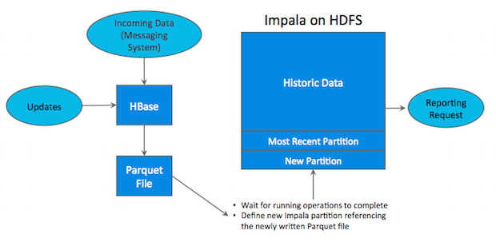

如上图所示，数据实时写入 HBase，实时的数据更新也在 HBase 完成，为了应对 OLAP 需求，我们定时（通常是 T+1 或者 T+H）将 HBase 数据写成静态的文件（如：Parquet）导入到 OLAP 引擎（如：HDFS）。这一架构能满足既需要随机读写，又可以支持 OLAP 分析的场景，但他有如下缺点：

* **架构复杂**：从架构上看，数据在 HBase、消息队列、HDFS 间流转，涉及环节太多，运维成本很高。并且每个环节需要保证高可用，都需要维护多个副本，存储空间也有一定的浪费。最后数据在多个系统上，对数据安全策略、监控等都提出了挑战。
*  **时效性低**：数据从 HBase 导出成静态文件是周期性的，一般这个周期是一天（或一小时），在时效性上不是很高。
*  **难以应对后续的更新**：真实场景中，总会有数据是「延迟」到达的。如果这些数据之前已经从 HBase 导出到 HDFS，新到的变更数据就难以处理了，一个方案是把原有数据应用上新的变更后重写一遍，但这代价又很高。

为了解决上述架构的这些问题，KUDU 应运而生。KUDU 的定位是 「Fast Analytics on Fast Data」，是一个既支持随机读写、又支持 OLAP 分析的大数据存储引擎。

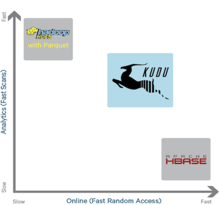

从上图可以看出，KUDU 是一个「折中」的产品，在 HDFS 和 HBase 这两个偏科生中平衡了随机读写和批量分析的性能。从 KUDU 的诞生可以说明一个观点：底层的技术发展很多时候都是上层的业务推动的，脱离业务的技术很可能是「空中楼阁」。

## KUDU的数据模型

KUDU 的数据模型与传统的关系型数据库类似，一个 KUDU 集群由多个表组成，每个表由多个字段组成，一个表必须指定一个由若干个（>=1）字段组成的主键，如下图：

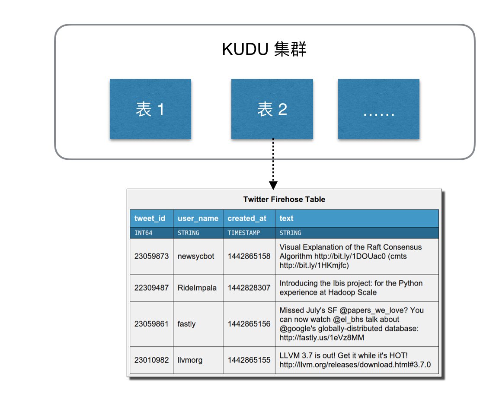

KUDU 表中的每个字段是强类型的，而不是 HBase 那样所有字段都认为是 bytes。这样做的好处是可以对不同类型数据进行不同的编码，节省空间。同时，因为 KUDU 的使用场景是 OLAP 分析，有一个数据类型对下游的分析工具也更加友好。

## KUDU的核心 API

KUDU 的对外 API 主要分为写跟读两部分。其中写包括：Insert、Update、Delete，所有写操作都必须指定主键；读 KUDU 对外只提供了 Scan 操作，Scan 时用户可以指定一个或多个过滤器，用于过滤数据。

## KDUDU的一致性模型

跟大多数关系型数据库一样，KUDU 也是通过 MVCC（Multi-Version Concurrency Control）来实现内部的事务隔离。KUDU 默认的一致性模型是 Snapshot Consistency，即客户端可以一致的访问到某个时间点的一个快照。

如果有更高的外部一致性（external consistency）需求，KUDU 目前还没有实现，不过 KUDU 提供了一些设计方案。这里先介绍下外部一致性，它是指：多个事务并发执行达到串行效果，并且保证修改时间戳严格按照事务发生先后顺序，即如果有先后两个事务 A、B， A 发生在 B 之前，那么对于客户端来说，要么看到 A，要么看到 A、B，不会只看到 B 而看不到 A。KUDU 提供了两个实现外部一致性的方案：

* 方案一：在各个 Client 之间传播带有时间戳的 token，大致思路是 Client 提交完一个写请求后，生成一个带时间戳的 token，然后把这个 token 传播给其他客户端，其他客户端请求的时候可以带上这个 token。
* 方案二：类似 Google Spanner 的方案，通过 commit-wait 机制实现外部一致性。

## KUDU的整体架构

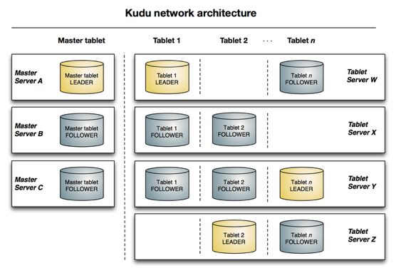

KUDU 中存在两个角色

* Mater Server：负责集群管理、元数据管理等功能
* Tablet Server：负责数据存储，并提供数据读写服务

为了实现分区容错性，跟其他大数据产品一样，对于每个角色，在 KUDU 中都可以设置特定数量（一般是 3 或 5）的副本。各副本间通过 Raft 协议来保证数据一致性。Raft 协议与 ZAB 类似，都是 Paxos 协议的工程简化版本。

KUDU Client 在与服务端交互时，先从 Master Server 获取元数据信息，然后去 Tablet Server 读写数据，如下图：

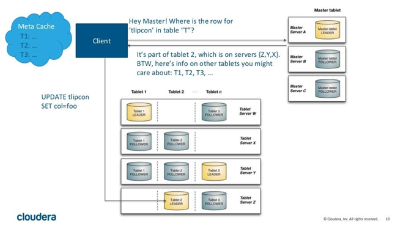

## KUDU的数据分区策略

与大多数大数据存储引擎类似，KUDU 对表进行横向分区，KUDU 表会被横向切分存储在多个 tablets 中。不过相比与其他存储引擎，KUDU 提供了更加丰富灵活的数据分区策略。

一般数据分区策略主要有两种，一种是 Range Partitioning，按照字段值范围进行分区，HBase 就采用了这种方式，如下图：

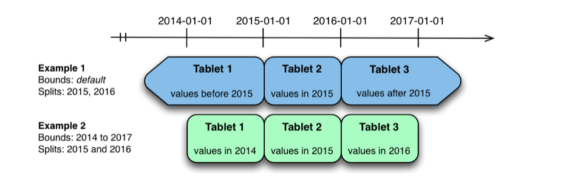

Range Partitioning 的优势是在数据进行批量读的时候，可以把大部分的读变成同一个 tablet 中的顺序读，能够提升数据读取的吞吐量。并且按照范围进行分区，我们可以很方便的进行分区扩展。其劣势是同一个范围内的数据写入都会落在单个 tablet 上，写的压力大，速度慢。

另一种分区策略是 Hash Partitioning，按照字段的 Hash 值进行分区，Cassandra 采用了这个方式，见下图：

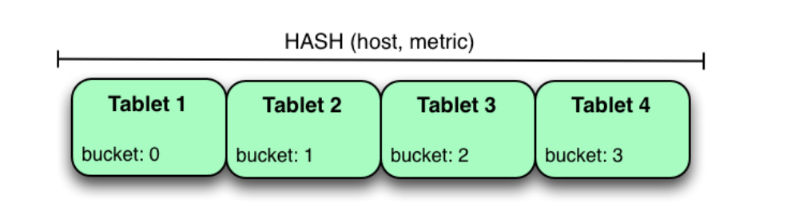

与 Range Partitioning 相反，由于是 Hash 分区，数据的写入会被均匀的分散到各个 tablet 中，写入速度快。但是对于顺序读的场景这一策略就不太适用了，因为数据分散，一次顺序读需要将各个 tablet 中的数据分别读取并组合，吞吐量低。并且 Hash 分区无法应对分区扩展的情况。

各种分区策略的优劣对比见下图：

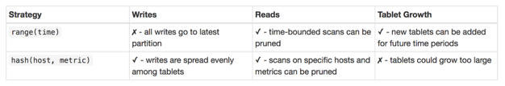

既然各分区策略各有优劣，能否将不同分区策略进行组合，取长补短呢？这也是 KUDU 的思路，KUDU 支持用户对一个表指定一个范围分区规则和多个 Hash 分区规则，如下图：

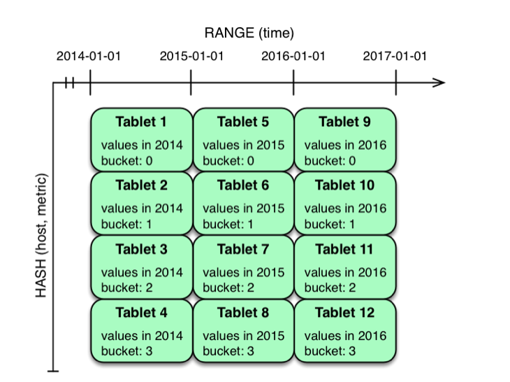

## KUDU的存储
### 存储设计目标
* 快速的列扫描
* 低延迟的随机更新
* 稳定的性能表现

### 存储方式

KUDU 是一个列式存储的存储引擎，其数据存储方式如下：
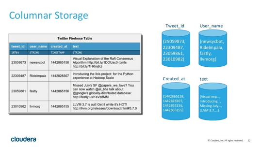

列式存储的数据库很适合于 OLAP 场景，其特点如下：

* 优势
	* 查询少量列时 IO 少，速度快
	* 数据压缩比高
	* 便于查询引擎性能优化：延迟物化、直接操作压缩数据、向量化执行

* 劣势
	* 查询列太多时性能下降（KUDU 建议列数不超过 300 ）
	* 不适合 OLTP 场景

### 存储实现

与其他大数据存储引擎类似，KUDU 的存储也是通过 LSM 树（Log-Structured Merge Tree）来实现的。KUDU 的最小存储单元是 RowSets，KUDU 中存在两种 RowSets：MemRowSets、DiskRowSets，数据先写内存中的 MemRowSet，MemRowSet 满了后刷到磁盘成为一个 DiskRowSet，DiskRowSet 一经写入，就无法修改了。见下图：

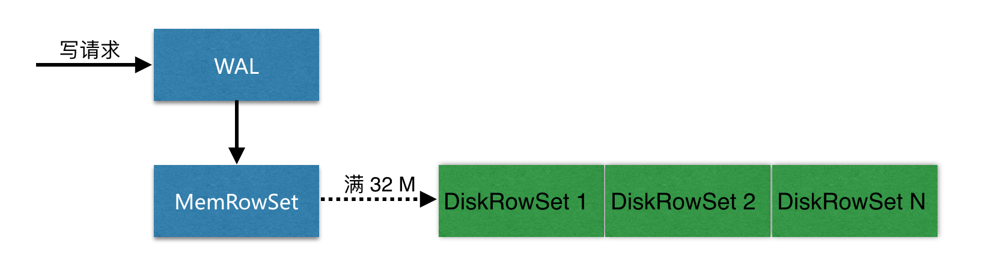

上面只是最粗粒度的一个写入过程，为了解释 KUDU 的为什么既能支持随机读写，又能支持大数据量的 OLAP 分析，需要更进一步进行解剖分析。需求探究的主要两个问题是：

* 如何应对数据变更？
* 如何优化读写性能以满足 OLAP 场景？

#### 应对数据变更
首先，DiskRowSet 是不可修改了，那么 KUDU 要如何应对数据的更新呢？在 KUDU 中，把 DiskRowSet 分为了两部分：base data、delta stores。base data 负责存储基础数据，delta stores负责存储 base data 中的变更数据。整个数据更新方案如下:

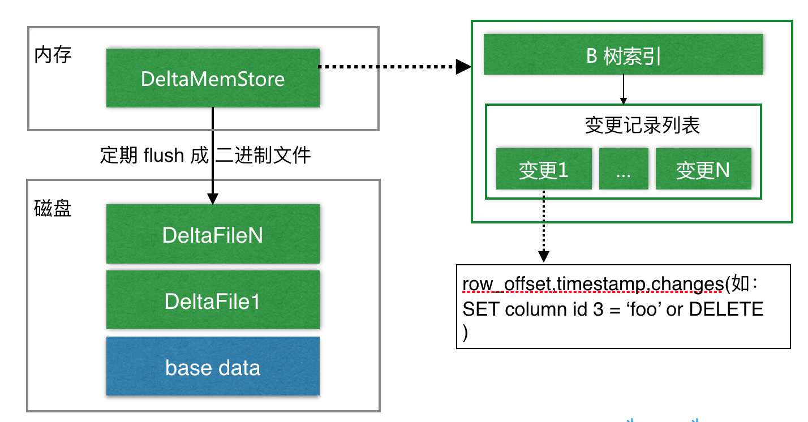

如上图所示，数据从 MemRowSet 刷到磁盘后就形成了一份 DiskRowSet（只包含 base data），每份 DiskRowSet 在内存中都会有一个对应的 DeltaMemStore，负责记录此 DiskRowSet 后续的数据变更（更新、删除）。DeltaMemStore 内部维护一个 B-树索引，映射到每个 row_offset 对应的数据变更。DeltaMemStore 数据增长到一定程度后转化成二进制文件存储到磁盘，形成一个 DeltaFile，随着 base data 对应数据的不断变更，DeltaFile 逐渐增长。

#### 优化读写性能

首先从 KUDU 的 DiskRowSet 数据结构上分析：

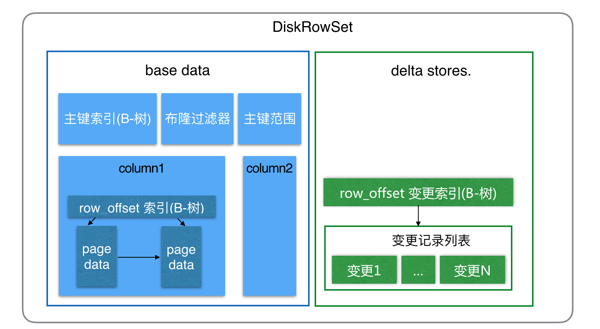

从上图可知，在具体的数据（列数据、变更记录）上，KUDU 都做了 B- 树索引，以提高随机读写的性能。在 base data 中，KUDU 还针对主键做了好几类索引（实际上由于 delta store 只记录变更数据，base data 中对主键的索引即本 DiskRowSet 中全局的主键索引）：

* 主键范围索引：记录本 DiskRowSet 中主键的范围，用于粗粒度过滤一些主键范围
* 布隆过滤器：通过主键的布隆过滤器来实现不存在数据的过滤
* 主键索引：要精确定位一个主键是否存在，以及具体在 DiskRowSet 中的位置（即：row_offset），通过以 B-树为数据结构的主键索引来快速查找。

随着时间的推移，KUDU 中的小文件会越来越多，主要包括各个 DiskRowSet 中的 base data，还有每个 base data 对应的若干份 DeltaFile。小文件的增多会影响 KUDU 的性能，特别是 DeltaFile 中还有很多重复的数据。为了提高性能，KUDU 会进行定期 compaction，compaction 主要包括两部分：

* DeltaFile compaction：过多的 DeltaFile 影响读性能，定期将 DeltaFile 合并回 base data 可以提升性能。在通常情况下，会发生频繁变更的字段是集中在少数几个字段中的，而 KUDU 是列式存储的，因此 KUDU 还在 DeltaFile compaction 时做了优化，文件合并时只合并部分变更列到 base data 中对应的列。
* DiskRowSet compaction：除了 DeltaFile，定期将 DiskRowSet 合并也能提升性能，一个原因是合并时我们可以将被删除的数据彻底的删除，而且可以减少同样 key 范围内数据的文件数，提升索引的效率。

当用户的查询存在列的过滤条件时，KUDU 还可以在查询时进行 延迟物化（Lazy Materialization ）来提升性能。

## kudu的读写过程
### 数据写过程

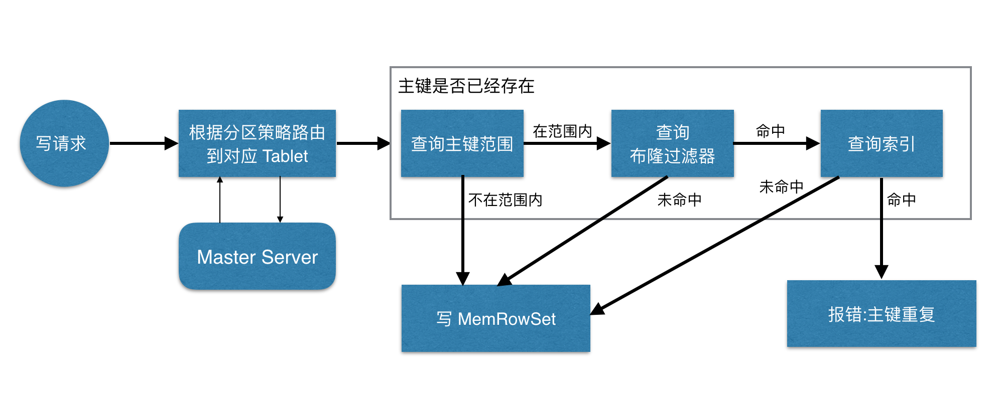

如上图，当 Client 请求写数据时，先根据主键从 Mater Server 中获取要访问的目标 Tablets，然后到依次对应的 Tablet 获取数据。因为 KUDU 表存在主键约束，所以需要进行主键是否已经存在的判断，这里就涉及到之前说的索引结构对读写的优化了。一个 Tablet 中存在很多个 RowSets，为了提升性能，我们要尽可能地减少要扫描的 RowSets 数量。首先，我们先通过每个 RowSet 中记录的主键的（最大最小）范围，过滤掉一批不存在目标主键的 RowSets，然后在根据 RowSet 中的布隆过滤器，过滤掉确定不存在目标主键的 RowSets，最后再通过 RowSets 中的 B-树索引，精确定位目标主键是否存在。如果主键已经存在，则报错（主键重复），否则就进行写数据（写 MemRowSet）。

### 数据更新过程

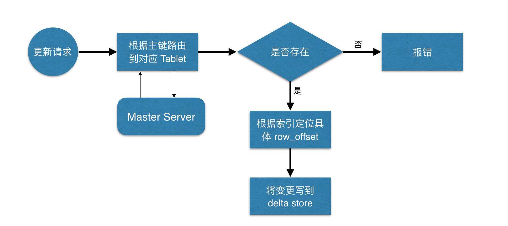

数据更新的核心是定位到待更新数据的位置，与写入的时候类似，等定位到具体位置后，然后将变更写到对应的 delta store 中。

### 数据读过程

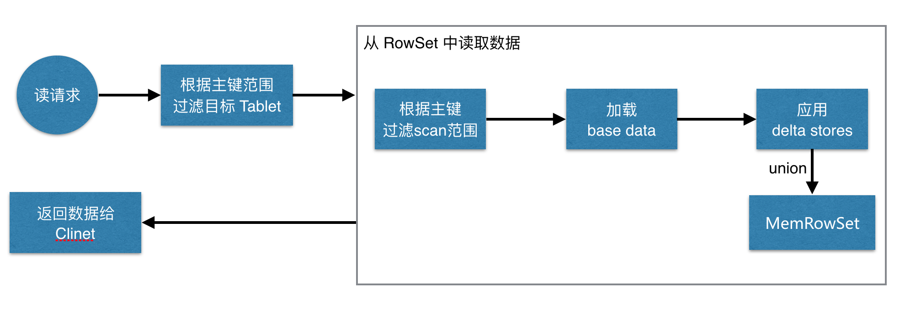

如上图，数据读取过程大致如下：先根据要扫描数据的主键范围，定位到目标的
Tablets，然后读取 Tablets 中的 RowSets。在读取每个 RowSet 时，先根据主键过滤要 scan 范围，然后加载范围内的 base data，再找到对应的 delta stores，应用所有变更，最后 union 上 MenRowSet 中的内容，返回数据给 Client。

## KUDU安装相关文件位置及配置

* /usr/bin/  : 所有KUDU相关命令的软链，它们会再软链到/etc/alternatives中去
* /var/lib/ : KUDU服务相关数据目录
* /var/log/   : KUDU相关服务运行日志目录
* /opt/cloudera/parcels/CDH/jars   : KUDU所有相关服务的安装文件，包含jar包，配置文件以及执行命令等。
* /tmp  :所有KUDU相关服务不同角色的OOM堆栈转存目录。以及所有角色启动的pid文件

## KUDU架构

	node01:	192.168.1.89  
	node02:	192.168.1.98 
	node03:	192.168.115
	
	KUDU Master : node02
	KUDU Tablet Server : node01-node03
	
	
## KUDU相关配置  

### master.gflagfile

	--fromenv=rpc_bind_addresses
	--fromenv=log_dir
	
	--fs_wal_dir=/data/lib/kudu/master
	--fs_data_dirs=/data/lib/kudu/master
	--default_num_replicas=1        # 此参数可以调整备份数量，默认为3

### tserver.gflagfile

	--fromenv=rpc_bind_addresses
	--fromenv=log_dir
	
	--fs_wal_dir=/data/lib/kudu/tserver
	--fs_data_dirs=/data/lib/kudu/tserver
	--tserver_master_addrs=192.168.20.133:7051   # 此参数指定master
