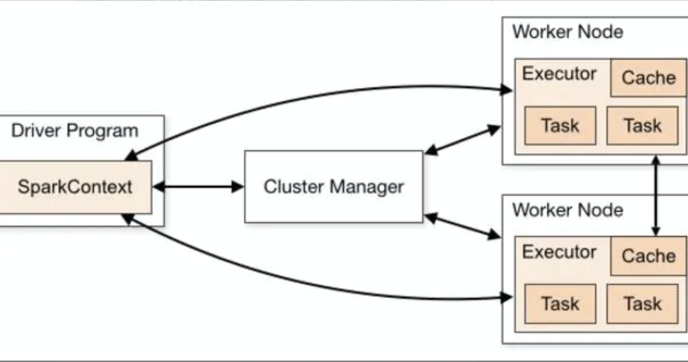
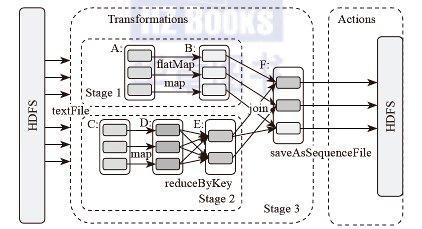

# Spark组件

## Spark简介

Spark是MapReduce的替代方案，而且兼容HDFS、Hive等分布式存储层，可融入Hadoop的生态系统，以弥补缺失MapReduce的不足。 
Spark相比Hadoop MapReduce的优势如下: 

1.  中间结果输出 
基于MapReduce的计算引擎通常会将中间结果输出到磁盘上，进行存储和容错。出于任务管道承接的考虑，当一些查询翻译到MapReduce任务时，往往会产生多个Stage，而这些串联的Stage又依赖于底层文件系统（如HDFS）来存储每一个Stage的输出结果。Spark将执行模型抽象为通用的有向无环图执行计划（DAG），这可以将多Stage的任务串联或者并行执行，而无须将Stage中间结果输出到HDFS中。类似的引擎包括Dr yad、Tez。 
2.  数据格式和内存布局 
Spark抽象出分布式内存存储结构弹性分布式数据集RDD,进行数据的存储。RDD能支持粗粒度写操作,但对于读取操作,RDD可以精确到每条记录,这使得RDD可以用来作为分布式索引Spark的特性是能够控制数据在不同节点上的分区,用户可以自定义分区策略,如Hash分区等.Shark和Spark SQL在Spark的基础上实现了列存储和列存储压缩. 
3.  执行策略 
Spark任务在shuffle中不是所有情景都需要排序,所以支持基于Hash的分布式聚合,调度中采用更为通用的任务执行计划图(DAG),每一轮次的输出结果在内存缓存
4. 任务调度的开销 
传统的MapReduce系统,是为了运行长达数小时的批量作业而设计的,在某些极端的情况下,提交一个任务的延迟非常高Spark采用了事件驱动的类库AKKA来启动任务,通过线程池复用线程来避免进程或线程启动和切换开销. 

## Spark架构

Spark是整个BDAS的核心。生态系统中的各个组件通过Spark来实现对分布式并行任务处理的程序支持. 
Spark架构采用了分布式计算中的Master-Slave模型。Master是对应集群中的含有Master进程的节点，Slave是集群中含有Worker进程的节点。Master作为整个集群的控制器，负责整个集群的正常运行；Worker相当于是计算节点，接收主节点命令与进行状态汇报；Executor负责任务的执行；Client作为用户的客户端负责提交应用，Driver负责控制一个应用的执行，如图所示。 

 
## Spark运行逻辑

如图所示，在Spark应用中，整个执行流程在逻辑上会形成有向无环图（DAG）。Action算子触发之后，将所有累积的算子形成一个有向无环图，然后由调度器调度该图上的任务进行运算。Spark的调度方式与MapReduce有所不同。Spark根据RDD之间不同的依赖关系切分形成不同的阶段（Stage），一个阶段包含一系列函数执行流水线。图中的A、B、C、D、E、F分别代表不同的RDD，RDD内的方框代表分区。数据从HDFS输入
Spark，形成RDD A和RDD C，RDD C上执行map操作，转换为RDD D，RDD B和RDDE执行join操作，转换为F，而在B和E连接转化为F的过程中又会执行Shuffle，最后RDD F通过函数saveAsSequenceFile输出并保存到HDFS中。 

 

## Spark分布式架构与单机多核架构的异同

1.  在单机多核环境下，多CPU共享内存和磁盘。当系统所需的计算和存储资源不够，需要扩展CPU和存储时，单机多核系统显得力不从心。
2.  大规模分布式并行处理系统是由许多松耦合的处理单元组成的，要注意的是，这里指的是处理单元而非处理器。每个单元内的CPU都有自己私有的资源，如总线、内存、硬盘等。这种结构最大的特点在于不共享资源。在不共享资源（Share Nothing）的分布式架构下，节点可以实现无限扩展，即计算能力和存储的扩展性可以成倍增长。在分布式运算下，数据尽量本地运算，减少网络I/O开销。由于大规模分布式系统要在不同处理单元之间传送信息，在网络传输少时，系统可以充分发挥资源的优势，达到高效率。也就是说，如果操作相互之间没有什么关系，处理单元之间需要进行的通信比较少，则采用分布式系统更好。因此，分布式系统在决策支持（DSS）和数据挖掘（DataMining）方面具有优势。

## Spark安装相关文件位置及配置

* /usr/bin/  : 所有Spark相关命令的软链，它们会再软链到/etc/alternatives中去
* /var/lib/ : Spark服务相关数据目录
* /var/log/   : Spark相关服务运行日志目录
* /opt/cloudera/parcels/CDH/jars   : Spark所有相关服务的安装文件，包含jar包，配置文件以及执行命令等。
* /tmp  :所有Spark相关服务不同角色的OOM堆栈转存目录。以及所有角色启动的pid文件

## Spark架构
	node01:	192.168.1.89  
	node02:	192.168.1.98 
	node03:	192.168.115
	
	History Server ： node01
	Gateway : node01-node03

## Spark相关配置  

#### spark-env.sh
	
	export STANDALONE_SPARK_MASTER_HOST=`hostname`
	
	export SPARK_MASTER_IP=$STANDALONE_SPARK_MASTER_HOST
	
	### Let's run everything with JVM runtime, instead of Scala
	export SPARK_LAUNCH_WITH_SCALA=0
	export SPARK_LIBRARY_PATH=${SPARK_HOME}/lib
	export SPARK_MASTER_WEBUI_PORT=18080
	export SPARK_MASTER_PORT=7077
	export SPARK_WORKER_PORT=7078
	export SPARK_WORKER_WEBUI_PORT=18081
	export SPARK_WORKER_DIR=/var/run/spark/work
	export SPARK_LOG_DIR=/var/log/spark
	export SPARK_PID_DIR='/var/run/spark/'
	
	if [ -n "$HADOOP_HOME" ]; then
	  export LD_LIBRARY_PATH=:/usr/lib/hadoop/lib/native
	fi
	
	export HADOOP_CONF_DIR=${HADOOP_CONF_DIR:-/etc/hadoop/conf}
	
	if [[ -d $SPARK_HOME/python ]]
	then
	    for i in 
	    do
	        SPARK_DIST_CLASSPATH=${SPARK_DIST_CLASSPATH}:$i
	    done
	fi
	
	SPARK_DIST_CLASSPATH="$SPARK_DIST_CLASSPATH:$SPARK_LIBRARY_PATH/spark-assembly.jar"
	SPARK_DIST_CLASSPATH="$SPARK_DIST_CLASSPATH:"
	SPARK_DIST_CLASSPATH="$SPARK_DIST_CLASSPATH:/usr/lib/hadoop/lib/*"
	SPARK_DIST_CLASSPATH="$SPARK_DIST_CLASSPATH:/usr/lib/hadoop/*"
	SPARK_DIST_CLASSPATH="$SPARK_DIST_CLASSPATH:/usr/lib/hadoop-hdfs/lib/*"
	SPARK_DIST_CLASSPATH="$SPARK_DIST_CLASSPATH:/usr/lib/hadoop-hdfs/*"
	SPARK_DIST_CLASSPATH="$SPARK_DIST_CLASSPATH:/usr/lib/hadoop-mapreduce/lib/*"
	SPARK_DIST_CLASSPATH="$SPARK_DIST_CLASSPATH:/usr/lib/hadoop-mapreduce/*"
	SPARK_DIST_CLASSPATH="$SPARK_DIST_CLASSPATH:/usr/lib/hadoop-yarn/lib/*"
	SPARK_DIST_CLASSPATH="$SPARK_DIST_CLASSPATH:/usr/lib/hadoop-yarn/*"
	SPARK_DIST_CLASSPATH="$SPARK_DIST_CLASSPATH:/usr/lib/hive/lib/*"
	SPARK_DIST_CLASSPATH="$SPARK_DIST_CLASSPATH:/usr/lib/flume-ng/lib/*"
	SPARK_DIST_CLASSPATH="$SPARK_DIST_CLASSPATH:/usr/lib/parquet/lib/*"
	SPARK_DIST_CLASSPATH="$SPARK_DIST_CLASSPATH:/usr/lib/avro/*"
	
 

#### spark-defaults.conf

	#
	# Licensed to the Apache Software Foundation (ASF) under one or more
	# contributor license agreements.  See the NOTICE file distributed with
	# this work for additional information regarding copyright ownership.
	# The ASF licenses this file to You under the Apache License, Version 2.0
	# (the "License"); you may not use this file except in compliance with
	# the License.  You may obtain a copy of the License at
	#
	#    http://www.apache.org/licenses/LICENSE-2.0
	#
	# Unless required by applicable law or agreed to in writing, software
	# distributed under the License is distributed on an "AS IS" BASIS,
	# WITHOUT WARRANTIES OR CONDITIONS OF ANY KIND, either express or implied.
	# See the License for the specific language governing permissions and
	# limitations under the License.
	#
	
	# Default system properties included when running spark-submit.
	# This is useful for setting default environmental settings.
	
	# Example:
	# spark.master                     spark://master:7077
	# spark.eventLog.enabled           true
	# spark.eventLog.dir               hdfs://namenode:8021/directory
	# spark.serializer                 org.apache.spark.serializer.KryoSerializer
	# spark.driver.memory              5g
	# spark.executor.extraJavaOptions  -XX:+PrintGCDetails -Dkey=value -Dnumbers="one two three"

 

