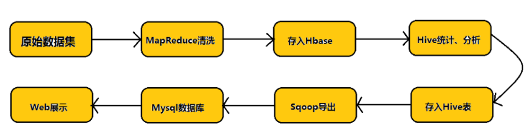
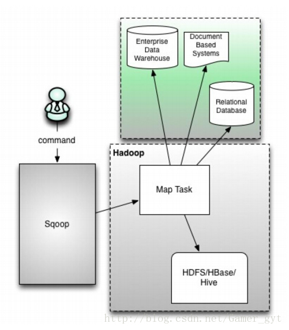
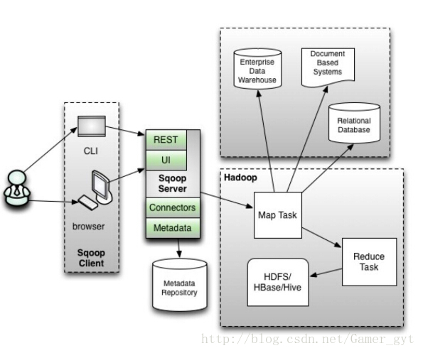

# Sqoop组件

## Sqoop是什么
1. Sqoop：SQL-to-Hadoop
2. 连接传统关系型数据库和Hadoop的桥梁 把关系型数据库的数据导入到Hadoop 系统 ( 如 HDFS、HBase 和 Hive) 中； 把数据从 Hadoop系统里抽取并导出到关系型数据库里
3. 利用MapReduce，批处理方式进行数据传输

## 基本思想

插拔式Connector架构， Connector是与特定数据源相关的组件， 主要负责(从特定数据源中)抽取和加载数据。

用户可选择Sqoop自带的Connector， 或者数据库提供的native Connector。

Sqoop： MapReduce方式并行导入导出，性能高； 类型自动转换(用户也可自定义类型转换)； 自动传播元信息。

## Sqoop的优势

1. 高效、可控的利用资源,任务并行度、超时时间等
2. 数据类型映射与转换可自动进行，用户也可自定义
3. 支持多种数据库（MySQL、Oracle、PostgreSQL）

## Sqoop1 
客户端工具， 不需要启动任何服务，调起MapReuce作业(实际只有Map操作), 使用方便， 只有命令行交互方式。
缺陷： 
(1) 仅支持JDBC的Connector
(2) 要求依赖软件必须安装在客户端上(包括Mysql/Hadoop/Oracle客户端， JDBC驱动，数据库厂商提供的Connector等)。
(3)安全性差： 需要用户提供明文密码

## sqoop2

引入了Sqoop Server端， 形成服务端-客户端，Connector集成到Server端，轻量客户端，部署较麻烦. 
(1) Sqoop Client: 
用户交互的方式：命令行(CLI) 和浏览器两种方式 
(2) Sqoop Server: 

* Connector:
	* Partitioner 数据切片
	* Extractor 数据抽取 Map操作
	* Loader 读取Extractor输出的数据，Reduce操作

* Metadata: Sqoop中的元信息，次啊用轻量级数据库Apache Derby, 也可以替换为Mysql

* RESTful和HTTP Server: 客户端对接请求

### 概念说明

Connector: 访问某种数据源的组件，负责抽取或写入数据；Sqoop2内置多个数据源组件： 

*  generic-jdbc-connector: 访问支持JDBC协议的数据库的Connector
*  hdfs-connector: 访问Hadoop HDFS的Connector
*  kafka-connector: 访问kafka的Connector
*  kit-connector: 使用Kite SDK实现，可访问HDFS/Hive/Hbase

### 架构

## Sqoop2 架构
	node01:	192.168.1.89  
	node02:	192.168.1.98 
	node03:	192.168.115
	
	Sqoop2 Server : node01

## Sqoop 相关配置  

#### 修改conf/sqoop-env-template.sh名称为 sqoop-env.sh
	 #Set path to where bin/hadoop is available
	 export HADOOP_COMMON_HOME=/opt/cloudera/parcels/CDH/lib/hadoop
	 #Set path to where hadoop-*-core.jar is available
	 export HADOOP_MAPRED_HOME=/opt/cloudera/parcels/CDH/lib/hadoop
	 
	 #set the path to where bin/hbase is available
	 #export HBASE_HOME=
	  
	 #Set the path to where bin/hive is available
	 #export HIVE_HOME=
	  
	 #Set the path for where zookeper config dir is
	 #export ZOOCFGDIR=

#### 其他配置
	添加数据库厂商Jdbc驱动包到lib：
	Oracle - ojdbc6.jar
	Mysql - mysql-connector-java-5.1.40-bin.jar
	
	修改环境变量:
	export SQOOP_HOME=PATH:$SQOOP_HOME/bin
