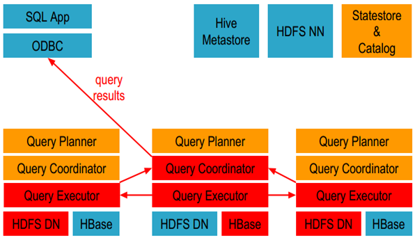

# Impala组件

## 什么是Impala

 Impala是用于处理存储在Hadoop集群中的大量数据的SQL查询引擎。它是一个用C ++和Java编写的开源软件。换句话说，Impala是性能最高的SQL引擎，它提供了访问存储在Hadoop分布式文件系统中的数据的最快方法。

## Impala的特点

1. Impala支持内存中数据处理，即，它访问/分析存储在Hadoop数据节点上的数据，而无需数据移动。
2. 与其他SQL引擎相比，Impala为HDFS中的数据提供了更快的访问。
3. 使用Impala，可以访问不同的数据存储，如HDFS，Apache HBase
4. Impala支持各种文件格式，如LZO，序列文件，Avro，RCFile和Parquet。
5. Impala使用Apache Hive的元数据，ODBC驱动程序和SQL语法。
6. C++编写，LLVM（构架编译器）统一编译运行用于优化以任意程序语言编写的程序的编译时间、链接时间、运行时间以及空闲时间，对开发者保持开放，并兼容已有脚本

## Impala的核心组件

1. Impala Statestore  
负责收集分布在集群中各个impalad进程的资源信息、各节点健康状况，同步节点信息，而且还负责query的调度分配

2. Impala Catalog 
分发表的元数据信息到各个impalad中
接收来自statestore的所有请求

3. Impala Daemon 
接收client、hue、jdbc或者odbc请求、Query执行并返回给中心协调节点
子节点上的守护进程，负责向statestore保持通信，汇报工作

## Impala的组成部分

Impala由以下的组件组成：

1. Clients – Hue、ODBC clients、JDBC clients、和Impala Shell都可以与Impala进行交互，这些接口都可以用在Impala的数据查询以及对Impala的管理。

2. Hive Metastore（元数据） 存储Impala可访问数据的元数据。例如，这些元数据可以让Impala知道哪些数据库以及数据库的结构是可以访问的，当你创建、删除、修改数据库对象或者加载数据到数据表里面，相关的元数据变化会自动通过广播的形式通知所有的Impala节点，这个通知过程由catalog service完成。

3. Cloudera Impala – Impala的进程运行在各个数据节点（Datanode）上面。每一个Impala的实例都可以从Impala client端接收查询，进而产生执行计划、协调执行任务。数据查询分布在各个Impala节点上，这些节点作为worker（工作者），并行执行查询。
4. HBase和HDFS – 存储用于查询的数据。

## Impala执行查询的具体过程

1. 客户端通过ODBC、JDBC、或者Impala shell向Impala集群中的任意节点发送SQL语句，这个节点的impalad实例作为这个查询的协调器（coordinator）。

2. Impala解析和分析这个查询语句来决定集群中的哪个impalad实例来执行某个任务。

3. HDFS和HBase给本地的impalad实例提供数据访问。
4. 各个impalad向协调器impalad返回数据，然后由协调器impalad向client发送结果集。

## Impala安装相关文件位置及配置

* /usr/bin/  : 所有Impala相关命令的软链，它们会再软链到/etc/alternatives中去
* /var/lib/ : Impala服务相关数据目录
* /var/log/   : Impala相关服务运行日志目录
* /opt/cloudera/parcels/CDH/jars   : Impala所有相关服务的安装文件，包含jar包，配置文件以及执行命令等。
* /tmp  :所有Impala相关服务不同角色的OOM堆栈转存目录。以及所有角色启动的pid文件

## Impala架构
	node01:	192.168.1.89  
	node02:	192.168.1.98 
	node03:	192.168.115
	
	Impala StateStore : node01
	Impala Catalog Server : node01
	Impala Daemon : node01-node03
	
## Impala相关配置  

在hdfs-site.xml文件中添加如下内容：

#### hdfs-site.xml
	
	<property>
	
	    <name>dfs.client.read.shortcircuit</name>
	
	    <value>true</value>
	
	</property>
	
	<property>
	
	    <name>dfs.domain.socket.path</name>
	
	    <value>/var/run/hadoop-hdfs/dn._PORT</value>
	
	</property>
	
	<property>
	
	  <name>dfs.datanode.hdfs-blocks-metadata.enabled</name>
	
	  <value>true</value>
	
	</property>
	
	<property>
	
	   <name>dfs.client.use.legacy.blockreader.local</name>
	
	   <value>false</value>
	
	</property>
	
	<property>
	
	   <name>dfs.datanode.data.dir.perm</name>
	
	   <value>750</value>
	
	</property>
	
	<property>
	
	   <name>dfs.block.local-path-access.user</name>
	
	   <value>cup</value>
	
	</property>
	
	<property>
	
	   <name>dfs.client.file-block-storage-locations.timeout</name>
	
	   <value>3000</value>
	
	</property>
	
 

