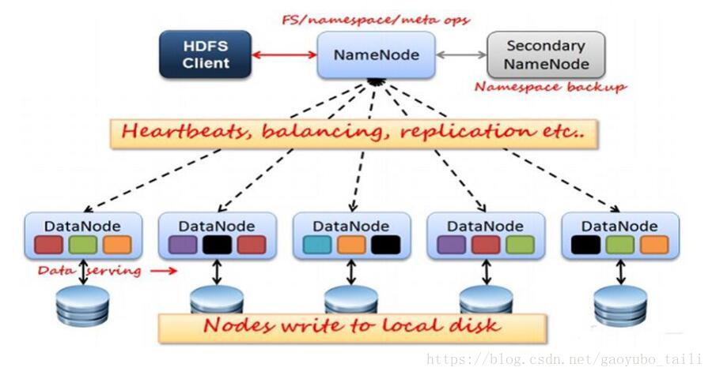
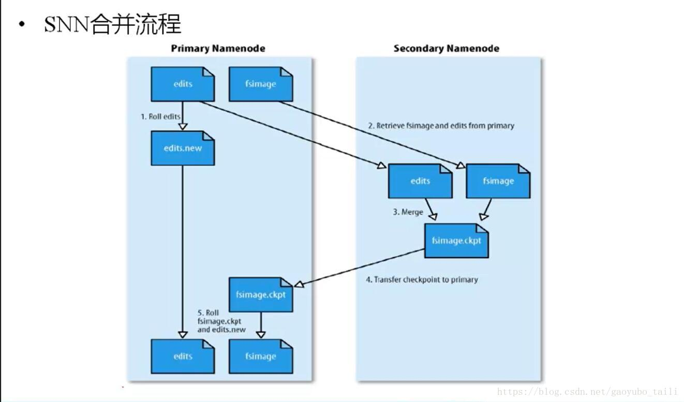
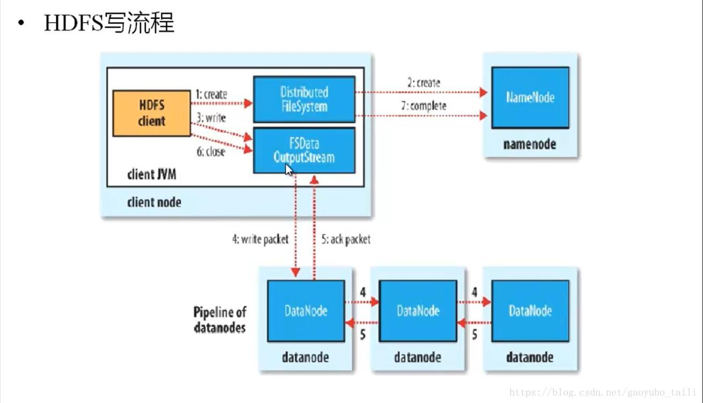
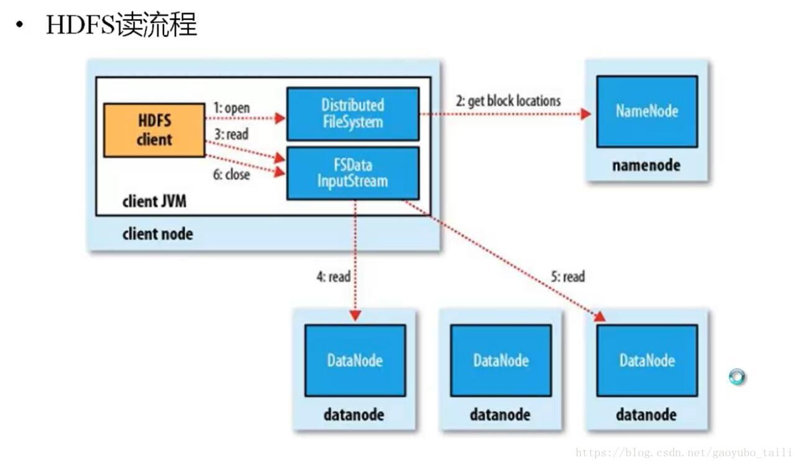

# 安装Hadoop组件-yarn+hdfs

## Hadoop 3个核心组件
* 分布式文件系统：Hdfs——实现将文件分布式存储在很多的服务器上（hdfs是一个基于Linux本地文件系统上的文件系统）
* 分布式运算编程框架：Mapreduce——实现在很多机器上分布式并行运算
* 分布式资源调度平台：Yarn——帮用户调度大量的mapreduce程序，并合理分配运算资源

## HDFS的设计特点
1. 大数据文件，非常适合上T级别的大文件或者一堆大数据文件的存储，如果文件只有几个G甚至更小就没啥意思了。

2. 文件分块存储，HDFS会将一个完整的大文件平均分块存储到不同计算器上，它的意义在于读取文件时可以同时从多个主机取不同区块的文件，多主机读取比单主机读取效率要高得多得都。

3. 流式数据访问，一次写入多次读写，这种模式跟传统文件不同，它不支持动态改变文件内容，而是要求让文件一次写入就不做变化，要变化也只能在文件末添加内容。

4. 廉价硬件，HDFS可以应用在普通PC机上，这种机制能够让给一些公司用几十台廉价的计算机就可以撑起一个大数据集群。

5. 硬件故障，HDFS认为所有计算机都可能会出问题，为了防止某个主机失效读取不到该主机的块文件，它将同一个文件块副本分配到其它某几个主机上，如果其中一台主机失效，可以迅速找另一块副本取文件。
 
## HDFS的关键元素
1. Block：将一个文件进行分块，通常是64M。

2. NameNode：保存整个文件系统的目录信息、文件信息及分块信息，这是由唯一 一台主机专门保存，当然这台主机如果出错，NameNode就失效了。在 Hadoop2.* 开始支持 activity-standy 模式----如果主 NameNode 失效，启动备用主机运行 NameNode。

3. DataNode：分布在廉价的计算机上，用于存储Block块文件。

## HDFS运行原理
1. NameNode和DataNode节点初始化完成后，采用RPC进行信息交换，采用的机制是心跳机制，即DataNode节点定时向NameNode反馈状态信息，反馈信息如:是否正常、磁盘空间大小、资源消耗情况等信息，以确保NameNode知道DataNode的情况；

2. NameNode会将子节点的相关元数据信息缓存在内存中，对于文件与Block块的信息会通过fsImage和edits文件方式持久化在磁盘上，以确保NameNode知道文件各个块的相关信息；

3. NameNode负责存储fsImage和edits元数据信息，但fsImage和edits元数据文件需要定期进行合并，这时则由SecondNameNode进程对fsImage和edits文件进行定期合并，合并好的文件再交给NameNode存储。

## HDFS数据合并原理
1. NameNode初始化时会产生一个edits文件和一个fsimage文件，edits文件用于记录操作日志，比如文件的删除或添加等操作信息，fsImage用于存储文件与目录对应的信息以及edits合并进来的信息，即相当于fsimage文件在这里是一个总的元数据文件，记录着所有的信息；

2. 随着edits文件不断增大，当达到设定的一个阀值的时候，这时SecondaryNameNode会将edits文件和fsImage文件通过采用http的方式进行复制到SecondaryNameNode下（在这里考虑到网络传输，所以一般将NameNode和SecondaryNameNode放在相同的节点上，这样就无需走网络带宽了，以提高运行效率），同时NameNode会产生一个新的edits文件替换掉旧的edits文件，这样以保证数据不会出现冗余；

3. SecondaryNameNode拿到这两个文件后，会在内存中进行合并成一个fsImage.ckpt的文件，合并完成后，再通过http的方式将合并后的文件fsImage.ckpt复制到NameNode下，NameNode文件拿到fsImage.ckpt文件后，会将旧的fsimage文件替换掉，并且改名成fsimage文件。   

通过以上几步则完成了edits和fsimage文件的合并，依此不断循环，从而到达保证元数据的正确性。

## HDFS写原理
1. HDFS客户端提交写操作到NameNode上，NameNode收到客户端提交的请求后，会先判断此客户端在此目录下是否有写权限，如果有，然后进行查看，看哪几个DataNode适合存放，再给客户端返回存放数据块的节点信息，即告诉客户端可以把文件存放到相关的DataNode节点下；

2. 客户端拿到数据存放节点位置信息后，会和对应的DataNode节点进行直接交互，进行数据写入，由于数据块具有副本replication，在数据写入时采用的方式是先写第一个副本，写完后再从第一个副本的节点将数据拷贝到其它节点，依次类推，直到所有副本都写完了，才算数据成功写入到HDFS上，副本写入采用的是串行，每个副本写的过程中都会逐级向上反馈写进度，以保证实时知道副本的写入情况；

3. 随着所有副本写完后，客户端会收到数据节点反馈回来的一个成功状态，成功结束后，关闭与数据节点交互的通道，并反馈状态给NameNode,告诉NameNode文件已成功写入到对应的DataNode。

## HDFS读原理
1. HDFS客户端提交读操作到NameNode上，NameNode收到客户端提交的请求后，会先判断此客户端在此目录下是否有读权限，如果有，则给客户端返回存放数据块的节点信息，即告诉客户端可以到相关的DataNode节点下去读取数据块；

2. 客户端拿到块位置信息后，会去和相关的DataNode直接构建读取通道，读取数据块，当所有数据块都读取完成后关闭通道，并给NameNode返回状态信息，告诉NameNode已经读取完毕。

## Hadoop架构
	node01:	192.168.1.89  
	node02:	192.168.1.98 
	node03:	192.168.115
	
	NameNode: node01  SecondaryNameNode: node02
	Balancer: node01 HttpFS: node02
	NFS Gateway: node02
	DataNode:node01-node03
## Yarn架构
	node01:	192.168.1.89  
	node02:	192.168.1.98 
	node03:	192.168.115
	ResourceManager: node01
	JobHistory Server : node01
	NodeManager :  node01-node03
## Hadoop+Yarn安装相关文件位置及配置

* /usr/bin/  : 所有Hadoop相关命令的软链，它们会再软链到/etc/alternatives中去
* /var/lib/ : Hadoop服务相关数据目录
* /var/log/   :Hadoop相关服务运行日志目录
* /opt/cloudera/parcels/CDH/jars   : hadoop所有相关服务的安装文件，包含jar包，配置文件以及执行命令等。
* /tmp  :所有Hadoop相关服务不同角色的OOM堆栈转存目录。以及所有角色启动的pid文件
* /dfs    :所有Hadoop存储文件  

## Hadoop相关配置  
#### core-site.xml
	
	<?xml version="1.0" encoding="UTF-8"?>

	<!--Autogenerated by Cloudera Manager-->
	<configuration>
	  <property>
	    <name>fs.defaultFS</name>
	    <value>hdfs://node01:8020</value>
	  </property>
	  <property>
	    <name>fs.trash.interval</name>
	    <value>1</value>
	  </property>
	  <property>
	    <name>io.compression.codecs</name>
	    <value>org.apache.hadoop.io.compress.DefaultCodec,org.apache.hadoop.io.compress.GzipCodec,org.apache.hadoop.io.compress.BZip2Codec,org.apache.hadoop.io.compress.DeflateCodec,org.apache.hadoop.io.compress.SnappyCodec,org.apache.hadoop.io.compress.Lz4Codec</value>
	  </property>
	  <property>
	    <name>hadoop.security.authentication</name>
	    <value>simple</value>
	  </property>
	  <property>
	    <name>hadoop.security.authorization</name>
	    <value>false</value>
	  </property>
	  <property>
	    <name>hadoop.rpc.protection</name>
	    <value>authentication</value>
	  </property>
	  <property>
	    <name>hadoop.security.auth_to_local</name>
	    <value>DEFAULT</value>
	  </property>
	  <property>
	    <name>hadoop.proxyuser.oozie.hosts</name>
	    <value>*</value>
	  </property>
	  <property>
	    <name>hadoop.proxyuser.oozie.groups</name>
	    <value>*</value>
	  </property>
	  <property>
	    <name>hadoop.proxyuser.mapred.hosts</name>
	    <value>*</value>
	  </property>
	  <property>
	    <name>hadoop.proxyuser.mapred.groups</name>
	    <value>*</value>
	  </property>
	  <property>
	    <name>hadoop.proxyuser.flume.hosts</name>
	    <value>*</value>
	  </property>
	  <property>
	    <name>hadoop.proxyuser.flume.groups</name>
	    <value>*</value>
	  </property>
	  <property>
	    <name>hadoop.proxyuser.HTTP.hosts</name>
	    <value>*</value>
	  </property>
	  <property>
	    <name>hadoop.proxyuser.HTTP.groups</name>
	    <value>*</value>
	  </property>
	  <property>
	    <name>hadoop.proxyuser.hive.hosts</name>
	    <value>*</value>
	  </property>
	  <property>
	    <name>hadoop.proxyuser.hive.groups</name>
	    <value>*</value>
	  </property>
	  <property>
	    <name>hadoop.proxyuser.hue.hosts</name>
	    <value>*</value>
	  </property>
	  <property>
	    <name>hadoop.proxyuser.hue.groups</name>
	    <value>*</value>
	  </property>
	  <property>
	    <name>hadoop.proxyuser.httpfs.hosts</name>
	    <value>*</value>
	  </property>
	  <property>
	    <name>hadoop.proxyuser.httpfs.groups</name>
	    <value>*</value>
	  </property>
	  <property>
	    <name>hadoop.proxyuser.hdfs.groups</name>
	    <value>*</value>
	  </property>
	  <property>
	    <name>hadoop.proxyuser.hdfs.hosts</name>
	    <value>*</value>
	  </property>
	  <property>
	    <name>hadoop.proxyuser.yarn.hosts</name>
	    <value>*</value>
	  </property>
	  <property>
	    <name>hadoop.proxyuser.yarn.groups</name>
	    <value>*</value>
	  </property>
	  <property>
	    <name>hadoop.security.group.mapping</name>
	    <value>org.apache.hadoop.security.ShellBasedUnixGroupsMapping</value>
	  </property>
	  <property>
	    <name>hadoop.security.instrumentation.requires.admin</name>
	    <value>false</value>
	  </property>
	  <property>
	    <name>net.topology.script.file.name</name>
	    <value>/etc/hadoop/conf.cloudera.yarn/topology.py</value>
	  </property>
	  <property>
	    <name>io.file.buffer.size</name>
	    <value>65536</value>
	  </property>
	  <property>
	    <name>hadoop.ssl.enabled</name>
	    <value>false</value>
	  </property>
	  <property>
	    <name>hadoop.ssl.require.client.cert</name>
	    <value>false</value>
	    <final>true</final>
	  </property>
	  <property>
	    <name>hadoop.ssl.keystores.factory.class</name>
	    <value>org.apache.hadoop.security.ssl.FileBasedKeyStoresFactory</value>
	    <final>true</final>
	  </property>
	  <property>
	    <name>hadoop.ssl.server.conf</name>
	    <value>ssl-server.xml</value>
	    <final>true</final>
	  </property>
	  <property>
	    <name>hadoop.ssl.client.conf</name>
	    <value>ssl-client.xml</value>
	    <final>true</final>
	  </property>
	</configuration>

 

#### hadoop-env.sh

	# Prepend/Append plugin parcel classpaths

	if [ "$HADOOP_USER_CLASSPATH_FIRST" = 'true' ]; then
	  # HADOOP_CLASSPATH={{HADOOP_CLASSPATH_APPEND}}
	  :
	else
	  # HADOOP_CLASSPATH={{HADOOP_CLASSPATH}}
	  :
	fi
	# JAVA_LIBRARY_PATH={{JAVA_LIBRARY_PATH}}
	
	export HADOOP_MAPRED_HOME=$( ([[ ! '/opt/cloudera/parcels/CDH/lib/hadoop-mapreduce' =~ CDH_MR2_HOME ]] && echo /opt/cloudera/parcels/CDH/lib/hadoop-mapreduce ) || echo ${CDH_MR2_HOME:-/usr/lib/hadoop-mapreduce/}  )
	export YARN_OPTS="-Xmx825955249 -Djava.net.preferIPv4Stack=true $YARN_OPTS"
	export HADOOP_CLIENT_OPTS="-Djava.net.preferIPv4Stack=true $HADOOP_CLIENT_OPTS"

 

#### hdfs-site.xml

	<?xml version="1.0" encoding="UTF-8"?>
	
	<!--Autogenerated by Cloudera Manager-->
	<configuration>
	  <property>
	    <name>dfs.namenode.name.dir</name>
	    <value>file:///dfs/nn</value>
	  </property>
	  <property>
	    <name>dfs.namenode.servicerpc-address</name>
	    <value>node01:8022</value>
	  </property>
	  <property>
	    <name>dfs.https.address</name>
	    <value>node01:50470</value>
	  </property>
	  <property>
	    <name>dfs.https.port</name>
	    <value>50470</value>
	  </property>
	  <property>
	    <name>dfs.namenode.http-address</name>
	    <value>node01:50070</value>
	  </property>
	  <property>
	    <name>dfs.replication</name>
	    <value>3</value>
	  </property>
	  <property>
	    <name>dfs.blocksize</name>
	    <value>134217728</value>
	  </property>
	  <property>
	    <name>dfs.client.use.datanode.hostname</name>
	    <value>false</value>
	  </property>
	  <property>
	    <name>fs.permissions.umask-mode</name>
	    <value>022</value>
	  </property>
	  <property>
	    <name>dfs.namenode.acls.enabled</name>
	    <value>false</value>
	  </property>
	  <property>
	    <name>dfs.client.use.legacy.blockreader</name>
	    <value>false</value>
	  </property>
	  <property>
	    <name>dfs.client.read.shortcircuit</name>
	    <value>false</value>
	  </property>
	  <property>
	    <name>dfs.domain.socket.path</name>
	    <value>/var/run/hdfs-sockets/dn</value>
	  </property>
	  <property>
	    <name>dfs.client.read.shortcircuit.skip.checksum</name>
	    <value>false</value>
	  </property>
	  <property>
	    <name>dfs.client.domain.socket.data.traffic</name>
	    <value>false</value>
	  </property>
	  <property>
	    <name>dfs.datanode.hdfs-blocks-metadata.enabled</name>
	    <value>true</value>
	  </property>
	</configuration>
	
 

#### mapred-site.xml

	<?xml version="1.0" encoding="UTF-8"?>
	
	<!--Autogenerated by Cloudera Manager-->
	<configuration>
	  <property>
	    <name>mapreduce.job.split.metainfo.maxsize</name>
	    <value>10000000</value>
	  </property>
	  <property>
	    <name>mapreduce.job.counters.max</name>
	    <value>120</value>
	  </property>
	  <property>
	    <name>mapreduce.job.counters.groups.max</name>
	    <value>50</value>
	  </property>
	  <property>
	    <name>mapreduce.output.fileoutputformat.compress</name>
	    <value>false</value>
	  </property>
	  <property>
	    <name>mapreduce.output.fileoutputformat.compress.type</name>
	    <value>BLOCK</value>
	  </property>
	  <property>
	    <name>mapreduce.output.fileoutputformat.compress.codec</name>
	    <value>org.apache.hadoop.io.compress.DefaultCodec</value>
	  </property>
	  <property>
	    <name>mapreduce.map.output.compress.codec</name>
	    <value>org.apache.hadoop.io.compress.SnappyCodec</value>
	  </property>
	  <property>
	    <name>mapreduce.map.output.compress</name>
	    <value>true</value>
	  </property>
	  <property>
	    <name>zlib.compress.level</name>
	    <value>DEFAULT_COMPRESSION</value>
	  </property>
	  <property>
	    <name>mapreduce.task.io.sort.factor</name>
	    <value>64</value>
	  </property>
	  <property>
	    <name>mapreduce.map.sort.spill.percent</name>
	    <value>0.8</value>
	  </property>
	  <property>
	    <name>mapreduce.reduce.shuffle.parallelcopies</name>
	    <value>10</value>
	  </property>
	  <property>
	    <name>mapreduce.task.timeout</name>
	    <value>600000</value>
	  </property>
	  <property>
	    <name>mapreduce.client.submit.file.replication</name>
	    <value>3</value>
	  </property>
	  <property>
	    <name>mapreduce.job.reduces</name>
	    <value>24</value>
	  </property>
	  <property>
	    <name>mapreduce.task.io.sort.mb</name>
	    <value>256</value>
	  </property>
	  <property>
	    <name>mapreduce.map.speculative</name>
	    <value>false</value>
	  </property>
	  <property>
	    <name>mapreduce.reduce.speculative</name>
	    <value>false</value>
	  </property>
	  <property>
	    <name>mapreduce.job.reduce.slowstart.completedmaps</name>
	    <value>0.8</value>
	  </property>
	  <property>
	    <name>mapreduce.jobhistory.address</name>
	    <value>node01:10020</value>
	  </property>
	  <property>
	    <name>mapreduce.jobhistory.webapp.address</name>
	    <value>node01:19888</value>
	  </property>
	  <property>
	    <name>mapreduce.jobhistory.webapp.https.address</name>
	    <value>node01:19890</value>
	  </property>
	  <property>
	    <name>mapreduce.jobhistory.admin.address</name>
	    <value>node01:10033</value>
	  </property>
	  <property>
	    <name>mapreduce.framework.name</name>
	    <value>yarn</value>
	  </property>
	  <property>
	    <name>yarn.app.mapreduce.am.staging-dir</name>
	    <value>/user</value>
	  </property>
	  <property>
	    <name>mapreduce.am.max-attempts</name>
	    <value>2</value>
	  </property>
	  <property>
	    <name>yarn.app.mapreduce.am.resource.mb</name>
	    <value>1024</value>
	  </property>
	  <property>
	    <name>yarn.app.mapreduce.am.resource.cpu-vcores</name>
	    <value>1</value>
	  </property>
	  <property>
	    <name>mapreduce.job.ubertask.enable</name>
	    <value>false</value>
	  </property>
	  <property>
	    <name>yarn.app.mapreduce.am.command-opts</name>
	    <value>-Djava.net.preferIPv4Stack=true -Xmx825955249</value>
	  </property>
	  <property>
	    <name>mapreduce.map.java.opts</name>
	    <value>-Djava.net.preferIPv4Stack=true</value>
	  </property>
	  <property>
	    <name>mapreduce.reduce.java.opts</name>
	    <value>-Djava.net.preferIPv4Stack=true</value>
	  </property>
	  <property>
	    <name>yarn.app.mapreduce.am.admin.user.env</name>
	    <value>LD_LIBRARY_PATH=$HADOOP_COMMON_HOME/lib/native:$JAVA_LIBRARY_PATH</value>
	  </property>
	  <property>
	    <name>mapreduce.map.memory.mb</name>
	    <value>0</value>
	  </property>
	  <property>
	    <name>mapreduce.map.cpu.vcores</name>
	    <value>1</value>
	  </property>
	  <property>
	    <name>mapreduce.reduce.memory.mb</name>
	    <value>0</value>
	  </property>
	  <property>
	    <name>mapreduce.reduce.cpu.vcores</name>
	    <value>1</value>
	  </property>
	  <property>
	    <name>mapreduce.job.heap.memory-mb.ratio</name>
	    <value>0.8</value>
	  </property>
	  <property>
	    <name>mapreduce.application.classpath</name>
	    <value>$HADOOP_MAPRED_HOME/*,$HADOOP_MAPRED_HOME/lib/*,$MR2_CLASSPATH</value>
	  </property>
	  <property>
	    <name>mapreduce.jobhistory.jhist.format</name>
	    <value>binary</value>
	  </property>
	  <property>
	    <name>mapreduce.admin.user.env</name>
	    <value>LD_LIBRARY_PATH=$HADOOP_COMMON_HOME/lib/native:$JAVA_LIBRARY_PATH</value>
	  </property>
	  <property>
	    <name>mapreduce.job.redacted-properties</name>
	    <value>fs.s3a.access.key,fs.s3a.secret.key</value>
	  </property>
	  <property>
	    <name>mapreduce.job.acl-view-job</name>
	    <value> </value>
	  </property>
	  <property>
	    <name>mapreduce.job.acl-modify-job</name>
	    <value> </value>
	  </property>
	  <property>
	    <name>mapreduce.cluster.acls.enabled</name>
	    <value>false</value>
	  </property>
	</configuration>

 

#### ssl-client.xml

	<?xml version="1.0" encoding="UTF-8"?>

	<!--Autogenerated by Cloudera Manager-->
	<configuration>
	  <property>
	    <name>ssl.client.truststore.type</name>
	    <value>jks</value>
	  </property>
	  <property>
	    <name>ssl.client.truststore.reload.interval</name>
	    <value>10000</value>
	  </property>
	</configuration>	
	
 

#### yarn-site.xml

	<?xml version="1.0" encoding="UTF-8"?>
	
	<!--Autogenerated by Cloudera Manager-->
	<configuration>
	  <property>
	    <name>yarn.acl.enable</name>
	    <value>true</value>
	  </property>
	  <property>
	    <name>yarn.admin.acl</name>
	    <value>*</value>
	  </property>
	  <property>
	    <name>yarn.resourcemanager.address</name>
	    <value>node01:8032</value>
	  </property>
	  <property>
	    <name>yarn.resourcemanager.admin.address</name>
	    <value>node01:8033</value>
	  </property>
	  <property>
	    <name>yarn.resourcemanager.scheduler.address</name>
	    <value>node01:8030</value>
	  </property>
	  <property>
	    <name>yarn.resourcemanager.resource-tracker.address</name>
	    <value>node01:8031</value>
	  </property>
	  <property>
	    <name>yarn.resourcemanager.webapp.address</name>
	    <value>node01:8088</value>
	  </property>
	  <property>
	    <name>yarn.resourcemanager.webapp.https.address</name>
	    <value>node01:8090</value>
	  </property>
	  <property>
	    <name>yarn.resourcemanager.client.thread-count</name>
	    <value>50</value>
	  </property>
	  <property>
	    <name>yarn.resourcemanager.scheduler.client.thread-count</name>
	    <value>50</value>
	  </property>
	  <property>
	    <name>yarn.resourcemanager.admin.client.thread-count</name>
	    <value>1</value>
	  </property>
	  <property>
	    <name>yarn.scheduler.minimum-allocation-mb</name>
	    <value>1024</value>
	  </property>
	  <property>
	    <name>yarn.scheduler.increment-allocation-mb</name>
	    <value>512</value>
	  </property>
	  <property>
	    <name>yarn.scheduler.maximum-allocation-mb</name>
	    <value>2745</value>
	  </property>
	  <property>
	    <name>yarn.scheduler.minimum-allocation-vcores</name>
	    <value>1</value>
	  </property>
	  <property>
	    <name>yarn.scheduler.increment-allocation-vcores</name>
	    <value>1</value>
	  </property>
	  <property>
	    <name>yarn.scheduler.maximum-allocation-vcores</name>
	    <value>16</value>
	  </property>
	  <property>
	    <name>yarn.resourcemanager.amliveliness-monitor.interval-ms</name>
	    <value>1000</value>
	  </property>
	  <property>
	    <name>yarn.am.liveness-monitor.expiry-interval-ms</name>
	    <value>600000</value>
	  </property>
	  <property>
	    <name>yarn.resourcemanager.am.max-attempts</name>
	    <value>2</value>
	  </property>
	  <property>
	    <name>yarn.resourcemanager.container.liveness-monitor.interval-ms</name>
	    <value>600000</value>
	  </property>
	  <property>
	    <name>yarn.resourcemanager.nm.liveness-monitor.interval-ms</name>
	    <value>1000</value>
	  </property>
	  <property>
	    <name>yarn.nm.liveness-monitor.expiry-interval-ms</name>
	    <value>600000</value>
	  </property>
	  <property>
	    <name>yarn.resourcemanager.resource-tracker.client.thread-count</name>
	    <value>50</value>
	  </property>
	  <property>
	    <name>yarn.application.classpath</name>
	    <value>$HADOOP_CLIENT_CONF_DIR,$HADOOP_CONF_DIR,$HADOOP_COMMON_HOME/*,$HADOOP_COMMON_HOME/lib/*,$HADOOP_HDFS_HOME/*,$HADOOP_HDFS_HOME/lib/*,$HADOOP_YARN_HOME/*,$HADOOP_YARN_HOME/lib/*</value>
	  </property>
	  <property>
	    <name>yarn.resourcemanager.scheduler.class</name>
	    <value>org.apache.hadoop.yarn.server.resourcemanager.scheduler.fair.FairScheduler</value>
	  </property>
	  <property>
	    <name>yarn.resourcemanager.max-completed-applications</name>
	    <value>10000</value>
	  </property>
	  <property>
	    <name>yarn.nodemanager.remote-app-log-dir</name>
	    <value>/tmp/logs</value>
	  </property>
	  <property>
	    <name>yarn.nodemanager.remote-app-log-dir-suffix</name>
	    <value>logs</value>
	  </property>
	</configuration>

	
	
