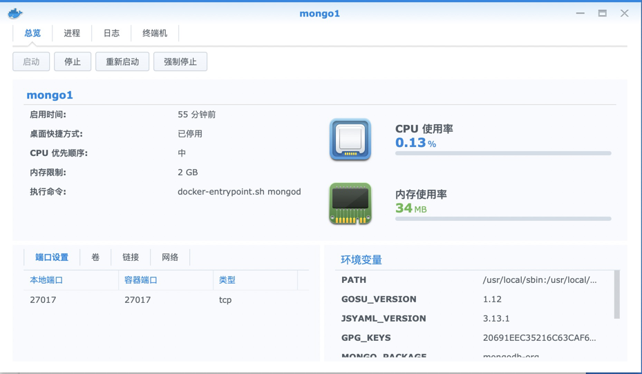
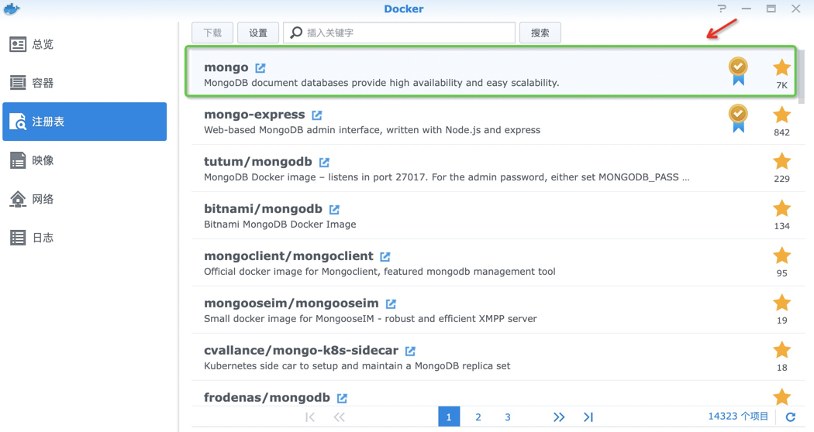
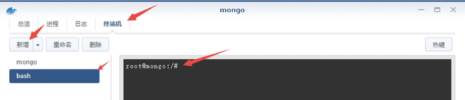
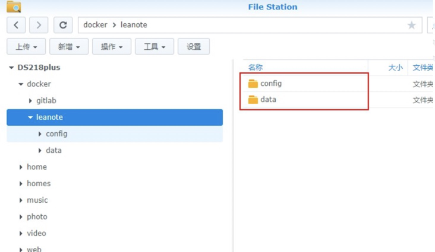
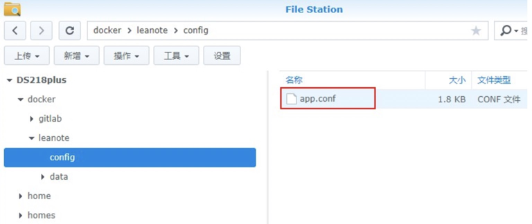
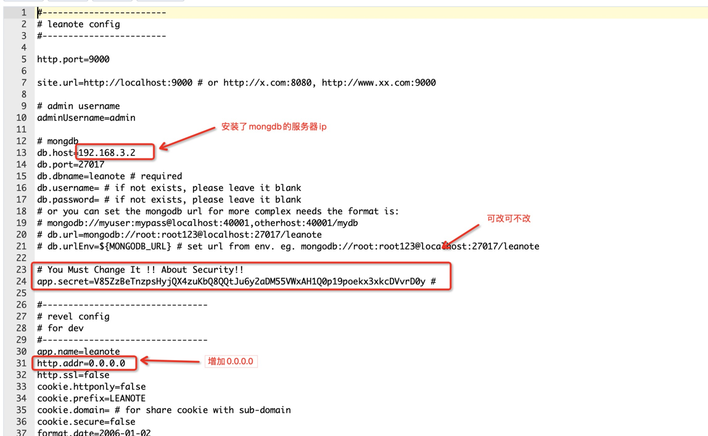
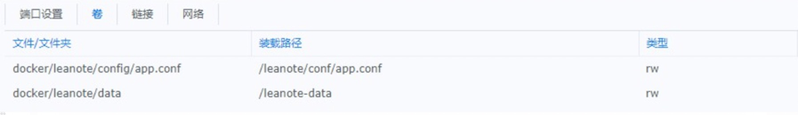
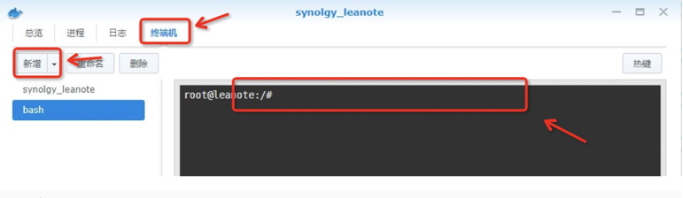

## 1. 下载数据库MongoDB & 蚂蚁笔记leanote
----------

* 需要在Docker中安装两个映像数据库mongo和蚂蚁笔记leanote。 

&emsp;&emsp;在Docker注册表中搜索mongo和leanote并进行安装映像。排名优先下载原则，下载排名第一的映像。

>如果下载过慢可以配置阿里云的上Docker加速镜像URL: https://593vfgxi.mirror.aliyuncs.com

或者自己按照如下步骤获取

>阿里云(https://aliyun.com) --> 产品分类 --> 云计算基础 --> 容器服务 --> 容器镜像服务 --> 管理控制台 --> 镜像中心 --> 镜像加速器 --> 加速器地址

## 2. 安装数据库mongo容器
----------

* 创建数据库mongo容器，端口设置27017。其他默认。

* 通过终端命令在/usr/local/下创建 leanote文件夹以及data目录,重启mongo容器

        # 依次执行mkdir命令
        mkdir /usr/local/leanote
        mkdir /usr/local/leanote/data

创建目录

## 3. 配置蚂蚁笔记leanote在Docker外部设置
----------

* 在群晖NAS中创建蚂蚁笔记leanote文件夹再在里面新建config与data文件夹，config文件夹下上传app.conf文件，这里是app.conf文件下载地址：[app.conf](https://raw.githubusercontent.com/izuolan/dockerfiles/master/leanote/app.conf)

创建文件

上传app.conf

* 修改app.conf文件
 三处需要修改地方，其中第二处可改可不改(隐私要求不高可以不改)。

修改配置文件

## 4. 安装蚂蚁笔记leanote容器
----------

* 创建leanote容器，修改容器名称synology_leanote，高级 卷设置中创建2个映射 一个文件夹 一个文件

        文件夹：docker/leanote/data 映射为 /leanote-data
        文件：docker/leanote/config/app.conf 映射为/leanote/conf/app.conf

文件映射
* 端口设置

端口设置

## 5. 使用蚂蚁笔记leanote容器初始化数据库mongo
----------

* 启动Docker中安装的synology_leanote_mongo和synology_leanote容器
* 通过synology_leanote容器的终端机初始化synology_leanote_mongo的数据

初始化

        # 192.168.3.2 是 app.conf 中 db.host 项的 ip地址
        mongorestore -h 192.168.3.2 -d leanote --dir/leanote/mongodb_backup/leanote_install_data/

* 重启synology_leanote容器

## 6. 蚂蚁笔记leanote使用
----------

* 浏览器输入192.168.3.2:9000 (根据你们的IP端口修改就行) 登陆就行
* 初始默认管理员账号为admin，密码为abc123 在后台可修改

