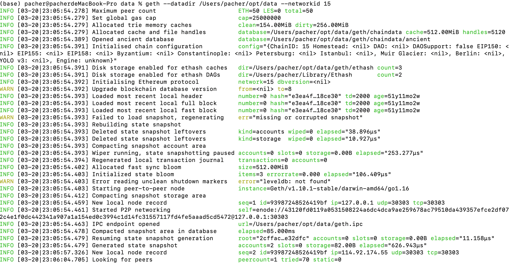

## 1. 使用homebrew-ethereum安装Geth
### 1.1 Installation
```
brew tap ethereum/ethereum
```
### 1.2 GO client
```
brew install ethereum
```
### 1.3 Solidity
安装最近的release版本
```
brew install solidity
```
安装0.7.x(0.x.x)最近的release版本
```
brew install solidity@7
```
### 1.4 Runing
#### 1.4.1 Go client
`geth`
#### 1.4.2 Solidity
`solc`

## 2. 启动节点同步
安装好了Geth，现在我们可以尝试运行一下它，执行下面的命令，geth就会开始同步区块，并存储在当前目录下。这里的 `--syncmode fast` 参数表示我们会以“快速”模式同步区块。在这种模式下，我们只会下载每个区块头和区块体，但不会执行验证所有的交易，直到所有区块同步完毕再去获取一个系统当前状态。这样就节省了很多交易验证的时间。
```
geth --datadir . --syncmode fast
```
通常，在同步以太坊区块链时，客户端会一开始就下载并验证每个块和每个交易，也就是说从创世区块开始。毫无疑问，如果我们不加 `--syncmode fast` 参数，同步将花费很长时间并且具有很高的资源要求(它将需要更多的RAM，如果你没有快速存储，则需要很长时间)。<br/>
如果我们想要同步测试网络的区块，可以用下面的命令：
```
geth --testnet --datadir . --syncmode fast
```
` --testnet ` 这个参数会告诉 `geth` 启动并连接到最新的测试网络，也就是 `Ropsten`。测试网络的区块和交易数量会明显少于主网，所以会更快一点。但即使是用快速模式同步测试网络，也会需要几个小时的时间。
## 3. 搭建自己的私有链
因为公共网络的区块数量太多，同步耗时太长，我们为了方便快速了解 `Geth` ，可以试着用它来搭一个只属于自己的私链。<br\>
首先，我们需要创建网络的“创世”(genesis)状态，这写在一个小小的json文件里(例如我们将其命名为 genesis.json)
```json
{
    "config" : {
        "chainId" : 15
    },
    "difficulty" : "2000",
    "gasLimit" : "2100000",
    "alloc" : {
        "0x5851d81C604dc422785E976399469CB4e94a77a7" : { "balance" : "300000" }
    }
}
```
>chainId:网络
>difficulty:难度系数
>gasLimit:每个区块里最多有多少Gas
>alloc:创世区预挖
要创建一条以它作为创世块的区块链，我们可以使用下面的命令：
```
geth --datadir /Users/pacher/opt/data init genesis.json
```
在当前目录下运行 `geth` ，就会启动这条私链，注意要将 `networked` 设置为创世块配置里的chainId一致。
```
geth --datadir /Users/pacher/opt/data --networkid 15
#启动poa私链后台执行
nohup geth --datadir /Users/pacher/opt/devdata --dev --rpc --rpcapi db,eth,net,web3,personal,miner --rpcport 8545 --rpcaddr 127.0.0.1 --rpccorsdomain "*" --networkid 15 2>>/Users/pacher/opt/devdata/output.log &
#进入控制台
geth attach ipc:/Users/pacher/opt/devdata/geth.ipc
```
我们可以看到节点正常启动：

这时我们就成功启动了一条自己的私链了。

## 3. JSON-RPC
以太坊客户端提供了API和一组远程调用(RPC)命令，这些命令被编码为JSON。这被称为JSON-RPC API。本质上，JSON-RPC API就是一个接口，允许我们编写的程序使用以太坊客户端作为网关，访问以太坊网络和链上数据。<br\>
通常，RPC接口作为一个HTTP服务，端口设定为8545。出于安全原因，默认情况下，它仅限于接受来自localhost的连接。<br\>
要访问JSON-RPC API，我们可以使用编程语言编写的专用库，例如JavaScript的web3.js。
或者也可以手动构建HTTP请求并发送/接收JSON编码的请求，如：
```
$ curl -X POST -H "Content-Type: application/json" --data \
'{"jsonrpc":"2.0","method":"web3_clientVersion","params":[],"id":1}' \
http://localhost:8545
```


