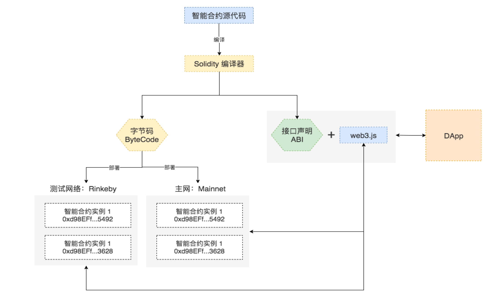

# Solidity 简介## 1. Solidity是什么
* Solidity 是一门面向合约的、为实现智能合约而创建的高级编 程语言。这门语言受到了 C++，Python 和 Javascript 语言的 影响，设计的目的是能在以太坊虚拟机(EVM)上运行。
* Solidity 是静态类型语言，支持继承、库和复杂的用户定义类 型等特性。
* 内含的类型除了常见编程语言中的标准类型，还包括 address 等以太坊独有的类型，Solidity 源码文件通常以 .sol 作为扩展 名
* 目前尝试 Solidity 编程的最好的方式是使用 Remix。Remix 是一个基于 Web 浏览器的 IDE，它可以让你编写 Solidity 智 能合约，然后部署并运行该智能合约。
## 2. Solidity语言特性
Solidity的语法接近于JavaScript，是一种面向对象的语言。但作为一 种真正意义上运行在网络上的去中心合约，它又有很多的不同:
* 以太坊底层基于帐户，而不是UTXO，所以增加了一个特殊的 address 的数据类型用于定位用户和合约账户。
* 语言内嵌框架支持支付。提供了payable等关键字，可以在语言层面 直接支持支付。
* 使用区块链进行数据存储。数据的每一个状态都可以永久存储，所以 在使用时需要确定变量使用内存，还是区块链存储。
* 运行环境是在去中心化的网络上，所以需要强调合约或函数执行的调 用的方式。
* 不同的异常机制。一旦出现异常，所有的执行都将会被回撤，这主要 是为了保证合约执行的原子性，以避免中间状态出现的数据不一致。
## 3. Solidity源码和智能合约
Solidity 源代码要成为可以运行在以太坊上的智能合约需要经历如下的步骤:
1. 用 Solidity 编写的智能合约源代码需要先使用编译器编译为字节码 (Bytecode)，编译过程中会同时产生智能合约的二进制接口规范 (Application Binary Interface，简称为 ABI);
2. 通过交易(Transaction)的方式将字节码部署到以太坊网络，每次 成功部署都会产生一个新的智能合约账户;
3. 使用 Javascript 编写的 DApp 通常通过 web3.js + ABI去调用智能合 约中的函数来实现数据的读取和修改。
## 4. Solidity编译器
### 4.1 Remix
• Remix 是一个基于 Web 浏览器的 Solidity IDE;可在线使用而无需安装任 何东西
• http://remix.ethereum.org
### 4.2 solcjs
• solc 是 Solidity 源码库的构建目标之一，它是 Solidity 的命令行编译器 • 使用 npm 可以便捷地安装 Solidity 编译器 solcjs
• npm install -g solc
### 4.3 流程

## 5. 一个简单的智能合约
``` sol
pragma solidity ^0.4.0;
contract SimpleStorage {
        uint storedData;
        function set(uint x) public {
            storedData = x;
        }
        function get() public view returns (uint) {
        }
 }
```
## 6. 智能合约概述
### 6.1 Solidity中的合约
* 一组代码(合约的函数 )和数据(合约的状态 )，它们位于以太坊区块链的一个特定地址上
* 代码行 uint storedData; 声明一个类型为 uint (256位无符号整数)的状态变量，叫做 storedData
* 函数 set 和 get 可以用来变更或取出变量的值
### 6.2 合约结构
* 状态变量(State Variables) 作为合约状态的一部分，值会永久保存在存储空间内。
* 函数(Functions) 合约中可执行的代码块。
* 函数修饰器(Function Modifiers) 用在函数声明中，用来补充修饰函数的语义。
* 事件(Events) 非常方便的 EVM 日志工具接口
### 6.3 子货币
```sol
pragma solidity >0.6.1;
contract Coin{  
    address public minter;
    //这一行声明了一个可以被公开访问的 address 类型的状态变量。关键字 public 自动生成一个函数，允许你在这个合约之外 访问这个状态变量的当前值。 
    mapping(address => uint) public balances;
//创建一个公共状态变量，但它是一个更复杂的数据类型， 该类型将 address 映射为无符号整数。mappings 可以看作是一个哈希表，它会执行虚拟初始化， 把所有可能存在的键都映射到一个字节表示为全零的值   
    event Sent(address from , address to, uint amount);
//声明了一个“事件”(event)，它会在 send 函数的最后一行触发。用户可以监听区块链上正在发送的事件，而不会花费太多成本。一旦它被发出，监听该事件的listener都将收到通知。所有的事件都包含了 from ， to 和 amount 三个参数，可方便追踪事务   
    constructor() public { minter = msg.sender;}
    function mint(address receiver, uint amount) public {
        require(msg.sender == minter);
        balances[receiver] += amount;
    }
    function send(address receiver, uint amount) public {
        require(amount <= balances[msg.sender]);
        balances[msg.sender] -= amount;
        balances[receiver] += amount;
        emit Sent(msg.sender,receiver,amount);
        //触发Sent事件，并将参数传入
   }
}
```
### 6.4 子货币优化
```solidity
pragma solidity >0.6.1;

contract Coin{ 
    address public minter;
    mapping(address => uint256) public balances;
    event Sent(address from , address to, uint256 amount);
    constructor(uint256 initalSupply) public { 
        balances[msg.sender] = initalSupply;
    }
    function send(address _receiver, uint256 amount) public returns(bool) {
        require(amount <= balances[msg.sender]);
        require(balances[_receiver] + amount >= balances[_receiver]); 
        balances[_receiver] += amount;
        emit Sent(msg.sender,_receiver,amount);
        return true;
    }
}
```


