# 以太坊编程语言Solidity漏洞;##  1. 漏洞合约分析
该合约是一个银行类合约，用户可以存入eth到该合约，并在存入到期之后取出。原题对该合约描述如下：
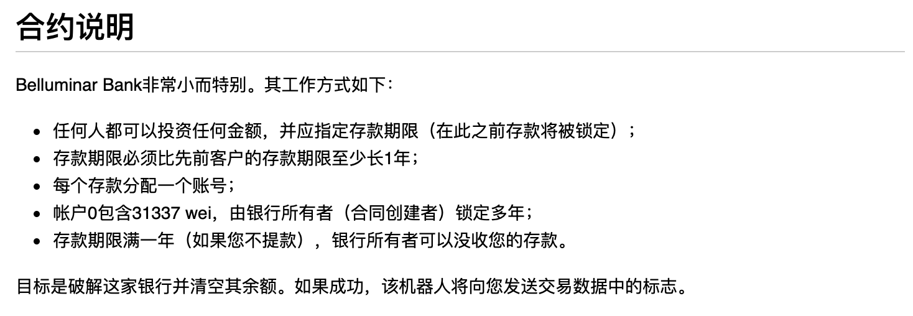
该合约中存在漏洞，攻击者利用漏洞可以盗取合约中的所有余额。漏洞涉及到整数溢出、变量覆盖以及由变量覆盖导致的变量相互影响。

合约源码如下：
```sol
pragma solidity ^0.4.23;
contract BelluminarBank {
    struct Investment {
        uint256 amount;                      //存款金额
        uint256 deposit_term;             //存款期限
        address owner;                       //存款账户
    }
    //全局变量
    Investment[] balances;                //存款记录数组
    uint256 head;                              //第一个有效存款索引
    address private owner;               //银行合约拥有者
    bytes16 private secret;                //银行合约超级取款密码
    function BelluminarBank(bytes16 _secret, uint256 deposit_term) public {
        //合约初始化，设置超级密码和拥有者
        secret = _secret;
        owner = msg.sender;
        if(msg.value > 0) {
            balances.push(Investment(msg.value, deposit_term, msg.sender));
        }
    }
    function bankBalance() public view returns (uint256) {
        //获取合约当前总存款余额
        return address(this).balance;
    }
    //局部变量覆盖全局变量
    function invest(uint256 account, uint256 deposit_term) public payable {
        //存钱到指定的存款记录，如果指定记录不存在，就新建一个记录
        if (account >= head && account < balances.length) {
            //记录存在，则直接增加该记录余额
            Investment storage investment = balances[account];
            investment.amount += msg.value;
        } else {
            if(balances.length > 0) {
            //要求存款期限大于当前合约中最后一个存款记录的期限加1年
            //！！！存在整数溢出
                require(deposit_term >= balances[balances.length - 1].deposit_term + 1 years);
            }
            //构造存储记录并添加到存款记录，即balance数组
            //！！！存在局部变量覆盖全局storage问题
            investment.amount = msg.value;
            investment.deposit_term = deposit_term;
            investment.owner = msg.sender;
            balances.push(investment);
        }
    }

    function withdraw(uint256 account) public {
        //存款期限到达之后可以取出自己的存款
        require(now >= balances[account].deposit_term);
        require(msg.sender == balances[account].owner);
        
        msg.sender.transfer(balances[account].amount);
    }

    function confiscate(uint256 account, bytes16 _secret) public {
        //银行合约拥有者可以把指定的到期存款记录和之前的存款记录的余额全部取出
        require(msg.sender == owner);
        require(secret == _secret);
        require(now >= balances[account].deposit_term + 1 years);
        
        uint256 total = 0;
        for (uint256 i = head; i <= account; i++) {
            total += balances[i].amount;
            delete balances[i];
        }
        head = account + 1;
        msg.sender.transfer(total);
    }
}
```
要提取合约的全部合约余额，confiscate 函数是关键，但该函数调用成功必须满足：

* `msg.sender == owner`
* `secret == _secret`
* `now >= balances[account].deposit_term + 1 years`

攻击者可以通过合约存储访问、整数溢出和变量覆盖来依次构造上述条件。
### 1.1 solidity全局变量存储
在BelluminarBank合约中，一共有4个全局变量，分别是balances、head、owner、secrete。它们的默认访问属性是private，看上去只有合约自己能够访问这些变量。事实上，合约的所有变量数据都是公开存储在链上的区块中，任何人都可以通过访问存储数据来获得这些变量的值。在solidity语言中，全局变量都存储在storage中，根据solidity的变量存储规则，定长的变量在storage中是顺序存储的，数组变量在storage中其索引位置存放的是其数组长度。该合约storage中的变量存储布局如下：
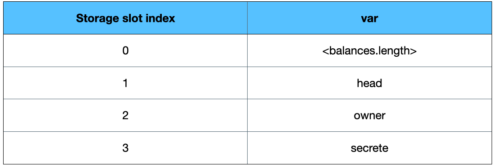

对于在公链部署的合约，可通过以太坊web3接口`web3.eth.getStorageAt(contractAddress, index)`获取某个合约指定storage索引的数据。

因此，secrete并不是一个不可获取的私有数据，攻击者只需要访问该合约`storage`中的数据就可以构造`confiscate`函数的`secret == _secret`条件。
### 1.2 solidity全局变量覆盖
BelluminarBank合约中的 confiscate 函数要求调用者必须是合约拥有者才可以进行余额提取操作，看上去攻击者是无法提取的。然而，由于solidity语言的局部变量存储特性，导致本合约的 owner 变量可以被修改，覆盖问题出现在 invest 函数中。

首先来看 solidity 局部变量覆盖全局 storage 的问题。solidity 语言的变量存储有一个特性，即数组、映射、结构体类型的局部变量默认是引用合约的 storage ，而全局变量默认存储在 storage 中。因此，如果这些局部变量未被初始化，则它们将直接指向 storage，修改这些变量就是在修改全局变量。

以如下的简单合约 test 为例，函数 test1 中定义了一个局部结构体变量x，但是没有对其进行初始化。根据 solidity 的变量存储规则，这时候x是存储在 storage 中的，而且是从索引0开始，那么对其成员变量x,y赋值之后，刚好覆盖了全局变量a和b。有兴趣可以在 remix 中在线对本合约进行调试。
```sol
pragma solidity 0.4.24;

contract test {

    struct aa{

        uint x;

        uint y;

    }

    uint public a = 4;

    uint public b = 6;

    function test1() returns (uint){

        aa x;

        x.x = 9;

        x.y = 7;

    }

}
```
在 invest 函数的else分支中，使用了一个局部结构变量 investment。该局部变量在当前执行分支中并没有被初始化，默认指向合约的 storage 。执行中对该变量的成员赋值就会直接覆盖全局变量，覆盖关系为：

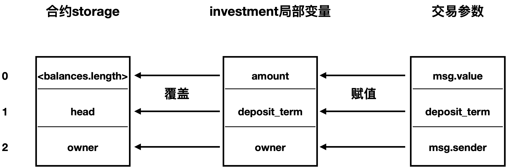

同时，在变量覆盖之前必须满足如下条件，即存款期限是最末一个存款记录的期限后一年：`deposit_term >= balances[balances.length - 1].deposit_term + 1 years` 。由于 deposit_term 是用户提供的，轻松就可以满足。 

所以，通过精心构造invest函数的参数就可以覆盖 stroage 中的 sender，从而改变该合约的拥有者为攻击者，突破 confiscate 函数的`msg.sender == owner`限制。
### 1.3 整数溢出
在BelluminarBank合约源码的 confiscate 函数还有另外一个如下的时间限制，即必须在存款满一年后才能提取，`now >= balances[account].deposit_term + 1 years`。

上一节用于全局变量覆盖的存款操作使得 balances 中最末一个存储记录的期限已经是1年后，即攻击者至少在2年后才能调用 confiscate 函数进行提款。与此同时，deposit_term 在赋值给局部变量的时候会把全局变量head覆盖为超大的数，这也使得后续的 `for (uint256 i = head; i <= account; i++)` 循环处理无法提取全部的存款，因为 head 不为0。

显然，必须把 head 覆盖为0才能提取全部的存款，即 invest 函数的 deposit_term 参数必须为0。但如果该参数为0，又无法满足 invest 函数的全局变量覆盖执行的条件 `deposit_term >= balances[balances.length - 1].deposit_term + 1 years`。

仔细分析可发现，如果 `balances[balances.length - 1].deposit_term+ 1 years` 恰好等于0，则上述的条件恒为真。显然，`balances[balances.length - 1].deposit_term` 只要取值为`(uint256_max – 1 years + 1)` ，就会导致相加后的值为 `uint256_max+1` 。这个结果会超过uint256 的表达空间，产生溢出导致最后的值为0。

因此，攻击者先做第一次存款，把 balances 最后一项的 `deposit_term` 设置为特殊值；然后做第二次存款，`deposit_term` 传入0值，就能触发整数溢出，绕过变量覆盖条件限制并修改 head 为0值。
### 1.4 “变量纠缠”的副作用
在全局变量覆盖中，很容易产生“变量纠缠”现象，从而触发一些容易被忽视的副作用。这里以一个简单合约 test 为例，函数 testArray 中依然存在结构体局部变量a覆盖全局变量x的情况。但由于x是数组变量，其直接索引的 storage 存储位置仅存储其数组长度，也就是a.x只会覆盖x的数据长度，而a.y将覆盖变量 num。

在 testArray 函数中，赋值操作 a.x = 5 时，因为 x.length 与变量a.x处于同一存储位置，赋值后数组x的长度变成了5。接下来，赋值a.y，并将变量a加入到数组x。所以变量a实际上加入到了数组x索引为5的位置。如果调试 testArray 函数执行，会发现在函数执行完毕之后，x[5].x = 6, x[5].y = 7。

这是为什么呢？明明代码中赋值写的是 a.x = 5，a.y = 7。这就是全局变量x和局部变量a形成了“纠缠”，首先是局部变量a修改导致全局变量x改变，然后是全局变量x修改导致了局部变量修改，最后把修改后的局部变量又存储到修改后的全局变量。这里即是，赋值操作a.x = 5时，把数组x的长度变成了5; 接下来 x.push 操作，实际上是先将该数组x的长度加1，此时a.x = 6; 最后再把a.x = 6, a.y=7加入到x[5]。所以，存入数据的x就是新数组的长度6。
```sol
pragma solidity 0.4.24;

contract test {

    struct aa{

        uint x;

        uint y;

    }

    aa [] x;

    uint public num = 4;


    function testArray() returns (uint){

        aa a;

        a.x = 5;

        a.y = 7;

        x.push(a);

    }

}
```
## 2 漏洞利用方式
在第1节中对合约 BelluminarBank存在的几个漏洞进行了分析，下面将说明如何利用这个漏洞提取合约的全部余额，这里在Remix在线编译环境中部署该合约，并演示其利用方式。
（为了方便查看数据，我们将合约源码中的一部分内容进行了可见性修改）

首先部署合约，在部署参数中设置 `secrete 为"0x01000000000000000000000000000000"，deposit_term为1000，msg.value为 31337 wei` 。

部署合约后，合约的全局变量如下图所示：
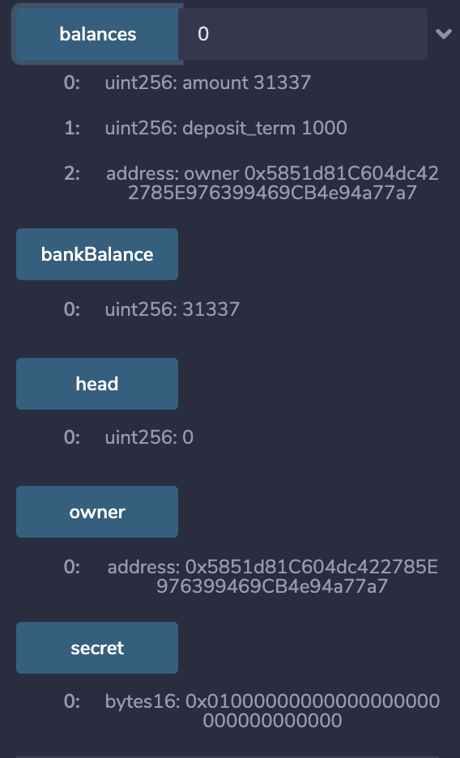
这样，合约目前的余额是 31337 wei，合约拥有者的地址为：0x5851d81C604dc422785E976399469CB4e94a77a7
下面开始需要构造条件使得攻击者可以成功调用confiscate函数。
### 步骤1: 覆盖owner并构造整数溢出条件

要想转走合约余额，首先必须修改合约的owner。利用局部结构体 investment 修改合约owner，需满足条件：

* `account < head or account >= balances.length`
* `deposit_term >= balances[balances.length – 1].deposit_term + 1 years`

设置攻击者（0x03A6...F57d）的invest调用参数如下：

* msg.value = 1 wei (因为在合约初始化时owner已经存入一笔金额，所以此时balances数组长度为1，为了不改变balances数组长度，这里依然将其设置为1 we i
* depositsit_term = 2^256 - 1 years = 115792089237316195423570985008687907853269984665640564039457584007913098103936 （在步骤2中需要利用这个数值构造溢出，同时这个值可以使源码中 require 条件得到满足）
* account = 1 (满足条件 account >= balances.length)

调用之后，新的存款记录数据将存放在balances数组索引为1的位置。此时的balances数组情况和全局storage变量情况如下图所示。
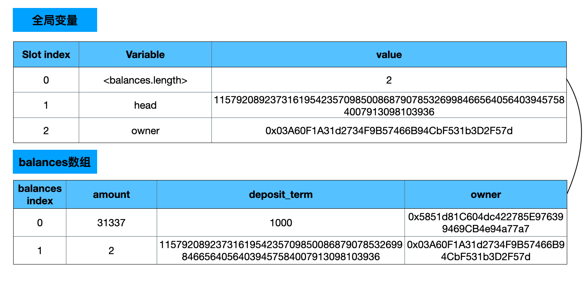
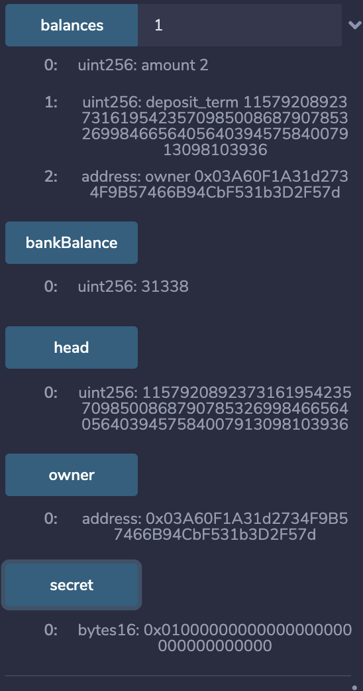
可以发现，owner已经修改为攻击者地址，同时head被传入的deposit_term覆盖为一个超大值。

而提取余额是从balances数组中head索引开始的存款记录开始计算数额的。显然，为了提取到合约owner的余额，即balances[0]账户的余额，head必须被覆盖为0。因此，需要进行第二次storage变量覆盖，修改head。
### 步骤2: 恢复head并绕过deposit_term限制

继续设置攻击者调用invest的参数：

* `msg.value = 2wei` (同样保证balances的长度覆盖后不出现错误)

* `deposit_term = 0:` 恢复head

* `account = 2` (满足条件 account >= balances.length 即可)

因为在步骤 1 中，已经将`balances[1].deposit_term` 设置为 2^256 -1 years，因此在第二次调用 invest 函数时，由于`balances[balances.length - 1].deposit_term + 1 years`溢出为0满足了require条件，所以可以成功进行第二次覆盖。

这样即满足了调用confiscate函数的条件`msg.sender == owner`，通过读取storage很容易获得secrete，条件`secret == _secret` 也可以满足，同时还重新覆盖了head使之变为0 。

覆盖之后全局storage变量和balances数组如下图所示：
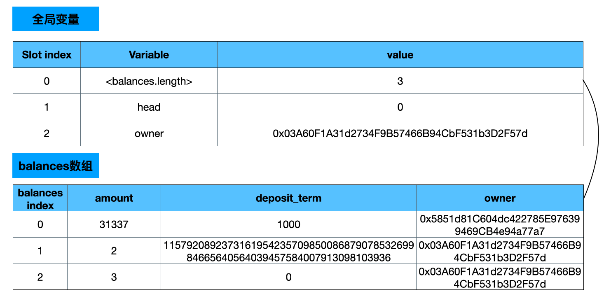
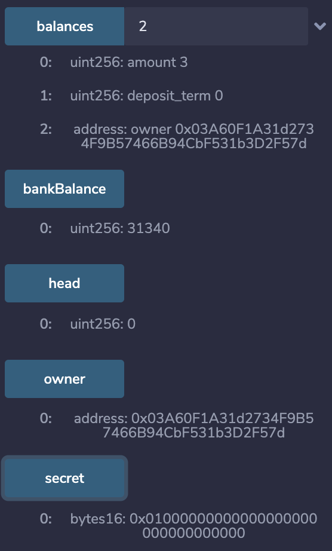
可以发现head已经修改为0了。

现在来看看第三个条件：

`now >= balances[account].deposit_term + 1 years`

account是传入的数据，目前合约中account数量为3。在前面的invest调用后， `balances[2].deposit_term = 0`。 显然条件 `now >= balances[2].deposit_term + 1 years` 成立，所以在恢复head数据的同时，也绕过了confiscate函数中对于存款期限的判定。接下来只要调用函数confiscate时，设置account 为 2，便可使时间判断条件满足，同时也能提取所有账户的余额。
### 步骤3: 增加合约余额

经过步骤1和步骤2，仿佛攻击者已经可以调用confiscate函数提取所有余额了，然而实际上是不行的。交易会发生回滚，这是为什么呢？

仔细分析前面的数据就会发现，步骤1中msg.value为 1 wei，但是最后balances数组中的balances[1].amount 却变成了 2 wei。这是因为变量覆盖过程中产生了“纠缠”副作用，由于msg.value覆盖balances数组的长度，balances更新前增加了数组长度，数组长度又改变了msg.value，最后导致存入的amount变成了新的数组长度，即2。

所以，每次调用invest函数进行变量覆盖，存款记录的账目金额都比调用者实际支付的msg.value大。下图是两次调用invest之后的balances数组情况。
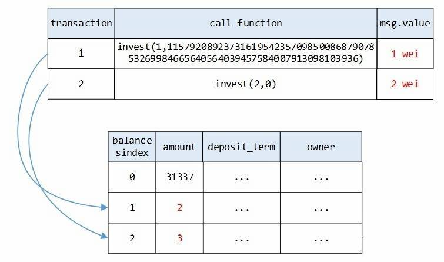

从图中可以看出，存款记录中的账面值会比实际交易的msg.value多 1 wei。通过confiscate函数计算得到的所有账户总额为31342 wei，而实际的合约账户总余额为 31340 wei。
为了能够将合约中所有余额提取出来，需要增加合约的真实余额，使其同存款记录中的余额相等。然而，通过invest方式增加的余额都会被计入账面余额，那么怎么在不通过invest函数的情况下增加合约的真实余额呢？答案是selfdestruct函数。
因此，可以构造一个合约，然后在合约中调用selfdestruct函数将合约的余额转给BelluminarBank合约。为此，构造如下合约：
```sol
pragma solidity ^0.4.23;
contract donar{

    function donar() public payable{

        selfdestruct(0xF82FF094E848112399eE4536835aB203490f80B8);

    }

}
```
该合约创建后马上销毁，同时将自己的余额转给银行合约。

在 remix 中 编译该合约，同时将 contractAddr替换为银行合约地址。然后 在deploy该合约时，设置 msg.value 为2 wei。当合约创建又销毁之后，其余额（2wei）将转给银行账户，使银行合约的账面余额和实际余额一致，这样confiscate函数调用就能够正确执行。

Donar合约部署设置如下：
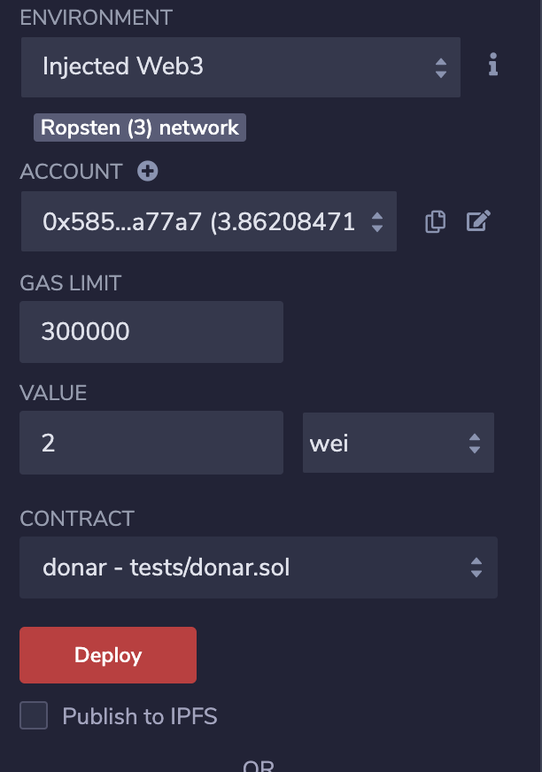
合约部署完之后，BelluminarBank 合约余额如下图：
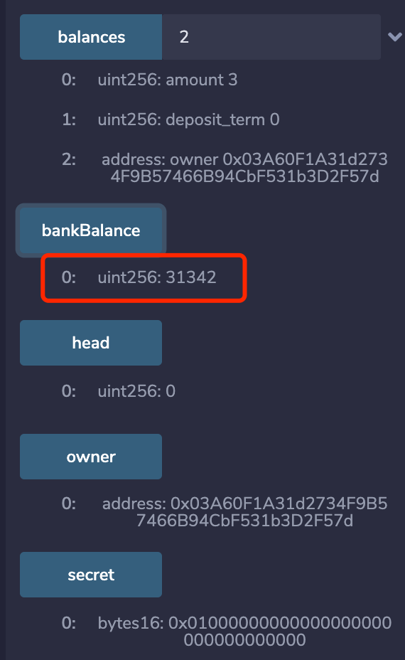
### 步骤4：调用confiscate提取合约余额

经过上面的操作之后，设置confiscate函数的参数为[2，“0x01000000000000000000000000000000”]即可将合约的全部余额转走。
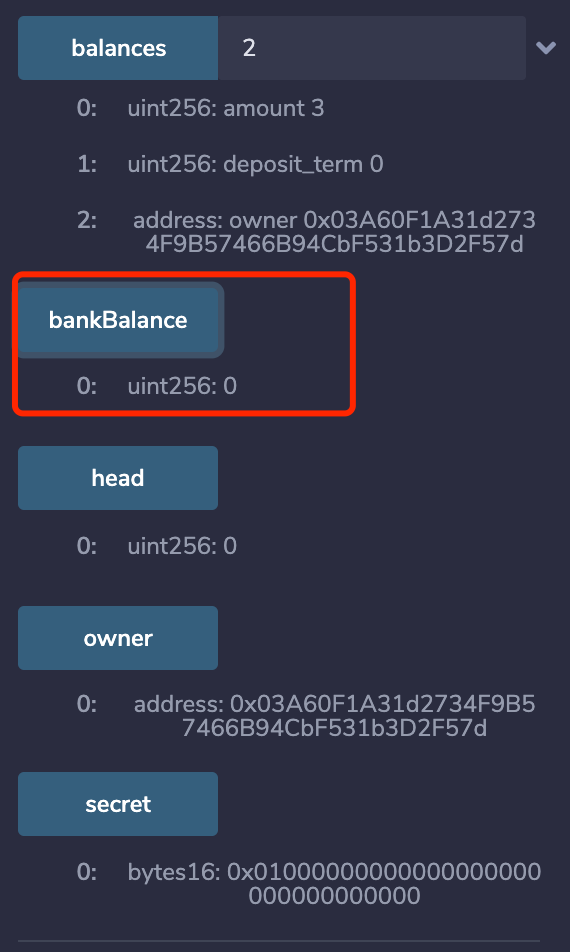
## 3 关于使用Solidity开发的智能合约安全建议

### 3.1 外部调用

#### 3.1.1 尽量避免外部调用
<a name="avoid-external-calls"></a>

调用不受信任的外部合约可能会引发一系列意外的风险和错误。外部调用可能在其合约和它所依赖的其他合约内执行恶意代码。因此，每一个外部调用都会有潜在的安全威胁，尽可能的从你的智能合约内移除外部调用。当无法完全去除外部调用时，可以使用这一章节其他部分提供的建议来尽量减少风险。

<a name="send-vs-call-value"></a>

#### 3.1.2 仔细权衡“send()”、“transfer()”、以及“call.value()”

当转账Ether时，需要仔细权衡“someAddress.send()”、“someAddress.transfer()”、和“someAddress.call.value()()”之间的差别。

-  `x.transfer(y)`和`if (!x.send(y)) throw;`是等价的。send是transfer的底层实现，建议尽可能直接使用transfer。
- `someAddress.send()`和`someAddress.transfer()` 能保证[可重入](#reentrancy) **安全** 。
    尽管这些外部智能合约的函数可以被触发执行，但补贴给外部智能合约的2,300 gas，意味着仅仅只够记录一个event到日志中。
- `someAddress.call.value()()` 将会发送指定数量的Ether并且触发对应代码的执行。被调用的外部智能合约代码将享有所有剩余的gas，通过这种方式转账是很容易有可重入漏洞的，非常 **不安全**。

使用`send()` 或`transfer()` 可以通过制定gas值来预防可重入， 但是这样做可能会导致在和合约调用fallback函数时出现问题，由于gas可能不足，而合约的fallback函数执行至少需要2,300 gas消耗。

一种被称为[*push* 和*pull*](#favor-pull-over-push-payments)的 机制试图来平衡两者， 在 *push* 部分使用`send()` 或`transfer()`，在*pull* 部分使用`call.value()()`。（*译者注：在需要对外未知地址转账Ether时使用`send()` 或`transfer()`，已知明确内部无恶意代码的地址转账Ether使用`call.value()()`）

需要注意的是使用`send()` 或`transfer()` 进行转账并不能保证该智能合约本身重入安全，它仅仅只保证了这次转账操作时重入安全的。

<a name="handle-external-errors"></a>

#### 3.1.3 处理外部调用错误

Solidity提供了一系列在raw address上执行操作的底层方法，比如： `address.call()`，`address.callcode()`， `address.delegatecall()`和`address.send`。这些底层方法不会抛出异常(throw)，只是会在遇到错误时返回false。另一方面， *contract calls* （比如，`ExternalContract.doSomething()`)）会自动传递异常，（比如，`doSomething()`抛出异常，那么`ExternalContract.doSomething()` 同样会进行`throw`） )。

如果你选择使用底层方法，一定要检查返回值来对可能的错误进行处理。

```sh
// bad
someAddress.send(55);
someAddress.call.value(55)(); // this is doubly dangerous, as it will forward all remaining gas and doesn't check for result
someAddress.call.value(100)(bytes4(sha3("deposit()"))); // if deposit throws an exception, the raw call() will only return false and transaction will NOT be reverted

// good
if(!someAddress.send(55)) {
    // Some failure code
}

ExternalContract(someAddress).deposit.value(100);
```
<a name="expect-control-flow-loss"></a>

#### 3.1.4 不要假设你知道外部调用的控制流程

无论是使用**raw calls** 或是**contract calls**，如果这个`ExternalContract`是不受信任的都应该假设存在恶意代码。即使`ExternalContract`不包含恶意代码，但它所调用的其他合约代码可能会包含恶意代码。一个具体的危险例子便是恶意代码可能会劫持控制流程导致竞态。（浏览[Race Conditions](https://github.com/ConsenSys/smart-contract-best-practices/#race-conditions)获取更多关于这个问题的讨论）

<a name="favor-pull-over-push-payments"></a>

#### 3.1.5对于外部合约优先使用*pull* 而不是*push*

外部调用可能会有意或无意的失败。为了最小化这些外部调用失败带来的损失，通常好的做法是将外部调用函数与其余代码隔离，最终是由收款发起方负责发起调用该函数。这种做法对付款操作尤为重要，比如让用户自己撤回资产而不是直接发送给他们。（*译者注：事先设置需要付给某一方的资产的值，表明接收方可以从当前账户撤回资金的额度，然后由接收方调用当前合约提现函数完成转账*）。（这种方法同时也避免了造成 [gas limit相关问题](https://github.com/ConsenSys/smart-contract-best-practices/#dos-with-block-gas-limit)。）

```sh
// bad
contract auction {
    address highestBidder;
    uint highestBid;

    function bid() payable {
        if (msg.value < highestBid) throw;

        if (highestBidder != 0) {
            if (!highestBidder.send(highestBid)) { // if this call consistently fails, no one else can bid
                throw;
            }
        }

       highestBidder = msg.sender;
       highestBid = msg.value;
    }
}

// good
contract auction {
    address highestBidder;
    uint highestBid;
    mapping(address => uint) refunds;

    function bid() payable external {
        if (msg.value < highestBid) throw;

        if (highestBidder != 0) {
            refunds[highestBidder] += highestBid; // record the refund that this user can claim
        }

        highestBidder = msg.sender;
        highestBid = msg.value;
    }

    function withdrawRefund() external {
        uint refund = refunds[msg.sender];
        refunds[msg.sender] = 0;
        if (!msg.sender.send(refund)) {
            refunds[msg.sender] = refund; // reverting state because send failed
        }
    }
}
```
<a name="mark-untrusted-contracts"></a>

#### 3.1.6 标记不受信任的合约

当你自己的函数调用外部合约时，你的变量、方法、合约接口命名应该表明和他们可能是不安全的。

```sh
// bad
Bank.withdraw(100); // Unclear whether trusted or untrusted

function makeWithdrawal(uint amount) { // Isn't clear that this function is potentially unsafe
    Bank.withdraw(amount);
}

// good
UntrustedBank.withdraw(100); // untrusted external call
TrustedBank.withdraw(100); // external but trusted bank contract maintained by XYZ Corp

function makeUntrustedWithdrawal(uint amount) {
    UntrustedBank.withdraw(amount);
}
```

### 3.2 使用`assert()`强制不变性

当断言条件不满足时将触发断言保护 -- 比如不变的属性发生了变化。举个例子，代币在以太坊上的发行比例，在代币的发行合约里可以通过这种方式得到解决。断言保护经常需要和其他技术组合使用，比如当断言被触发时先挂起合约然后升级。（否则将一直触发断言，你将陷入僵局）

例如：

```
contract Token {
    mapping(address => uint) public balanceOf;
    uint public totalSupply;

    function deposit() public payable {
        balanceOf[msg.sender] += msg.value;
        totalSupply += msg.value;
        assert(address(this).balance >= totalSupply);
    }
}
```
注意断言保护 **不是** 严格意义的余额检测， 因为智能合约可以不通过`deposit()` 函数被 [强制发送Ether](#ether-forcibly-sent)！

### 3.3 正确使用`assert()`和`require()` 

在Solidity 0.4.10 中`assert()`和`require()`被加入。`require(condition)`被用来验证用户的输入，如果条件不满足便会抛出异常，应当使用它验证所有用户的输入。 `assert(condition)` 在条件不满足也会抛出异常，但是最好只用于固定变量：内部错误或你的智能合约陷入无效的状态。遵循这些范例，使用分析工具来验证永远不会执行这些无效操作码：意味着代码中不存在任何不变量，并且代码已经正式验证。

<a name="beware-rounding-with-integer-division"></a>

### 3.4 小心整数除法的四舍五入

所有整数除数都会四舍五入到最接近的整数。 如果您需要更高精度，请考虑使用乘数，或存储分子和分母。

（将来Solidity会有一个fixed-point类型来让这一切变得容易。）

```sh
// bad
uint x = 5 / 2; // Result is 2, all integer divison rounds DOWN to the nearest integer

// good
uint multiplier = 10;
uint x = (5 * multiplier) / 2;

uint numerator = 5;
uint denominator = 2;
```

<a name="ether-forcibly-sent"></a>

### 3.5 记住Ether可以被强制发送到账户

谨慎编写用来检查账户余额的不变量。

攻击者可以强制发送wei到任何账户，而且这是不能被阻止的（即使让fallback函数`throw`也不行）

攻击者可以仅仅使用1 wei来创建一个合约，然后调用`selfdestruct(victimAddress)`。在`victimAddress`中没有代码被执行，所以这是不能被阻止的。

### 3.6 不要假设合约创建时余额为零

攻击者可以在合约创建之前向合约的地址发送wei。合约不能假设它的初始状态包含的余额为零。浏览[issue 61](https://github.com/ConsenSys/smart-contract-best-practices/issues/61) 获取更多信息。

### 3.7 记住链上的数据是公开的

许多应用需要提交的数据是私有的，直到某个时间点才能工作。游戏（比如，链上游戏rock-paper-scissors（石头剪刀布））和拍卖机（比如，sealed-bid second-price auctions）是两个典型的例子。如果你的应用存在隐私保护问题，一定要避免过早发布用户信息。

例如：

* 在游戏石头剪刀布中，需要参与游戏的双方提交他们“行动计划”的hash值，然后需要双方随后提交他们的行动计划；如果双方的“行动计划”和先前提交的hash值对不上则抛出异常。
* 在拍卖中，要求玩家在初始阶段提交其所出价格的hash值（以及超过其出价的保证金），然后在第二阶段提交他们所出价格的资金。
* 当开发一个依赖随机数生成器的应用时，正确的顺序应当是（1）玩家提交行动计划，（2）生成随机数，（3）玩家支付。产生随机数是一个值得研究的领域；当前最优的解决方案包括比特币区块头（通过http://btcrelay.org验证），hash-commit-reveal方案（比如，一方产生number后，将其散列值提交作为对这个number的“提交”，然后在随后再暴露这个number本身）和 [RANDAO](http://github.com/randao/randao)。
* 如果你正在实现频繁的批量拍卖，那么hash-commit机制也是个不错的选择。

### 3.8 权衡Abstract合约和Interfaces

Interfaces和Abstract合约都是用来使智能合约能更好的被定制和重用。Interfaces是在Solidity 0.4.11中被引入的，和Abstract合约很像但是不能定义方法只能申明。Interfaces存在一些限制比如不能够访问storage或者从其他Interfaces那继承，通常这些使Abstract合约更实用。尽管如此，Interfaces在实现智能合约之前的设计智能合约阶段仍然有很大用处。另外，需要注意的是如果一个智能合约从另一个Abstract合约继承而来那么它必须实现所有Abstract合约内的申明并未实现的函数，否则它也会成为一个Abstract合约。

### 3.9 在双方或多方参与的智能合约中，参与者可能会“脱机离线”后不再返回

不要让退款和索赔流程依赖于参与方执行的某个特定动作而没有其他途径来获取资金。比如，在石头剪刀布游戏中，一个常见的错误是在两个玩家提交他们的行动计划之前不要付钱。然而一个恶意玩家可以通过一直不提交它的行动计划来使对方蒙受损失 -- 事实上，如果玩家看到其他玩家泄露的行动计划然后决定他是否会损失（译者注：发现自己输了），那么他完全有理由不再提交他自己的行动计划。这些问题也同样会出现在通道结算。当这些情形出现导致问题后：（1）提供一种规避非参与者和参与者的方式，可能通过设置时间限制，和（2）考虑为参与者提供额外的经济激励，以便在他们应该这样做的所有情况下仍然提交信息。

<a name="keep-fallback-functions-simple"></a>

### 3.10 使Fallback函数尽量简单

[Fallback函数](http://solidity.readthedocs.io/en/latest/contracts.html#fallback-function)在合约执行消息发送没有携带参数（或当没有匹配的函数可供调用）时将会被调用，而且当调用 `.send()` or `.transfer()`时，只会有2,300 gas 用于失败后fallback函数的执行（*译者注：合约收到Ether也会触发fallback函数执行*）。如果你希望能够监听`.send（）`或`.transfer（）`接收到Ether，则可以在fallback函数中使用event（译者注：让客户端监听相应事件做相应处理）。谨慎编写fallback函数以免gas不够用。

```sh
// bad
function() payable { balances[msg.sender] += msg.value; }

// good
function deposit() payable external { balances[msg.sender] += msg.value; }

function() payable { LogDepositReceived(msg.sender); }
```

<a name="mark-visibility"></a>

### 3.11 明确标明函数和状态变量的可见性

明确标明函数和状态变量的可见性。函数可以声明为 `external`，`public`， `internal` 或 `private`。 分清楚它们之间的差异， 例如`external` 可能已够用而不是使用 `public`。对于状态变量，`external`是不可能的。明确标注可见性将使得更容易避免关于谁可以调用该函数或访问变量的错误假设。

```sh
// bad
uint x; // the default is private for state variables, but it should be made explicit
function buy() { // the default is public
    // public code
}

// good
uint private y;
function buy() external {
    // only callable externally
}

function utility() public {
    // callable externally, as well as internally: changing this code requires thinking about both cases.
}

function internalAction() internal {
    // internal code
}
```

<a name="lock-pragmas"></a>

### 3.12 将程序锁定到特定的编译器版本

智能合约应该应该使用和它们测试时使用最多的编译器相同的版本来部署。锁定编译器版本有助于确保合约不会被用于最新的可能还有bug未被发现的编译器去部署。智能合约也可能会由他人部署，而pragma标明了合约作者希望使用哪个版本的编译器来部署合约。

```sh
// bad
pragma solidity ^0.4.4;


// good
pragma solidity 0.4.4;
```
<a name="beware-division-by-zero"></a>

（*译者注：这当然也会付出兼容性的代价*）

### 3.13 小心分母为零 (Solidity < 0.4)

早于0.4版本, 当一个数尝试除以零时，Solidity [返回zero](https://github.com/ethereum/solidity/issues/670) 并没有 `throw` 一个异常。确保你使用的Solidity版本至少为 0.4。

<a name="differentiate-functions-events"></a>

### 3.14 区分函数和事件

为了防止函数和事件（Event）产生混淆，命名一个事件使用大写并加入前缀（我们建议**LOG**）。对于函数， 始终以小写字母开头，构造函数除外。

```sh
// bad
event Transfer() {}
function transfer() {}

// good
event LogTransfer() {}
function transfer() external {}
```

<a name="prefer-newer-constructs"></a>

### 3.15 使用Solidity更新的构造器

更合适的构造器/别名，如`selfdestruct`（旧版本为`suicide`）和`keccak256`（旧版本为`sha3`）。 像`require(msg.sender.send(1 ether))`的模式也可以简化为使用`transfer()`，如`msg.sender.transfer(1 ether)`。

<a name="known-attacks"></a>

