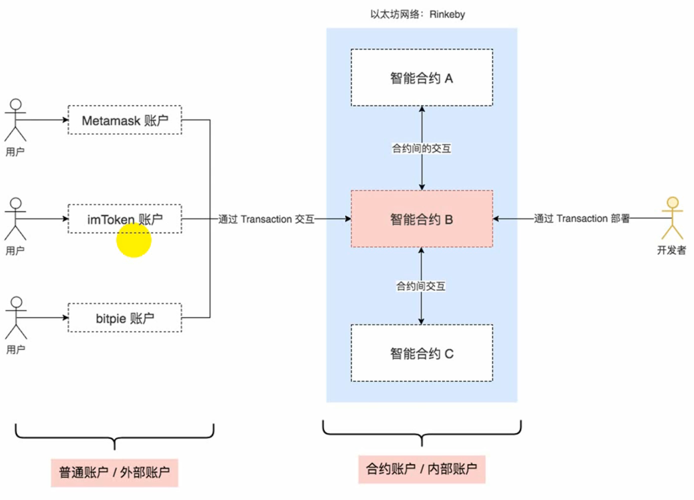

# 以太坊账户
## 1. 账户设计
### 1.1 从UTXO谈起
比特币在基于UTXO的结构中存储有关用户余额的数据：系统的整个状态是一组UTXO的集合，每个UTXO都有一个所有者和一个面值(就像不同的硬币)，而交易会花费若干个输入的UTXO，并根据规则创建若干个新的UTXO。<br\>
每个引用的输入必须有效且尚未花费，对于一个交易，必须包含有与每个输入的所有者匹配的签名，总输入必须大于等于总输出值，所以系统中用户的余额(balance)是用户具有私钥的UTXO的总值。
### 1.2 以太坊的做法
以太坊的“状态”，就是系统中所有账户的列表，每个账户都包含了一个余额(balance)，和以太坊特殊定义的数据(代码和内部存储)。如果发送账户有足够的余额来支付，则交易有效；在这种情况下发送账户先扣款，而收款账户将记入这笔收入，如果接收账户有相关代码，则代码会自动运行，并且它的内部存储也可能被更改，或者代码还可能向其他账户发送额外的消息，这就会导致进一步的借贷资金关系
## 2. 优缺点比较
### 2.1 比特币UTXO模式优点：
* 更高程度的隐私：如果用户为他们收到的每笔交易使用新地址，那么通常很难将账户相互链接。这很大程度上适用于于货币，但不太适用于任意Dapps，因为Dapps通常涉及跟踪和用户绑定的复杂状态，可能不存在像货币那样简单的用户状态划分方案。
* 潜在的可扩展性：UTXO在理论上更符合可扩展性要求。因为我们只需要依赖拥有UTXO的那些人去维护基于Merkle树的所有权证明就够了，即使包括所有者在内的每个人都决定忘记该数据，那么也只有所有者受到对应UTXO的损失，不影响接下来的交易。而在账户模式中，如果每个人都丢失了与账户相对应的Merkle树的部分，那将会使得和该账户有关的消息完全无法处理，包括发币给它。
### 2.2 以太坊账户模式优点：
* 可以节省大量空间：不将UTXOs分开存储，而是合为一个账户，每个交易只需要一个输入、一个签名并产生一个输出。
* 更好的可替代性：货币本质上都是同质化、可替代的；UTXO的设计使得货币从来源分成了“可花费”和“不可花费”两类，这在实际应用中很难有对应的模型。
* 更加简单：更容易编码和理解，特别是设计复杂脚本的时候。UTXO在脚本逻辑复杂时更令人费解。
* 便于维护持久轻节点：只要沿着特定方向扫描状态树，轻节点可以很容易地随时访问账户相关的所有数据。而UTXO的每个交易都会使得状态引用发生改变，这对轻节点来说长时间运行Dapp会有很大压力。
### 2.3 比特币和以太坊的对比
|      &emsp;    | BitCoin | Ethereum |
| :----: | :----: | :----: |
| 设计定位 | 现金系统 | 去中心化应用平台 |
| 数据组成 | 交易列表(账本) | 交易和账户状态 |
| 交易对象 | UTXO | Accounts |
| 代码控制 | 脚本 | 智能合约 |

## 3. 以太坊账户类型
### 3.1 外部账户（Externally owned account，EOA）
* 有对应的以太币余额
* 可以发送交易（转币或触发合约代码）
* 由用户私钥控制
* 没有关联代码
### 3.2 合约账户（Contract accounts）
* 有对应的以太币余额
* 有关联代码
* 由代码控制
* 可通过交易或来自其他合约的调用消息来触发代码执行
* 执行代码时可以操作自己的存储空间，也可以调用其他合约

## 4. 以太坊交易
签名的数据包，由EOA发送到另一个账户
* 消息的接收方地址
* 发送方签名
* 金额（value）
* 数据（DATA，可选）
* Start Gas
* Gas price

## 5. 消息
* 合约可以向其他合约发送“消息”；
* 消息是不会被序列化的虚拟对象，只存在于以太坊执行环境（EVM）中；
* 可以看做函数调用
* 消息发送方
* 消息接收方
* 金额（value）
* 数据（DATA，可选）
* Start Gas

## 6. 合约
* 可以读/写自己的内部存储（32字节key-value的数据库）
* 可向其他合约发送消息，依次触发执行
* 一旦合约运行结束，并且由它发送的消息触发的所有子执行（sub-execution）结束，EVM就会终止运行，直到下次交易被唤醒

### 6.1 合约应用
* 维护一个数据存储（账本），存放对其他合约或外部世界有用的内容
* 最典型的例子是模拟货币的合约（代币）
* 通过合约实现一种具有更复杂的访问策略的普通账户（EOA），这被称为“转发合同”：只有在满足某些条件时才会将传入的消息重新发送到某个所需的目的地址；例如：一个人可以拥有一份转发合约，该合约会等待直到给定三个私钥中的两个确认之后，再重新发送特定消息
* 钱包合约是这类应用中很好的例子
* 管理多个用户之间的持续合同或关系
* 这方面的例子包括金融合同，以及某些特定的托管合同或某种保险

