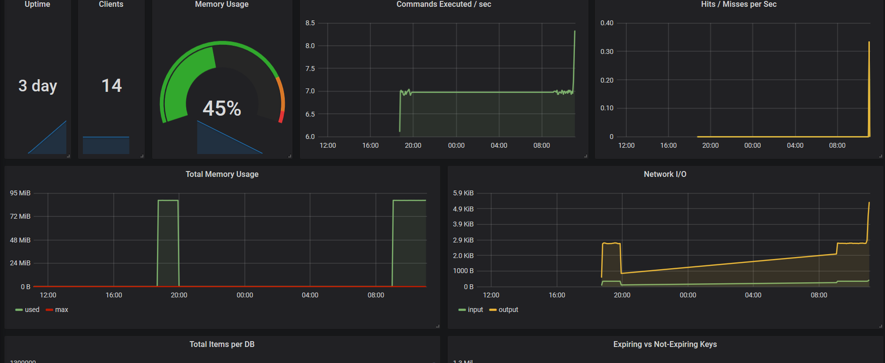
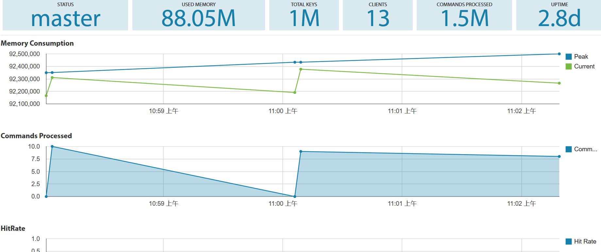
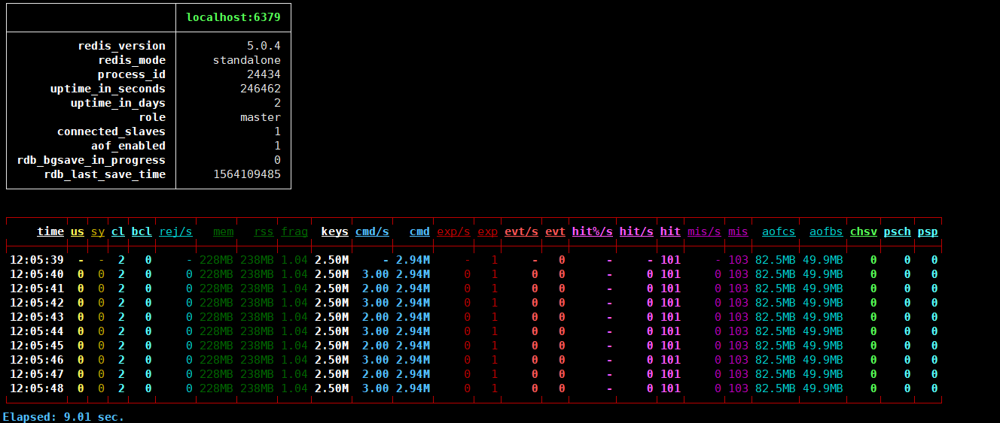
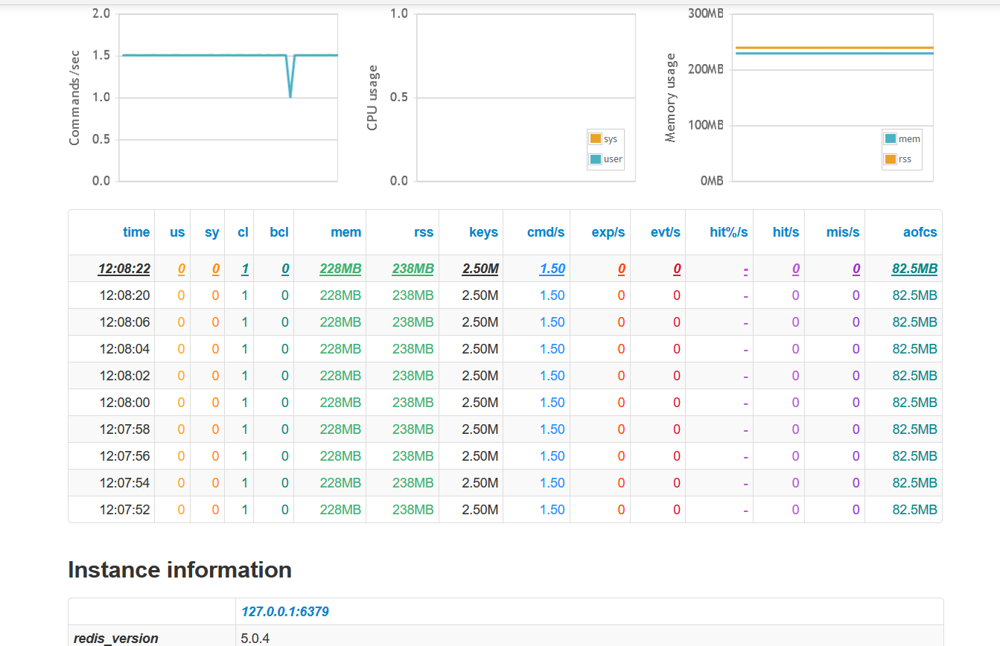

## 1. Redis性能压力Redis性能压力主要源于响应时间变慢和内存突然增长，甚至达到上限的问题。其原因主要有以下几个方面：

* 慢查询
* 大对象和大键/键个数增长、平均长度突增
* 网络通信延迟
* Redis持久化引发的延迟
* 数据淘汰引发的延迟
  当Redis出现问题时，我们很难直接定位到具体原因，需要通过Redis的监控提供的信息进行分析才能得到答案。

## 2. Redis监控参数
Redis可以通过info all命令的的输出获取相关性能指标。可以分为以下十类：
* server(基本信息)
* clients(连接信息)
* memory(内存信息)
* persistence(持久化信息)
* stats(命令等状态信息)
* replication(复制信息)
* cpu(CPU相关信息)
* cluster(集群信息)
* keyspace(键空间信息)
* commandstats(调用命令相关信息)
  在下面的介绍中，我将会介绍各类信息中的关键参数，其余部分可以自行研究。
### 2.1 Server
```
uptime_in_days：从Redis server 启动到现在的天数
```

### 2.2 Clients
```
connected_clients：已连接客户端的数量 (不包括从服务器)
blocked_clients：正在等待阻塞命令（BLPOP、BRPOP、BRPOPLPUSH）的客户端的数量
```
### 2.3 Memory
```
used_memory：已使用的内存（不包含内存碎片）
used_memory_rss：已使用的内存（包含内存碎片）
used_memory_peak：过去Redis内存使用的峰值
maxmemory：最大内存
通过used_memory/maxmemory可以计算出内存使用率，未设置淘汰策略(maxmemory_policy)时，达到maxmemory限制不能写入数据。
```
### 2.4 Persistence
```
rdb_last_bgsave_status/aof_last_write_statu/aof_last_bgrewrite_statuss：最后一次持久化/AOF重写状态
aof_pending_bio_fsync：后台IO队列中等待fsync的任务数
aof_current_size：AOF当前文件大小
```
### 2.5 Stats
```
total_commands_processed：服务器已执行的命令数量
instantaneous_ops_per_sec：每秒执行命令数
rejected_connections：因为最大客户端数量限制而被拒绝的连接请求数量
expired_keys：过期的数据库键数量
evicted_keys：因最大内存容量限制而被驱逐的键数量
keyspace_hits：键空间命中数
keyspace_misses：键空间未命中数
total_net_input_bytes：网络流入总流量
total_net_output_bytes：网络流出总流量
```
### 2.6 Replication
```
master_link_status：主从连接状态
master_repl_offset：主从间这个变量的差距代表延迟的偏移量
```
### 2.7 CPU
```
used_cpu_sys：Redis服务器耗费的系统CPU
used_cpu_user：Redis服务器耗费的用户CPU
used_cpu_sys_children：Redis后台进程耗费的系统CPU
used_cpu_user_children：Redis后台进程耗费的用户CPU
```
### 2.8 Cluster
```
cluster_enabled：是否使用集群
```
### 2.9 Keyspace
```
dbx:keys=xxx,expires=x,avg_ttl=x：数据库的键数量、带有过期时间的键的数量，存活的时间计数
```
### 2.10 Commandstats
```
# Commandstats （执行命令的次数，执行命令所耗费的毫秒数）
cmdstat_replconf:calls=175272,usec=335561,usec_per_call=1.91
cmdstat_command:calls=6,usec=5579,usec_per_call=929.83
cmdstat_set:calls=2117489,usec=8755492,usec_per_call=4.13
cmdstat_auth:calls=417,usec=809,usec_per_call=1.94
cmdstat_zrangebyscore:calls=174,usec=2521,usec_per_call=14.49
cmdstat_latency:calls=1210,usec=2403,usec_per_call=1.99
cmdstat_bgrewriteaof:calls=1,usec=1901,usec_per_call=1901.00
cmdstat_zadd:calls=26908,usec=573861,usec_per_call=21.33
cmdstat_host::calls=16,usec=398,usec_per_call=24.88
cmdstat_zremrangebyscore:calls=2454,usec=14800,usec_per_call=6.03
cmdstat_slowlog:calls=2420,usec=10422,usec_per_call=4.31
cmdstat_info:calls=90152,usec=7952483,usec_per_call=88.21
cmdstat_psync:calls=1,usec=2465,usec_per_call=2465.00
cmdstat_config:calls=1216,usec=101234,usec_per_call=83.25
```
## 3. Redis监控工具
### 3.1 Prometheus+Grafana
Prometheus可以理解为一个数据库+数据抓取工具，从各节点抓来统一的数据，放入Prometheus这一个时间序列数据库中。那如何保证各处的数据格式是统一的呢？就是通过这个exporter。exporter也是用GO写的程序，它开放一个http接口，对外提供格式化的数据。通过在node节点部署exporter即可实现对Redis的监控。Grafana是一个提供高度可视化的工具,将Prometheus的数据进行可视化展示。


### 3.2 Redis-monitor
Redis-monitor是由Python编写的开源的图形化监控工具。核心服务部分只包括一个web服务和基于Redis自带的Info命令以及monitor命令的监控服务。支持多实例监控，监控信息可以使用redis存储和sqlite持久化存储。


### 3.3 Redis-stat
Redis-stat是一个用Ruby编写的简单Redis监控工具，基于Redis的INFO命令，因此与基于MONITOR命令的其他监视工具不同，通常不会影响Redis实例的性能。Redis-stat监视Redis实例在客户端输出，也可以提供Web服务器提供的仪表板页面。
```
redis-stat  localhost:6379 -a xxx 1 10 --csv=/tmp/output.csv --verbose #客户端输出类vmstat格式的信息
redis-stat --server --daemon #后台运行，在web界面进行输出。
```



### 3.4 Redis-faina
redis-faina是由Instagram开发并开源的一个Redis查询分析工具。Redis-faina是通过Redis的MONITOR命令来实现的，通过对在Redis上执行的query进行监控，统计出一段时间的query特性。
```
redis-cli -p 6379 MONITOR | head -n | ./redis-faina.py [options] #Redis-faina对MONITOR的输出文件进行分析展示
```
输出格式如下
```
Overall Stats
========================================
Lines Processed      7904
Commands/Sec         256.80

Top Prefixes
========================================
n/a

Top Keys
========================================
970125      3952    (50.00%)
aaa850      2       (0.03%)
aaa919      2       (0.03%)
aaa852      2       (0.03%)
aaa853      2       (0.03%)
aaa678      2       (0.03%)
aaa679      2       (0.03%)
aaa856      2       (0.03%)

Top Commands
========================================
AUTH      3952    (50.00%)
set       3950    (49.97%)

Command Time (microsecs)
========================================
Median      1920.0
75%     2016.25
90%         2092.0
99%         2840.0

Heaviest Commands (microsecs)
========================================
AUTH      22542297.5
set       8236623.75

Slowest Calls
========================================
20718202.0      "AUTH" "970125"
8456.0          "set" "aaa82" "aaaaaaaa82"
6624.0          "set" "aaa103" "aaaaaaaa103"
6506.0          "set" "aaa817" "aaaaaaaa817"
6105.0          "set" "aaa2024" "aaaaaaaa2024"
6081.0          "set" "aaa1057" "aaaaaaaa1057"
6074.75         "set" "aaa1948" "aaaaaaaa1948"
6067.0          "set" "aaa576" "aaaaaaaa576"
```

