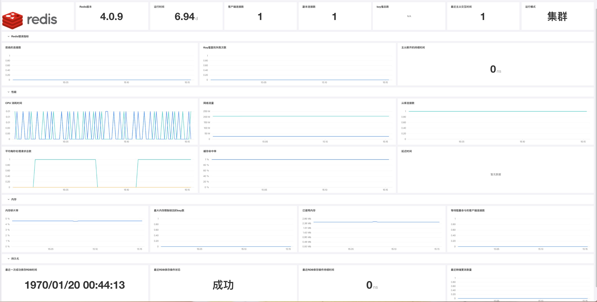

## 简介
监控Redis可以帮助解决两个方面的问题：Redis本身的资源问题，以及基础架构中其他方面出现的问题。 其需要监测的几个关键领域为：

* 性能指标
* 内存指标
* 基本活动指标
* 持久性指标　　　
* 错误指标

## 场景视图



## 前置条件

-  已安装 DataKit

## 配置详情

1. 找到 datakit 默认安装路径的 conf.d 文件夹 (cd /usr/local/cloudcare/dataflux/datakit/conf.d)
2. 进入 db 目录，复制 redis.conf.sample 为 redis.conf
3. 修改 servers = [ redis 连接信息 ] 
4. 重启 datakit 使配置生效

```
[[inputs.redis]]
  servers = ["tcp://:password@localhost:6379"]
```

## 采集指标

#### **redis**

| 指标                           | 描述                                                         |
| :----------------------------- | ------------------------------------------------------------ |
| `aof_current_rewrite_time_sec`   | 正在进行的AOF重写操作的持续时间（s）                         |
| `aof_enabled`                    | 指示AOF日志记录已激活的标志                                  |
| `aof_last_bgrewrite_status`      | 最近一次AOF重写操作的状态                                    |
| `aof_last_rewrite_time_sec`      | 最近一次AOF重写操作的持续时间（s）                           |
| `aof_last_write_status`         | 最近一次AOF写入操作的状态                                    |
| `aof_rewrite_in_progress`        | 指示正在进行AOF重写操作的标志                                |
| `aof_rewrite_scheduled`          | 正在进行的RDB保存完成后，指示AOF重写操作的标志将被调度       |
| `blocked_clients`                | 正在等待阻塞命令的客户端的数量                               |
| `client_biggest_input_buf`       | 当前连接的客户端中最大输入缓存                               |
| `client_longest_output_list`     | 当前连接的客户端中最长输出列表                               |
| `clients`                        | 客户端连接数量                                               |
| `cluster_enabled`                | 指示Redis集群已启用，1为是                                   |
| `connected_slaves`               | 连接副本的数量                                               |
| `evicted_keys`                   | 由于最大内存限制而收回的密钥数                               |
| `expired_keys`                   | 密钥过期事件总数                                             |
| `instantaneous_input_kbps`       | 每秒网络的读取速率（kb）                                     |
| `instantaneous_ops_per_sec`     | 每秒处理的命令数（ops）                                      |
| `instantaneous_output_kbps`      | 每秒的网络写入速率（kb）                                     |
| `keyspace_hitrate`              | 主词典中查找键成功率                                         |
| `keyspace_hits`                 | 主词典中查找键成功的次数                                     |
| `keyspace_misses`                | 主词典中查找键失败的次数                                     |
| `latest_fork_usec`               | 最近一次fork操作的持续时间（ms）                             |
| `loading`                        | 指示转储文件的加载是否正在进行的标志                         |
| `lru_clock`                      | 时钟每分钟递增，用于LRU管理                                  |
| `master_repl_offset`             | 服务器的当前复制偏移量                                       |
| `maxmemory`                      | 配置允许redis使用的最大内存，0为不限制                       |
| `maxmemory_policy`               | 配置的内存淘汰策略，默认noeviction（配置为内存满后写入失败） |
| `mem_fragmentation_ratio`        | 内存碎片率（used_memory_rss/used_memeory）                   |
| `migrate_cached_sockets`         | 为迁移目的而打开的插槽数                                     |
| `pubsub_channels`                | 具有客户端订阅的发布/订阅频道的全局数量                      |
| `pubsub_patterns`                | 具有客户端订阅的发布/订阅模式的全局数量                      |
| `rdb_bgsave_in_progress`         | 指示RDB保存正在进行的标志，1表示正在进行；0表示没有进行      |
| `rdb_changes_since_last_save`    | 自上次转储以来的更改数量                                     |
| `rdb_current_bgsave_time_sec`    | 正在进行的RDB保存操作的持续时间（s）                         |
| `rdb_last_bgsave_status`         | 最近一次RDB保存操作的状态（成功或失败）                      |
| `rdb_last_bgsave_time_sec`      | 最近一次RDB保存操作的持续时间（s）                           |
| `rdb_last_save_time`            | 最近一次成功保存RDB的时间戳（s）                             |
| `rdb_last_save_time_elapsed`     | 自上次RDB保存操作以来经过的时间（s）                         |
| `redis_version`                  | 版本信息                                                     |
| `rejected_connections`           | 由于最大客户端数量限制而拒绝的连接数                         |
| `repl_backlog_active`            | 指示复制积压活动的标志                                       |
| `repl_backlog_first_byte_offset` | 复制积压缓冲区的主偏移量                                     |
| `repl_backlog_histlen`           | 复制积压缓冲区中数据的大小（bytes）                          |
| `repl_backlog_size`              | 复制积压缓冲区的总大小（bytes）                              |
| `sync_full`                      | 主从全量同步成功次数                                         |
| `sync_partial_err`               | 主从部分同步失败次数                                         |
| `sync_partial_ok`                | 主从部分同步成功次数                                         |
| `total_commands_processed`       | 服务器处理的命令总数                                         |
| `total_connections_received`     | 服务器接受的连接总数                                         |
| `total_net_input_bytes`          | 从网络读取的字节总数（bytes）                                |
| `total_net_output_bytes`         | 写入网络的总字节数（bytes）                                  |
| `total_system_memory`            | Redis主机拥有的总内存量（bytes）                             |
| `uptime`                         | 正常运行时间                                                 |
| `used_cpu_sys`                   | Redis服务器消耗的系统CPU                                     |
| `used_cpu_sys_children`          | 后台进程消耗的系统CPU                                        |
| `used_cpu_user`                  | Redis服务器消耗的用户CPU                                     |
| `used_cpu_user_children`         | 后台进程消耗的用户CPU                                        |
| `used_memory`                    | Redis分配的总字节数（bytes）                                 |
| `used_memory_lua`                | Lua引擎使用的字节数（bytes）                                 |
| `used_memory_peak`               | Redis消耗的峰值内存（bytes）                                 |
| `used_memory_rss`                | Redis分配的字节数（bytes）                                   |

#### **redis_cmdstat**

| 指标          | 描述               |
| ------------- | ------------------ |
| `calls`         | 命令执行次数       |
| `usec`          | 命令执行耗时       |
| `usec_per_call` | 每次命令执行的耗时 |

#### redis_keyspace

| 指标    | 描述         |
| ------- | ------------ |
| `avg_ttl` | 平均存活周期 |
| `expires` | 到期时间     |
| `keys`    | 键的数量     |

## 监控指标说明
### 1. 性能指标
| 指标描述                                    | 名称 | 类型 
| ---:                                     | :---- | ----  
| 延迟时间 | `latency`     | 性能
| 平均每秒处理请求总数 | `instantaneous_ops_per_sec`     | 吞吐量
| 缓存命中率 | `hit_rate` | 可用性

**性能指标监控要点**

* **延迟时间:**    延迟是客户端请求与实际服务器响应之间的时间的度量。跟踪延迟是检测Redis性能变化的最直接方法。
由于Redis的单线程特性，异常情况下的延迟可能会导致严重的瓶颈。一个请求的长响应时间会增加所有后续请求的延迟。
一旦确定延迟是一个问题，可以通过检测是否是由slowlog 慢查询引起的延迟、是否是由网络延迟、是否是Intrinsic latency 固有延迟

> slowlog 慢查询引起的延迟: <br/>
> &emsp;&emsp;&emsp;&emsp;slowlog-log-slower-than： 慢查询时间阈值，超过这个阈值的查询将会被记录，默认值10000，但是微妙，也即10毫秒。<br/>
>&emsp;&emsp;&emsp;&emsp;slowlog-max-len：慢查询日志最大条数，默认值128，先进先出的队列的形式记录在内存中。<br/>
>网络延迟:<br/>
>&emsp;&emsp;&emsp;&emsp;redis-cli --latency 命令用来检测网络延迟，输出的时间单位为毫秒，它通过Redis PING命令测量Redis服务器响应的时间(以毫秒为单位)来实现这一点。<br/>
>Intrinsic latency 固有延迟<br/>
>&emsp;&emsp;&emsp;&emsp;任何请求响应都要经过代码的处理，必然有延迟，Intrinsic latency是Redis自身处理指令需要消耗的时间，这部分时间耗费无法避免。

* **平均每秒处理请求总数:**跟踪处理的命令吞吐量对于诊断Redis实例中的高延迟原因至关重要。
高延迟可能是由许多问题引起的，从积压命令队列到慢速命令，再到网络过度使用。
可以通过测量每秒处理的命令数来进行诊断 - 如果它相对比较平稳，则原因不是计算密集型命令（Redis本身引起的）。
如果一个或多个慢速命令导致延迟问题，可能发现每秒的命令数量完全下降或停止。
与历史基线相比，每秒处理的命令数量的下降可能是低命令量或阻塞系统的慢命令的标志。
* **缓存率:**使用Redis作为缓存时，监视缓存命中率可以告诉您缓存是否被有效使用。命中率低意味着客户端正在寻找不再存在（Redis内存中）的Key值。
低缓存命中率可能由许多因素引起，包括数据到期和分配给Redis的内存不足（这可能导致key值被清除）。
低命中率可能会导致应用程序延迟增加，因为它们必须从较慢的备用资源中获取数据。

### 2. 内存指标

| 指标描述                                    | 名称 | 类型 
| ---:                                     | :---- | ----  
| 已使用内存 | `used_memory`     | 性能
| 内存碎片率 | `mem_fragmentation_ratio `     | 吞吐量
| 最大内存限制收回的key数 | `evicted_keys ` | 可用性
| 等待阻塞命令的客户端连接数 | `blocked_clients ` | 可用性

**内存指标监控要点**

* **已使用内存:**如果已使用内存超过可用内存，操作系统将开始交换老的/未使用的部分内存(pages)，将该部分pages写入磁盘，为较新/活动页腾出内存空间。每个交换的部分都写入磁盘，严重影响性能。从磁盘写入或读取速度比写入或从存储器读取速度慢5个数量级（100,000）
* **内存碎片率:**内存碎片率度量标准给出了操作系统看到的内存与Redis分配的内存的比率。操作系统负责为每个进程分配物理内存。操作系统的虚拟内存管理器处理由内存分配器调解的实际映射。如果Redis实例的内存占用为1GB，内存分配器将首先尝试找到一个连续内存段来存储数据。如果没有找到连续的段，分配器必须将进程的数据划分为多个段，从而导致内存开销的增加。跟踪内存碎片率对于了解Redis实例的性能非常重要。内存碎片率大于1表示发生碎片。比率超过1.5表示碎片过多，Redis实例占用了所请求的物理内存的150％。碎片率低于1会告诉您Redis需要的内存比系统上可用的内存多，这会导致交换。交换到磁盘将导致延迟显着增加（请参阅已用内存）。理想情况下，操作系统会在物理内存中分配一个连续的段，碎片比率等于1或稍大一些。
* **最大内存限制收回的key数:**如果使用Redis作为缓存，可能将其配置为在达到maxmemory限制时（按照某种方式）自动清除key值。
如果使用Redis作为数据库或队列，可能需要交换而不是清除key值，在这种情况下，因此可以跳过此指标。
跟踪key值清理指标非常重要，因为Redis按顺序处理每个操作，这意味着驱逐大量key可以降低命中率，从而增加延迟时间。
如果使用TTL，可能不会期望清理key值。在这种情况下，如果此指标始终高于零，可能会看到实例中的延迟增加。
大多数不使用TTL的其他配置最终会耗尽内存并开始清理key值。只要响应时间可以接受，就可以接受稳定的清除率。
* **等待阻塞命令的客户端连接数:**Redis提供了许多在List上运行的阻塞命令。BLPOP，BRPOP和BRPOPLPUSH分别是命令LPOP，RPOP和RPOPLPUSH的阻塞变体。
当List非空时，命令按预期执行。但是，当List为空时，阻塞命令将一直等到源被填充或达到超时。
等待数据的被阻止客户端数量的增加可能是一个有问题的迹象。

## 3. 基本活动指标

| 指标描述                                    | 名称 | 类型 
| ---:                                     | :---- | ----  
| Redis版本 | `redis_version`     | 属性
| 运行时间 | `uptime`     | 属性
| 客户端连接数 | `clients`     | 利用率
| 副本连接数 | `connected_slaves `     | 属性
| 最近主从交互时间 | `master_last_io_seconds_ago ` | 属性
| key值总数 | `keys ` | 利用率
| 运行模式 | `cluster_enabled ` | 属性

**基本指标监控要点**

* **客户端连接数:**由于对Redis的访问通常由应用程序发起，因此对于大多数场景，连接客户端的数量将有合理的上限和下限。如果数字偏离正常范围，这表示可能存在问题。如果它太低，表示客户端连接可能已经丢失，如果它太高，大量的并发客户端连接可能会打垮服务器处理请求的能力。监视客户端连接可帮助确保有足够的可用资源用于新客户端或管理会话。
* **客户端连接数:**如果数据库是处于大量读取的用途就可能正在使用Redis中提供的主从数据库复制功能。在这种情况下，监控连接的从站数量是关键。如果连接的从站数量意外更改，则可能表示主机已关闭或从站实例出现问题。
*  **最近主从交互时间:**使用Redis的复制功能时，slave会定期检查其主服务器。主从长时间没有通信的可能表示主从Redis实例之间存在问题。
*  **key值总数:**跟踪数据库中的key数通常是个不错的想法。作为内存数据存储，key值集合空间越大，为了确保性能，Redis需要的物理内存越多。

## 4. 持久化指标
Redis需要启用持久性配置，尤其是在使用Redis的复制功能时。
如果使用Redis作为缓存，或者在数据丢失无关紧要的用例中，则可能不需要持久性。

| 指标描述                                    | 名称 | 类型 
| ---:                                     | :---- | ----  
| 最近一次成功保存RDB的时间戳 | `rdb_last_save_time`     | 属性
| 自上次转储以来的更改数量 | `rdb_changes_since_last_save`     | 属性
| 最近RDB保存操作状态 | `rdb_last_bgsave_status`     | 属性
| 最近RDB保存操作持续时间 | `rdb_last_bgsave_time_sec`     | 属性

**持久化指标监控要点**

* **最近RDB保存操作持续时间:**
写入磁盘之间的时间间隔过长可能会在服务器发生故障时导致数据丢失。
在上次保存时间和故障时间之间对数据集所做的任何更改都将丢失。
* **自上次转储以来的更改数量:**
监控自上次转储以来的更改数量可让您更深入地了解数据的波动性。如果数据集在该间隔内没有太大变化，那么写入之间的长时间间隔不是问题。

## 5. Redis错误信息指标

| 指标描述                                    | 名称 | 类型 
| ---:                                     | :---- | ----  
| 拒绝的连接数 | `rejected_connections`     | 错误
| Key值查找失败次数 | `keyspace_misses`     | 错误
| 主从断开的持续时间 | `master_link_down_since_seconds`     | 错误

**Redis错误指标监控要点**

* **拒绝的连接数:**Redis能够处理许多活动连接，默认情况下可以使用10,000个客户端连接。可以通过更改redis.conf中的maxclient指令将最大连接数设置为不同的值。如果Redis实例当前处于其最大连接数，就将断开任何新的连接尝试。
* **Key值查找失败次数:**每次Redis查找key时，只有两种可能的结果：key存在，或key不存在。查找不存在的键会导致keyspace_misses计数器递增，因此keyspace_misses意味着客户端尝试在数据库中查找不存在的密key。如果不使用Redis作为缓存，则keyspace_misses应该为零或接近零。请注意，调用阻塞的任何阻塞操作（BLPOP，BRPOP和BRPOPLPUSH）都将导致keyspace_misses递增。
* **主从断开的持续时间:**该指标仅在主从之间的连接丢失时可用。
理想情况下，此值不应超过零-主从之间保持持续通信，以确保slave不提供过时数据。


