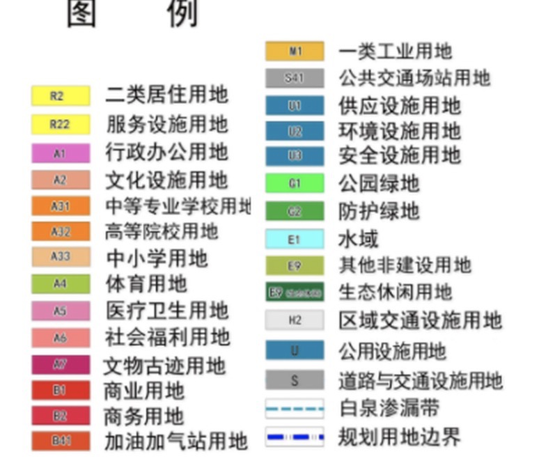
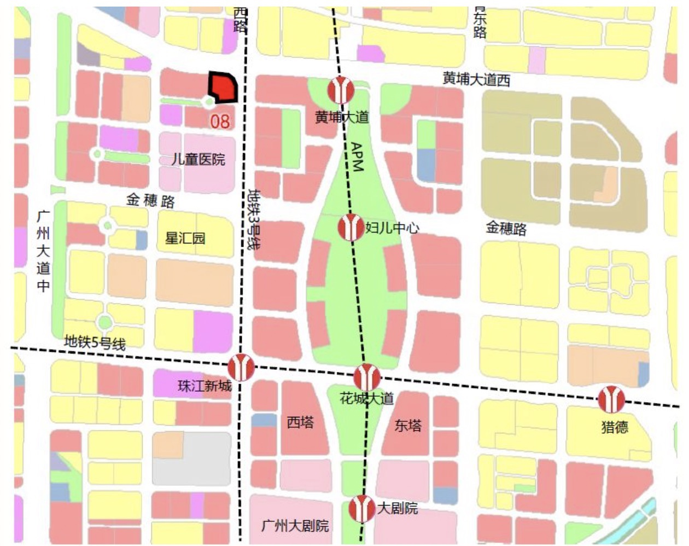
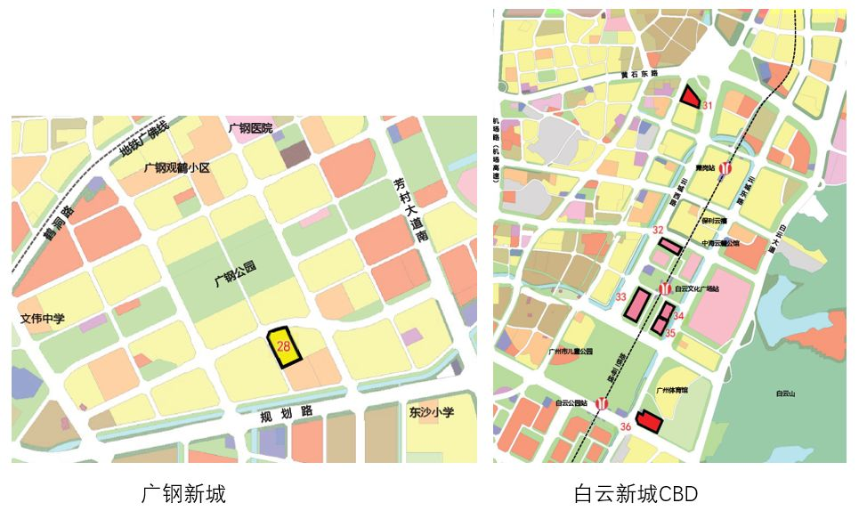
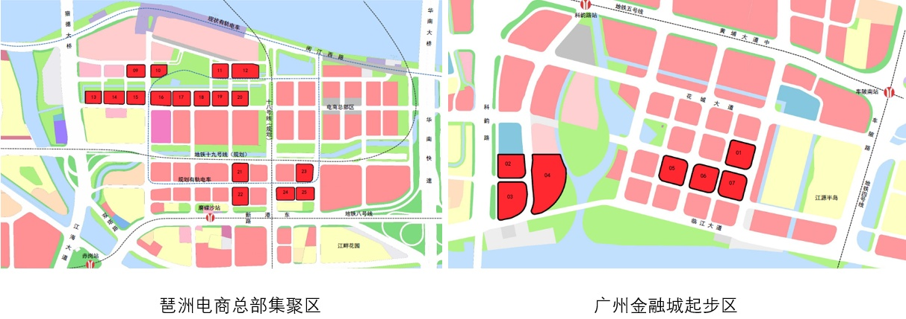

# 1. 房屋选址指南
## 1.1 核心选址(升值空间)
* 买房选在什么样的地段，更能升值。
最简单的做法就是参考邯郸市城区控制性详细规划.
因为，我国的地产走势，受到政府影响非常大，政府对一个区域的经营投入，直接影响这个区块未来的发展，和升值潜力。
>所谓控制性详细规划，大概指的是，在城市建设中，政府对一个地块，有着怎样的规划。你在搜索引擎里随便一搜图片“控规”，你看到这些花里胡哨的图片参考如下: [https://www.bing.com/images/search?q=邯郸市规控图片&qpvt=邯郸市规控图片&tsc=ImageHoverTitle&form=IGRE&first=1](https://www.bing.com/images/search?q=%E9%82%AF%E9%83%B8%E5%B8%82%E8%A7%84%E6%8E%A7%E5%9B%BE%E7%89%87&qpvt=%E9%82%AF%E9%83%B8%E5%B8%82%E8%A7%84%E6%8E%A7%E5%9B%BE%E7%89%87&tsc=ImageHoverTitle&form=IGRE&first=1)

**看控制性详细规划要注意什么?**
其实很简单,看控制性详细规划其实最重要的就是其中的颜色!!!!!!

看起来可能比较复杂，你也不太能记住。我建议重点关注的无非是：居住用地，就是黄的，办公/商业用地，基本是红的/粉的.（当然不同的图可能有细微差异。）
**那我们要注意的就是其中颜色的比例，很重要!!!!!!!!!**
居住用地与商办用地的比例，直接决定了未来这个地块的发展。原因很简单：如果这个地块都是黄色的居住用地，证明这里只是一个居住型的卫星城，并没有不可替代的优势；而如果这个地块大面积比例是商办地块，则商业的繁荣，必然在此提供了工作岗位，这些人群倾向于就近购房或者租房居住，未来这里的房价和租金都有保障。即使房价下行，由于旁边有足够的商业和工作人群，这里的房价，至少跌的缓。
我举个简单的例子以广州为例：
广州最核心的CBD地块，就是珠江新城花城广场一线CBD，控制性详细规划是长这样的：

你看，中间整体地块全都标红，全是甲级和超甲级办公楼，旁边的黄色地块住宅，必然价值上存在不可替代性。这个区域云集着广州一大半以上的五百强、金融、大国企总部，所以这个区块的住宅，也是最贵的。
我们再来看一看在建的周边区域，基于同样的逻辑，哪些更有发展:

这两个地块，距离市中心都算近，也都是政府重点开发的区域。有一点值得留意:地块里，大片面积都是黄色的住宅用地，而不是红色系的商业用地。即使售楼部的妹子再跟你说什么“这里面政府投入的规划非常好，很多企业都已经进驻”，你也要明白：控规里没有规划什么办公用地，这里就没什么工作岗位。广钢新城明显是居住区，白云新城口口声声说自己是个CBD，但是里面能上班的地块，主要是集中在地图左下一带，其实还是一个居住区。相对的不可替代性，就弱。当然，这两个地方房价现在也很高，主要是得益于距离市中心近，但它的发展后劲，我个人态度就相对保守
再比如：广州的金融城片区及琶洲互联网创新集聚区:

这两个区块，一眼看去，就知道和上两个地段完全不同。
首先，这两个区域里，大比例都是红色的商办地块，未来预期会有大量人群在这里办公，许多企业都会入驻。而这么密集的办公人群，如果就近买房，只能选择周围非常少量的黄色居住区块。所以，这里未来的住宅，在我看来是广州未来非常值得购买的地段。
其次，这些商办地块，现在还没盖好，所以区内住宅需求还不算特别大，一旦盖好，必然迎来上涨。
第三，这两个区域，里面的物业基本上都是很高层的超甲写字楼（具体可以在地块的控高和容积率数据里查到），未来容量大，都远远超过上面白云新城左下角的地块容积率，容量越大，未来对周边住宅带动越明显。
其实总结下来就是四点:
1. 看控规：优先选择整体地段中，商业写字楼用地比例大的；
2. 看用途：同样很高的商业办公用地比例，选择里面真正拿来做写字楼的；
3. 看产品：同样拿来做写字楼，选择里面楼层高、总面积大的；
4. 看时间：同样的产品，选择住宅先盖写字楼后盖的，这样写字楼盖好住宅才升值。
5. 看政策:   最近几年的政府工作报告中提及的重点区域
这种控规选地段法，本质上是“分享城市发展及政府商业规划的红利”，这非常考验城市发展和政府执行力。在北上广深一线和强二线城市，城市发展相对迅速，政府规划的商业区通常都能真正发展成商业区，我的这个原则，相对有用。但是如果是弱二线城市乃至于三四线城市，经常出现政府规划了一个开发区，想的很好，大干快上，规划了连片写字楼，结果城市经济不行，跟不上去，规划了也没人来上班，那就不适合采用我这种地段选择法。所以这些数据可能要参照的邯郸市的整体经济指标来看.
* 首先, 参考最近几年的政府工作报告当中提到的重点区域
 浏览近几年的政府工作报告中提到的重点区域建设,大概可以整理出一个备选的区块清单,再去参考控制性详细规划挑选优质区域
* 第二, 明确片区的规划定位
针对每一个区块,都要去看看政府对其产业发展的定位是什么, 该产业是否对于城市/国家的发展起到举足轻重的作用(如:金融, 互联网, 高端制造, 基础科学等).
* 第三, 如何判断规划是否落地
可能我们会有疑惑, "片区规划看上去像是给人画饼,看完了不知道规划的东西能不能落地", 那么以下两个方法可以帮助我们进一步确认自己的判断
    * 该地区是否有龙头房企重仓
首先我们要明确一点,开发商拿地之前一定比我们常人做了更多的研究. 参考他们的决定, 就相当于有专业人士帮我们做了前期的可研分析, 也不失为一种简单粗暴的好办法.(比如冀南新区的板块是否有一些比较头部的公司 e.g.:融创, 保利, 龙湖, 万科等等)如果可以得到了众多开发商的认可之后,这块区域未来住宅集聚,提升了周边的消费需求,商业配套也一定不会差的.
    * 交通总体规划是否到位?
表明政府要重点发展某块片区的决心的典型方式通常包括: 设置多条地铁线路, 新建高铁站, 修建主干道(延伸段), 增加公交线路等, 一个交通规划尚未落地的区域,很难说未来的发展会是怎么样的.
>素材参考市自然资源和规划局 : [http://www.hd.gov.cn/ztzl/ndgzbb/bm/sghj/](http://www.hd.gov.cn/ztzl/ndgzbb/bm/sghj/)
>邯郸冀南新区管理委员会:[http://www.jinanxinqu.gov.cn/zwgk/tzgg/201901/t20190122_995868.html](http://www.jinanxinqu.gov.cn/zwgk/tzgg/201901/t20190122_995868.html)
>邯郸市中心城区控制性详细规划: [https://wenku.baidu.com/view/71d5ee1d26284b73f242336c1eb91a37f011320d.html](https://wenku.baidu.com/view/71d5ee1d26284b73f242336c1eb91a37f011320d.html)
>邯郸市政府工作报告: [https://www.hd.gov.cn/hdyw/bmdt/bm/gzw/202101/t20210122_1419406.html](https://www.hd.gov.cn/hdyw/bmdt/bm/gzw/202101/t20210122_1419406.html)
>邯郸市重点领域投资三年行动计划: [https://www.hd.gov.cn/hdzfxxgk/gszbm/auto23692/202009/t20200922_1379043.html](https://www.hd.gov.cn/hdzfxxgk/gszbm/auto23692/202009/t20200922_1379043.html)

## 1.2 如何筛选片区内的好地段
* 靠近公交和地铁(主要看地铁或者规划中的地铁线路)
直观来看, 地铁, 城际轨道交通, 机场快线, 公交线路被汇集到一个站点,再围绕该站点打造高密度的商业空间. 这样一来, 附近人群使用公共交通的频率大大增加, 生活便利性得到极大的改善, 同时站点附近也聚集了大量人流, 为这里的商业提供了巨大的消费需求 所以在我看来这也是个房产价值高地的风向标.
* 公共设施和商业配套完备
就我而言饭后和家人在公园里散散步,是城市人最奢侈的享受了, 因此我个人认为靠近公园的房子会更值钱. 若再加上有河道或者是湖泊,则更是锦上添花了.
地段好,还意味着出行购物方便, 能以步行距离到达超市, 购物中心, 美食广场, 商业步行街等日常消费场所那是无比幸福的一件事,所以我认为楼盘附近若有大型综合体, 社区购物中心或者集中式商铺在建,必然印证了该地段的价值.
* 远离几种"红线外不利因素"
红线外不利因素是指规划建设范围以外, 非开发商能控制的不利客观存在, 比如: **垃圾焚烧厂, 加油站, 危险品仓库, 高压线等**存在安全隐患,或对人体健康有一定影响的不利因素.
* 学区房
有好学区优先,没有次之, 虽然说学区这个概念再未来可能会被取缔,但是再三线四线城市可以作为保守投资进行配置(ps:虽然我个人不怎么看好)

## 1.3 配套的设施重要性
* 公园
公园最佳的距离是0.5千米外, 而大于0.5千米后要越近越好. 为什么说考虑到0.5千米外, 我考虑到公园可能有广场舞的大喇叭, 而在避免了大喇叭的情况下, 茶余饭后可以去公园漫步锻炼是很不错的选择.
* 医院
住在距离医院5-8千米的地方是比较方便的, 因为在家里有老人或者病人需要前往医院检查或治疗是比较方便的.这个距离是考虑到医院周围的人流量比较大,交通可能会存在拥堵,同时病原体也更容易从医院传出,可能会对我们的健康造成威胁.
* 中小学
对于学区房我个人是持有保守的态度, 因为在中国,好的学区是指升学率高, 排名靠前的, 重点的公立小学, 初中, 高中. 这些学校的教职员工, 不会因为周边房价的增值而多一分的工资, 这些学校也不会因为学区房的买卖而获得任何"奖励",  并且在当下一般是由市政府统一调配教育资源, 可能存在向新区或新校区倾斜的情况, 在这样的状况下, "学区房"我认为可能并不会特别稳固.
在举个例子现在以北京为例, 现在抽签入学, 教师轮换等制度, 正在从根本上摧毁价格高昂的学区房. 
我认为站在经济学角度去考量,如果真的要买学区房,那么久尽量去买小的, 因为学区房的最大价值无非是"学票"本身. 但从投资的角度而言,"学票"的价值未来很可能会逐渐走低,
所以我认为对于中小学, 如果希望孩子步行去上学的话选择放在 0.5-2千米距离就比较合适,如果说考虑培养孩子的自主性,让孩子坐公交, 或者去寄宿制的学校读书,则可以尽量远离学校. 毕竟在学校周围会有广播及学生的噪音,也会有乱穿马路的未成年人和大量私家车, 流动商贩等等不安定因素,这些都会影响居住的品质.
* 商业
小区配套的底商会大大提高生活的便捷度, 所以, 有底商且都开业的小区, 一定会比没有底商或底商没有开业, 甚至基本倒闭的小区住起来方便舒适 ,
不过鉴于饮食和购物需求,建议大型商业区直线距离不要超过5千米以上,而且保证尽量直线距离大于1千米的地方,尽量保证居住的舒适度.
* 锅炉房, 工厂等 "大烟囱"
此类建筑属于可以远离就尽量远离的建筑, 但确实存在的话, 尽量居住在此类建筑的上风口处,而间隔应尽可能的远, 否则将会严重影响我们的日常生活.
* 垃圾填埋场, 垃圾站
同样的, 垃圾填埋场, 垃圾站也是要尽量避开的场所, 埋葬场最好在居住地的一千米之外,尽量不要买下风处的房子!!!!!!不然夏天时会严重降低生活质量

## 1.4 开发商资质和开发商品牌选择
这里主要是指开发商的五证二书，国家规定，开发商销售或者预售商品房，需拿到“五证”和“二书”，五证分别是《国有土地使用证》、《建设用地规划许可证》、《建设工程规划许可证》、 《建设工程施工许可证》（建设工程开工证） 、《商品房销售（预售）许可证》； 二书分别是 《住宅质量保证书》、 《住宅使用说明书》。
有资格证书了，才是被合法销售的，之后遇到问题才能做到有法可依，也避免预售证陷阱这样的雷区。
记住这点预售证是按单栋楼发放的，在看房的时候要注意这点，避免被拿其他楼栋的预售证来忽悠。
开发商的口碑以及品牌也要关注，因为大牌开发商对问题的反应程度速度快，解决起来也比较有能力。
>2020年度地产销售额排名: [https://fdc.fang.com/news/2020-11-30/37949023.htm](https://fdc.fang.com/news/2020-11-30/37949023.htm)

# 2. 

